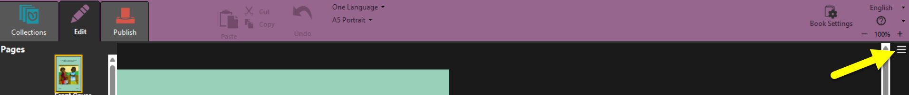
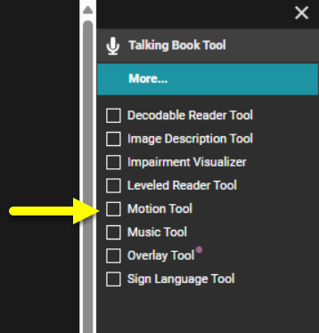
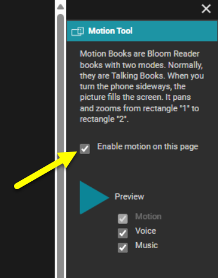
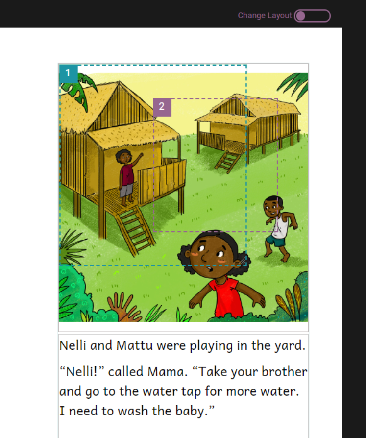
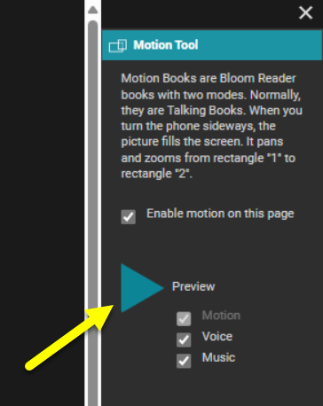

:::note

Content coming soon.

:::

The Motion Tool in Bloom allows you to add simple motion to an otherwise still picture in your book. This tool enables you to create a **pan and zoom effect** from one rectangle to another on the image. You can add motion to the first picture on each inside page of your book. This tool is particularly useful for creating engaging and dynamic content that can be viewed using the Bloom Reader app.

## Steps to Use the Motion Tool {#9f534c83eafe4eedbbfc8dc8c6faa98b}

1. To show the **Motion tool**, open the book you want to work on in the Edit tab.
2. On the far right of the Bloom window, click on the Menu button.

	

3. Click the **More** tab to bring up more options

	

4. Select the **Motion Tool**.

**Using the Motion Tool**

1. **In the Pages pane, click an inside page** that has a picture on it.
2. **Click the Motion Tool tab** in the toolbox.
3. **In the Motion Tool tab**, do one of these steps:
	1. Clear the check box on the **Enable Motion on this page** if you do not want to add motion to the picture on the current page. Then, click another inside page and repeat these steps.
	2. Select the check box on the **Enable Motion on this page** if you want to add motion to the picture on the current page. Then, proceed with the following steps.

		

4. **Click the picture** that shows the rectangles.
	1. Rectangle 1 indicates the area in focus when the motion begins.
	2. Rectangle 2 indicates the area in focus when the motion finishes.

	

5. **Reposition** and **resize** these rectangles as desired. To **reposition,** click and drag a rectangle by a numbered corner. To **resize, c**lick and drag the lower right corner, or move your mouse pointer over a line, then click and drag the double-headed arrow.
6. **Preview the motion**:
	1. Select the **Voice** checkbox if you want to hear the recorded audio during the preview.
	2. Select **Music** checkbox if you want to hear the music during the preview.
	3. Click **Preview** to start a preview. The Preview button changes to a pause button.

		

	4. Reposition or resize the rectangles as needed.
7. **Click another page** until all of them have motion or a cleared () Enable Motion on this page check box.

### Tips for Using the Motion Tool {#b2b2cd9be37b4eb2a89613e268181632}

- If you change the page size and orientation or choose a different layout after setting the rectangles, you should preview them again. Reposition or resize them if necessary.
- You may notice odd results if only some of the sentences on a page have recorded audio or you have cleared and re-recorded the audio for one sentence in a paragraph. If you see odd results, clear and record the audio again. Then, reposition or resize the rectangles.

By following these steps, you can effectively use the Motion Tool in Bloom to create more dynamic and engaging visual content in your books.

