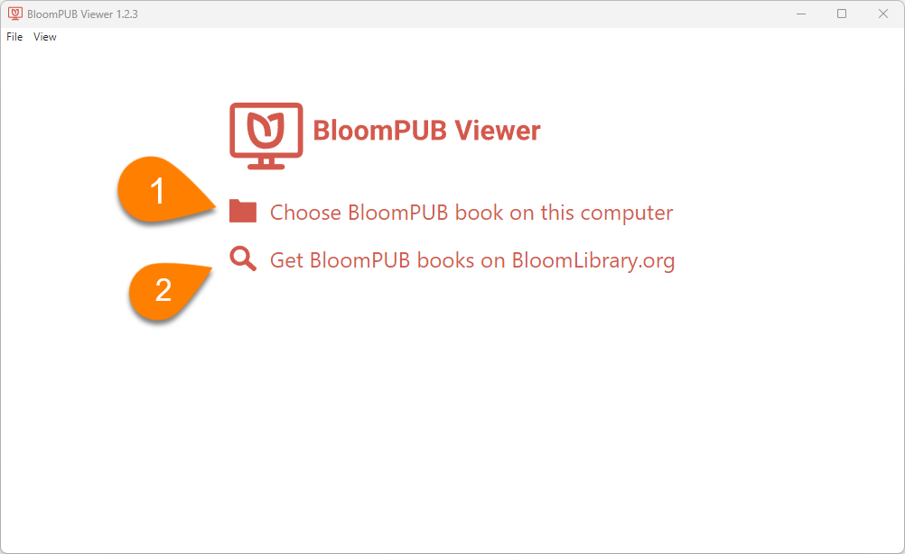
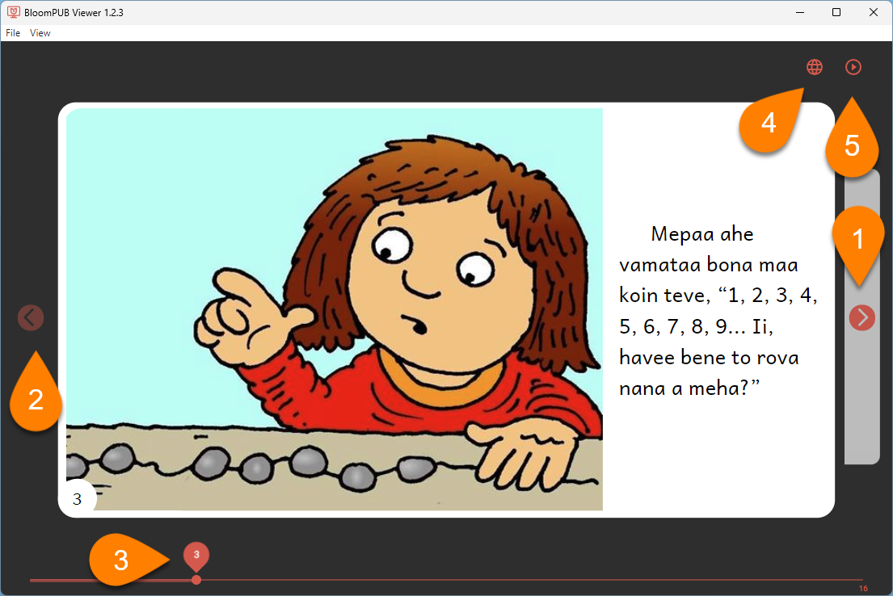

:::note

BloomPUB Viewer is a Windows program that allows you to view BloomPUB files on your computer.

:::

## Install BloomPUB Viewer {#af52be2640204e52943fa6aefb612b27}

To install BloomPUB Viewer:

1. Go to the [BloomPUB Viewer download page](https://bloomlibrary.org/page/create/page/bloompub-viewer).
2. Click on `DOWNLOAD BLOOMPUB VIEWER`:

	

3. Once downloaded, open the `BloomPUB-Viewer-Setup…exe` file to install it.

The program will install and open. 

## Use BloomPUB Viewer {#820ea236bc25473d93275a5563de0c76}

To use BloomPUB Viewer, 

1. **Click** **`Chooose BloomPUB book on this computer`** **to open a BloomPUB file;** 
or:
2. **Click** **`Get BloomPUB books on`** [**`BloomLibrary.org`**](http://bloomlibrary.org/) **to open your web browser and navigate to** [**bloomlibrary.org**](https://bloomlibrary.org/)**,** where you can download thousands of BloomPUB files.

After you open a BloomPUB file with BloomPub Viewer, you can: 

1. **Click on the forward arrow control to page forward through the book.**
2. **Click on the backward arrow control to page backward through the book.**
3. **Click and drag the page slider to go to a specific page.**
4. **If the BloomPUB file contains more than one language, click the globe icon to choose which language to display**
5. **If the BloomPUB is a Talking Book, click the start/pause button to play the audio.**

