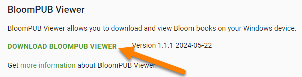
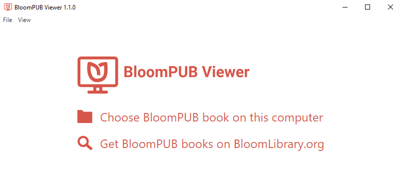

:::note

BloomPUB Viewer is a Windows program that allows you to view BloomPUB files on your computer.

:::

To install BloomPUB Viewer:

1. Go to the [BloomPUB Viewer download page](https://bloomlibrary.org/page/create/page/bloompub-viewer).
2. Click on `DOWNLOAD BLOOMPUB VIEWER`:

	

3. Once downloaded, open the `BloomPUB-Viewer-Setup…exe` file to install it.
4. The program will install and open:

	

