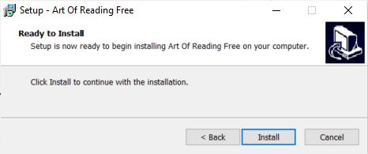

The **Art of Reading** is a collection of black and white line drawings from SIL International that you may use in Bloom for free. You must properly credit Art of Reading images when used in publication.

# Install the Art of Reading on Windows {#c1942ce626de4f59ab1e407ac924098f}

1. Download [ArtOfReading-Free-Setup3.3.exe](https://s3.amazonaws.com/bloomlibrary.org/ArtOfReading/ArtOfReading-Free-Setup3.3.exe).

	:::note
	
	If the link doesn’t work, please contact us as [issues@bloomlibrary.org](mailto:issues@bloomlibrary.org).
	
	:::
	
	

2. Open (double-click) the **ArtOfReading-Free-Setup3.3.exe file** to install the Art of Reading image library.
3. The installer program will take you through a series of screens where you will accept the license agreement, find out more information about the collection, and finally, click the "Install" button.

	

4. **Restart Bloom** to make The Art of Reading available within Bloom.

	:::note
	
	There is **no icon or desktop shortcut** for the Art of Reading_._ It will be available the next time that you run Bloom.
	
	:::
	
	

# Install the Art of Reading on Linux {#f554870b7f374b8e8bd94b775674eccd}

If you are using Bloom for Linux, see [bloomlibrary.org/artofreading](https://bloomlibrary.org/artofreading) for instructions to install The Art of Reading from the **SIL package repository**.

