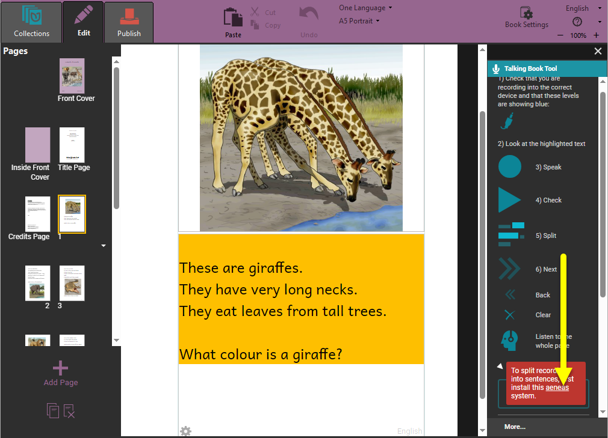
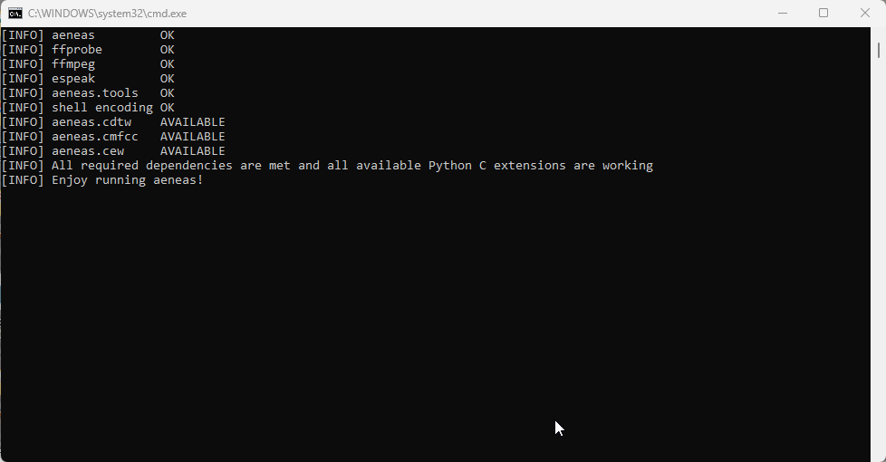

:::note

This page describes how to install **aeneas** on a Windows computer for use with Bloom.

:::

When you record an entire text box at once, Bloom can automatically split the recording into sentence-sized chunks. To do this, Bloom uses an extra program called **aeneas**.  Aeneas is a free software package, but you need to install it on your computer to use it. 

If you do not have aeneas installed on your computer, Bloom will display a warning in the lower portion of the Talking Book tool controls when you try to split a recording: 
`To split recordings into sentences, first install the` [`aeneas`](https://github.com/sillsdev/aeneas-installer/releases/tag/v1.7.3) `system`.

1. Click the link under “aeneas” in the Talking Book Tool’s warning box, or navigate to this webpage to download the [aeneas](https://github.com/sillsdev/aeneas-installer/releases/tag/v1.7.3) software: [https://github.com/sillsdev/aeneas-installer/releases/tag/v1.7.3](https://github.com/sillsdev/aeneas-installer/releases/tag/v1.7.3)

	

2. Click the **`aeneas-windows-setup-1.7.3.exe`** link to download the software.

	

3. Find the downloaded [**`aeneas-windows-setup-1.7.3.exe`**](https://github.com/sillsdev/aeneas-installer/releases/download/v1.7.3/aeneas-windows-setup-1.7.3.exe)  installer program (probably in the **Downloads** folder) and double-click it to launch the software installer.
4. Windows will show you a User Account Control window, asking whether you want to allow the app to make changes to your device. Click **Yes**.

	

5. Click **Next** to follow the steps of the setup wizard. **Do not make any changes to the default installation settings unless you are sure what you are doing.**

	

6. When you reach the “Ready to Install” screen, click **Install.** You will see a number of installation status screens:

	

	1. Including some in the Windows command line:

		

7. Eventually, you will see a “Completing the aeneas tools Setup Wizard” screen. Click `Finish`.

	

8. Restart your computer.

Now you can record an entire text box in Bloom, and let Bloom automatically split the recording into sentences. 

