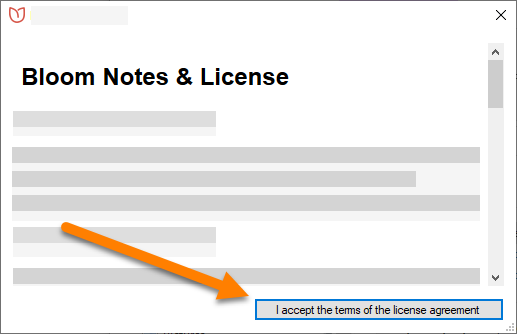

**Bloom Editor** is a program that runs on your computer. Before you can use Bloom, you need to install it on your computer. There are some additional programs that you should install, too, to use the Bloom image gallery.

# System Requirements {#2a975ec7819348eab9d4421a624ac4ae}

## Hardware {#5e94abda80254d1fa5a83a7539d3b365}

Bloom is designed to run on fairly modest hardware. Your computer should have at least the following to run Bloom:

- 1.5 Ghz processor
- 4 GB memory (RAM)
- 2 GB available hard disk space
- Bloom 6.3 and above require a 64 bit processor.

## Operating System {#3fcf15146bf34b8c82ff2a445247ddce}

**Windows 11**

 [WebView2](https://docs.bloomlibrary.org/webview2/)

Bloom 6.1 & 6.2

- [.NET 4.8](https://dotnet.microsoft.com/en-us/download/dotnet-framework/net48)

Bloom 6.3

- [.NET 8](https://dotnet.microsoft.com/en-us/download)

Information about older versions of Windows…

You can use older versions of Bloom with Windows XP and Windows Vista, but this is **NOT recommended**. If you must use these unsupported operating systems, you can download older versions of Bloom from the [Bloom Library downloads](https://bloomlibrary.org/page/create/downloads) page. 

Bloom can also run on computers that use Ubuntu Linux…

Bloom comes pre-installed in [Wasta-Linux](https://www.wastalinux.org/), SIL’s Linux distro.

If you are using Ubuntu Jammy (22.04)+, you can download Bloom 5.4 as a [Flatpak](https://flathub.org/apps/details/org.sil.Bloom).

For Ubuntu Bionic (18.04) and Focal (20.04), Bloom is distributed as apt packages from SIL’s package repository. See [Install Bloom on Linux](/installing-bloom-linux) for installation instructions.

## Fonts and Keyboards {#14b4c74f84664b658f7168630913c7d7}

Bloom assumes that you have a way to type your language on your computer. That will often involve using a certain font. SIL offers a free, high-quality fonts for many scripts on its website at [software.sil.org/fonts](https://software.sil.org/fonts).

You may also need a special **keyboard layout** to let you type the characters in your language. **Keyman** is a free program from SIL that has many keyboard layouts. You can get Keyman from [keyman.com](https://keyman.com/).

If you need help to find a font or keyboard for your language, try looking on SIL’s [ScriptSource](https://scriptsource.org/) site. 

# Download Bloom {#cb910b03fa4a483189be6b98d5a1bed8}

You can download Bloom installation program from the [Bloom Library Downloads page](https://bloomlibrary.org/downloads):

1. Go to [bloomlibrary.org/downloads](https://bloomlibrary.org/downloads).
2. Click the `Download` button at the top of the page to download the latest release version for Windows.

	

3. Open (double-click) the installer program (`BloomInstaller…exe`) to install Bloom on your computer.
4. While the installer is working, it will display this window:

	

5. The first time you run Bloom, it will show you a license agreement. Click `I accept the terms of the license agreement`.

	

:::note

When you open Bloom the first time, Bloom will ask you to create a **collection**. You may do so at this point, or you can create your initial collection later.
For more details on how to create a collection, see [Create a New Collection](/create-a-new-collection).

:::

# Art of Reading {#7ae355b83c5d4842bf18a125c883c217}

The **Art Of Reading Free Edition** is an optional addition to Bloom that gives you easy access to over 10,000 black & white illustrations from around the world. These are open licensed, so you can use them for free.

To use Art of Reading, see [Install Art of Reading](/install-art-of-reading).

# Troubleshooting {#9bb9718916d34c5fa12c8257ede140fb}

If Bloom does not install properly, try these steps:

1. Temporarily disable your computer's anti-virus software.
2. Try to install Bloom again. It will probably install correctly this time.

	:::caution
	
	Be sure to re-enable the anti-virus software after you have installed Bloom!
	
	:::
	
	

3. If this does not work, ask an IT expert to help you.
4. You may find other helpful ideas in [this community site post](https://community.software.sil.org/t/how-to-fix-installation-problems/17).

:::tip

You can also see [Bloom & Antivirus False Alarms](/antivirus-general) for more information.

:::

