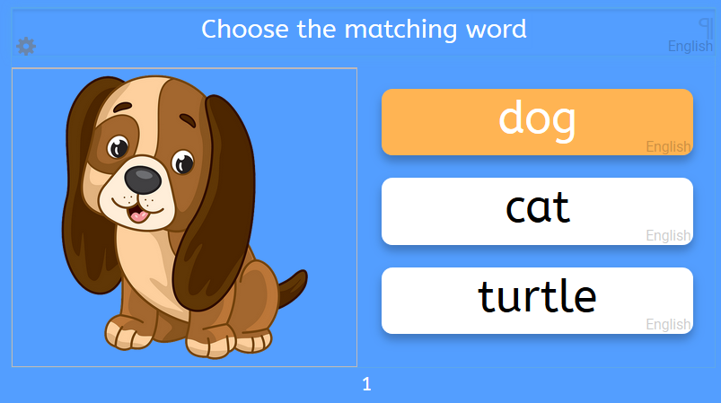
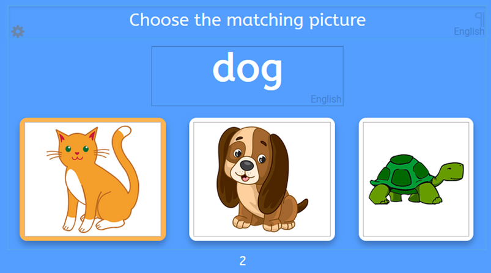
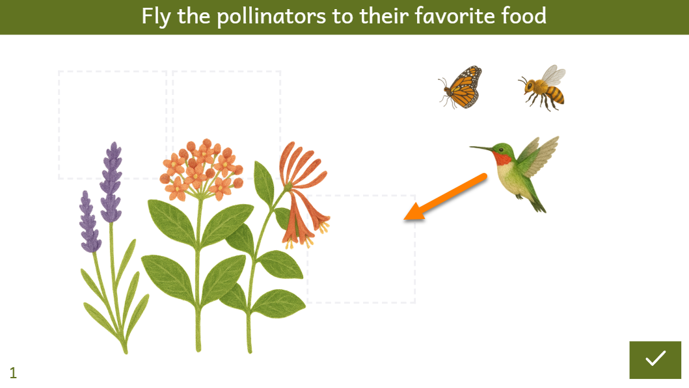
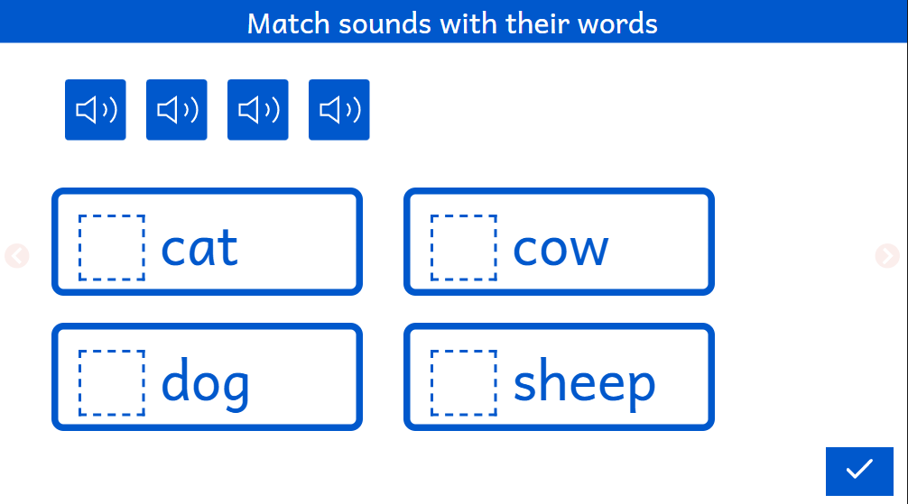

:::tip

Prior to Bloom 6.2, Games Pages were referred to as Activity Pages.

:::

A key advanced Bloom feature is Games. The Bloom editor features a number of built-in page templates to create **Games.** These interactive pages are available to Bloom subscription users and provide an easy-to-use means of including fun, interactive, and educational game components to your books. 

The following Game Pages types are offered in Bloom 6.2+:

1. [Comprehension Quiz](/games-pages#1c04bb19df12800b84e1cade013ef207)
2. [Simple Choice Games](/games-pages#1c04bb19df128017867ff252959d16c9)
3. [Drag-and-Drop Games](/games-pages#21d4bb19df1280a795a8d11f61e136e0)
4. [Widgets](/games-pages#1c04bb19df1280cb8677f74ceb8c8d17)

## Comprehension Quiz {#1c04bb19df12800b84e1cade013ef207}

Adding **Comprehension Quiz** pages to your books enhances the reading experience of your readership by allowing them to test their reading comprehension of your stories.

The layout of a Quiz Page is simple: at the top of the quiz is a comprehension question, e.g., “How is the teacher, Agnes, different?”. This is followed by a list of potential answers. 

Bloom allows for multiple correct answers, but typically, only one is marked as correct. When reading the book on Bloom Library or Bloom Reader, readers can tick the box indicating their answer to the quiz’s question. If the answer is correct, the player will ring a bell and the box will display the checkmark. If an incorrect answer is selected, a different sound will play indicating an incorrect answer and the text will fade. The reader is then given another chance to try a different answer.

Bloom’s analytics system can capture whether readers answer the questions correctly or incorrectly. Such information can provide valuable data for an organization or a project’s monitoring and evaluation efforts.

## Simple Choice Games {#1c04bb19df128017867ff252959d16c9}

**Simple Choice Games** come in two varieties:

- Choose Word from Image:

	

- Choose Image from Word:

	

## Drag-and-Drop Games {#21d4bb19df1280a795a8d11f61e136e0}

Bloom 6.2 introduces a new type of game template: drag-and-drop games. There are six drag-and-drop game templates, and they share a common feature: they require the reader to move specific objects on the page to designated target areas.

For example, in this sample game, the reader must drag the three insect pollinators to their favorite foods. The student reader might begin by dragging the hummingbird to the honeysuckle:

In another game, four recorded words must be matched to four written words:

## HTML5 Widgets {#1c04bb19df1280cb8677f74ceb8c8d17}

**HTML5 widgets** are JavaScript apps that are programmed outside of Bloom and can be embedded in Bloom book pages. These widgets offer numerous options for making books interactive.

To view just one example of a Bloom book with a widget, go to page 9 below:

<iframe width="100%" height="450px" allow="fullscreen" allowFullScreen={true}
  src="https://bloomlibrary.org/bloom-player/bloomplayer.htm?url=https://s3.amazonaws.com/bloomharvest/educationforlife@sil.org/dce90651-e17a-4f28-a135-42fd3327c137/bloomdigital/index.htm&initiallyShowAppBar=false&paused=true&allowToggleAppBar=true&independent=false&host=docs.bloomlibrary.org"></iframe>

:::note

Since Widgets are custom-made outside of the Bloom program, they cannot be translated or adapted into other languages like Bloom’s built-in Games. 

:::

