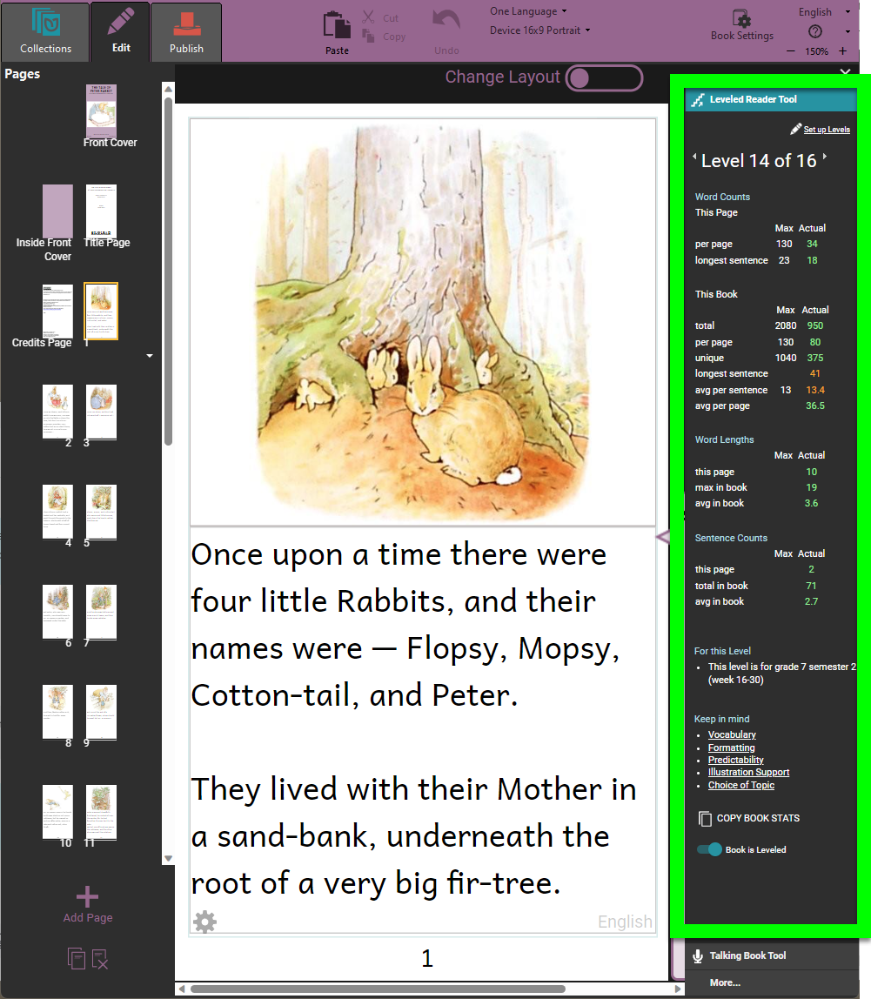
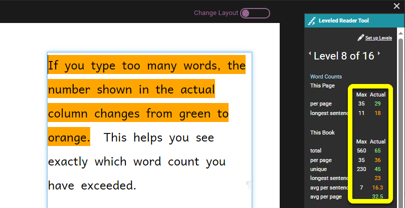
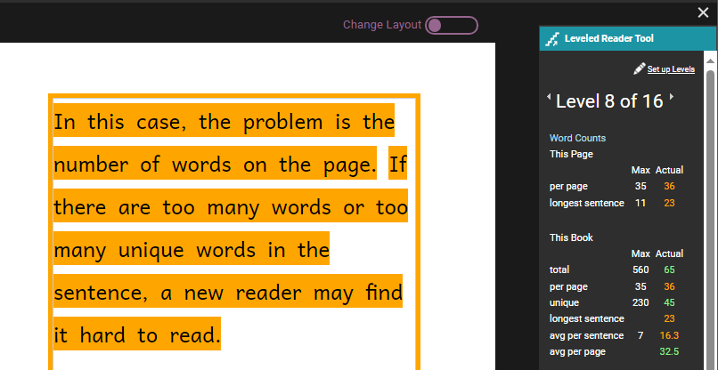
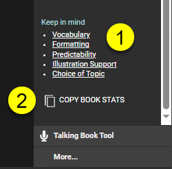

:::note

This page is a draft version.

:::

When you open your book, the **Leveled Reader Tool** appears on the right. As you add text to the page, the Leveled Reader Tool counts and displays the number of words you are using, and compares them to the maximum you should be using for the current level.

- The **Max** column shows you how many words and sentences are allowed for this level.
- The **Actual** column shows you how many words and sentences your book currently has.

(See  for more details on these measures.)

If you type too many words, the number shown in the **actual** column changes from green to orange.  In this way, Bloom helps you not to use too many words for the current level, and helps you see exactly which word count you have exceeded. 

**When there are too many words in a sentence,** Bloom highlights the sentence in orange.  

**When there are too many words on a page,** Bloom highlights all sentences on the page and puts an orange border around the page. 

If you have too many words in a sentence, you will need to shorten the sentence. If you have too many words on a page, you will need to shorten the text or put some of it on the next page. 

You can continue writing your book, adding pages, pictures, and text as you wish. Bloom will help you make sure that you do not add too many words to a sentence, a page, or a book. When you are done, you can publish your book and share it with others.

## Using the Leveled Book Tool with Existing Books {#8db40ccdc65945b2af8e1ad8d713ed64}

You can make an existing book into a leveled reader. Open the book in Edit mode. Then do the following:  

1. Click the menu button in the upper right-hand corner of the editing pane,
2. If the Talking Book tool (or a different tool) appears, click the **`More…`** button at the bottom of the window pane.
3. Click the Leveled Reader Tool line in the list of tools.
4. Click the “Book is not leveled” switch. Bloom will assign the book to a level and start showing word and sentence statistics for the book.
5. If you want to set the book to a different level, click the arrow to the right of the levels to increase the level, and the arrow to the left of the level to decrease the level.

	:::note
	
	If the Leveled Reader Tool says that this book is “Level 0 of 0”, close Bloom. Then restart Bloom and open the book again.  
	
	:::
	
	

## Extra helps {#779ea357cf5842c6a6a8753cca55b152}

At the bottom of the Leveled Readers Tool are links to some helpful articles about choosing appropriate vocabulary, formatting, and other aspects of making leveled readers **(1)**. (Note: these help articles are available in English, French, and Spanish, but may not be available in all the languages of the Bloom user interface.)

There is also a button that lets you copy the book statistics to your computer’s clipboard **(2)**. You can paste these statistics into a spreadsheet. 

## Leveled Reader Tool Statistics {#419a3f12f7a4441392f6c7a1685713d8}

The Leveled Reader Tool gives you three kinds of measures:

- 
- 
- 

### Word Counts {#64e923fe22ed45aaab27ce6b6f4fbffb}

**Word counts** are divided into two parts: word counts for the current page, and word counts for the entire book.  

	- For the current page:
		- The number of words per page
		- The length (in words) of the longest sentence on the page
	- For the entire book:
		- The total number of words in the book
		- The average number of words per page
		- The number of unique words in the book

			:::tip
			
			You might want to limit the number of unique words, as the repetition of the words used could be helpful to someone who is learning to read.
			
			:::
			
			

		- The longest sentence in the book
		- The average number of words per sentence
		- The average number of words per page

### **Word lengths** {#ef0d60ef76054b188bae27bea4f6bf74}

- The maximum length (in graphemes) of words on this page

	:::note
	
	A **grapheme** is the smallest unit of a writing system. In an alphabet such as the Latin alphabet, a letter is a grapheme. 
	
	:::
	
	

- The maximum length (in graphemes) of words in the book
- The average length (in graphemes) of words in the book

### **Sentence counts** {#f6b34e40cd09443bac749e4afbab57d3}

- The number of sentences on this page
- The total number of sentences in the book
- The average number of sentences in the book
