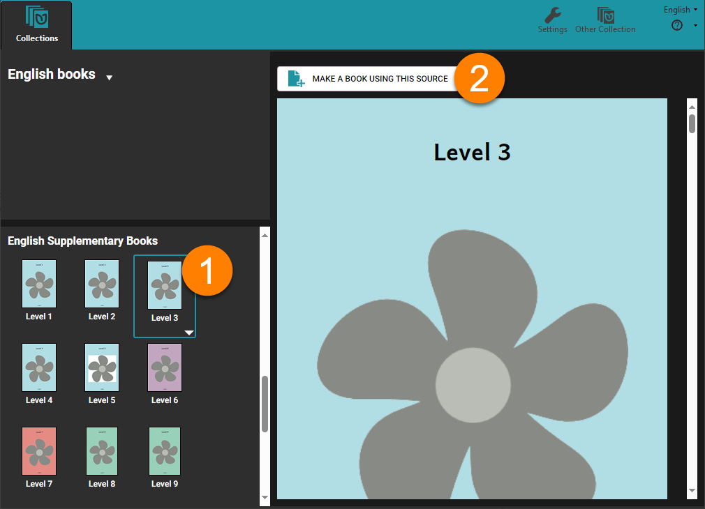

# About Leveled Readers {#337bd8c30b6b45b2a5e4d4d9f089546a}

A **Leveled Reader** is a book that is written specifically for a learner who is at a certain level of reading development — for example, beginner, developing, and advanced levels.

## Leveled Reader Levels {#140de27b23eb4d7884b0fd877bfb7d2c}

Each level defines specific targets for word length, sentence length, and number of unique words. These targets can be set for each sentence, each page, and the entire book. Levels also determine appropriate formatting. Levels may also include suggestions for appropriate vocabulary, illustration support, and topics for the given level.

As you enter text into the book, Bloom helps you keep in mind the level for which you are writing and points out when you exceed the limits set for the level. Bloom does this by highlighting text whenever you exceed the set limits.

:::tip

Creating a set of leveling criteria is usually done by someone with special skills in literacy education. If you do not have a set of specially constructed leveling criteria for your language, you can try the default levels that come with Bloom. 

:::

## Making a leveled book using a leveled reader template {#34dddd39abd046d49987f45561fe2edb}

If you have a set of leveled book templates, you can use one of them to start making a leveled book. 

In the Collections Tab, look in the **Sources for New Books.** Scroll down until you find the reader templates. In this example, we have a set of templates for various reading levels**.** 

1. **Select the template you want to use** (in this case, “Level 3”)
2. **Click** **`Make a book using this source`****.**

Bloom adds a new book to your collection and opens it, ready for editing.

:::✅

Remember that a level should include not only criteria for word length and sentence length, but also targets for font size and other formats. In many large book projects, a book designer creates a Bloom template with the characteristics for each level. 

:::

When you open your book, the **Leveled Reader Tool** appears. Learn more about [Use the Leveled Reader Tool](/leveled-reader-tool).

## How Bloom helps you create leveled readers {#92ad10caace54589ba3185b7a2fc011a}

:::note

Coming soon…

:::

# Getting help for creating leveled reader levels {#952d57fc85874ba48af852bdd410be2d}

:::note

Coming soon…

:::

