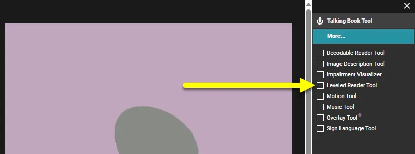
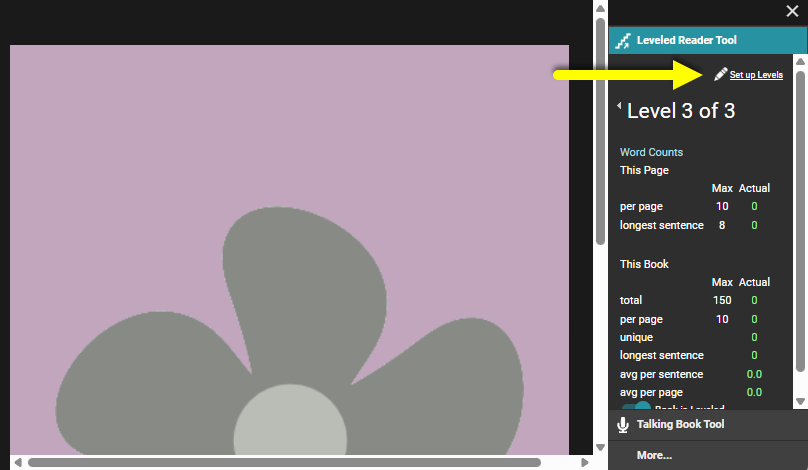
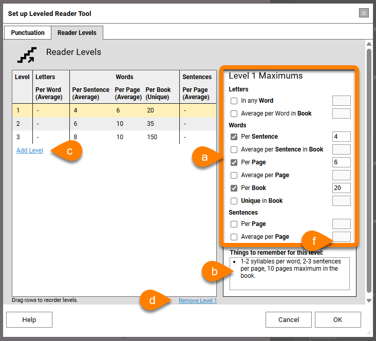
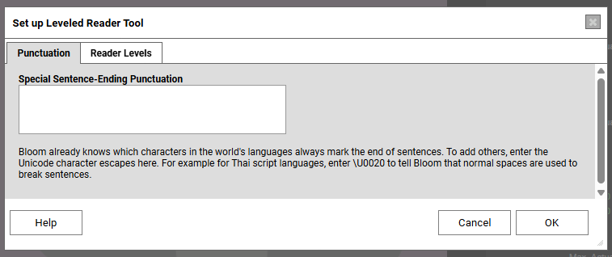

Bloom comes with a set of basic levels. You can edit these to suit your needs, or make additional levels. 

:::note

Creating a set of leveling criteria is usually done by someone with special skills in literacy education. 

:::

1. **Open the Leveled Reader tool**

	

2. **Click the** **`Set up Levels`** **button** (located at the top of the Leveled Reader tool) to display the Set up Leveled Reader Tool dialog box.

	

3. For each level:
	1. Edit the Maximums: letters in a word, words in a sentence, words per page, etc. If you do not want to define a given maximum length, you can leave it blank.
	2. Add any additional notes in the “Things to remember for this level” field.
	3. Click the `Add Level` link to add a level to the list of levels.
	4. If you need to remove a level, click the `Remove Level` link at the lower right-hand corner of the levels list.

		

4. Bloom knows about most punctuation marks that are used to end a sentence. If your language uses other punctuation marks to end a sentence, you can tell Bloom about them by listing them in the `Punctation` tab. (This step is optional.)

	:::tip
	
	If you need to list more than one punctuation character, add them to the box without any dividers or punctuation between them.
	
	:::
	
	

	

5. When you are finished, click `OK`.
