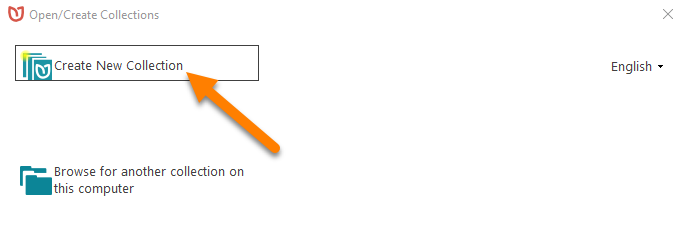
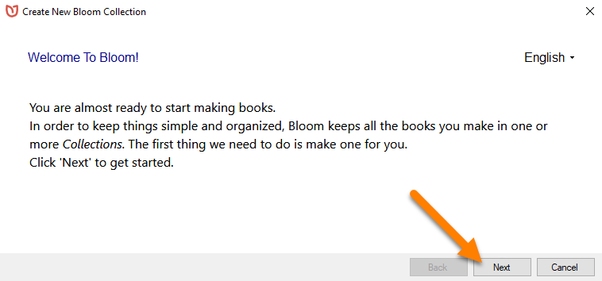
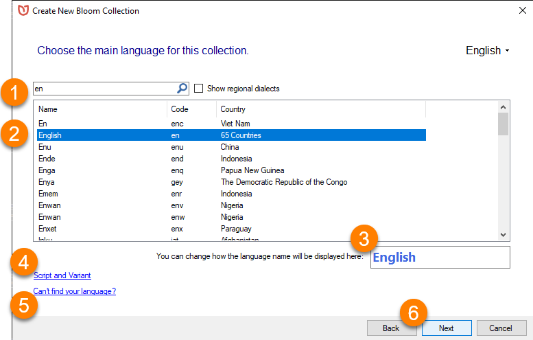
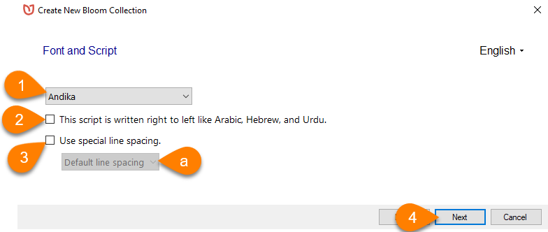
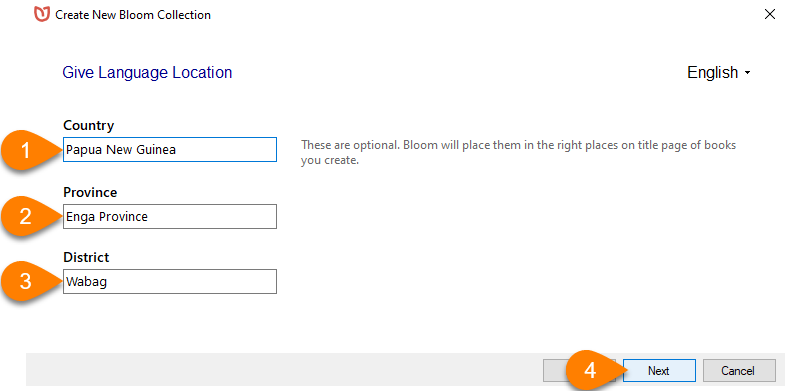
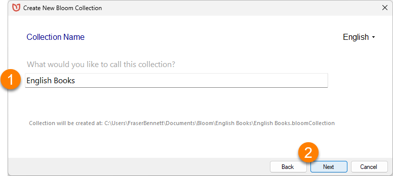
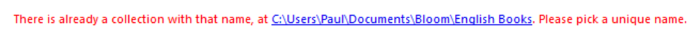
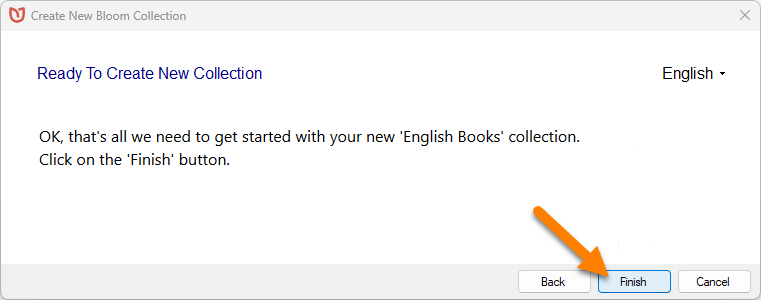
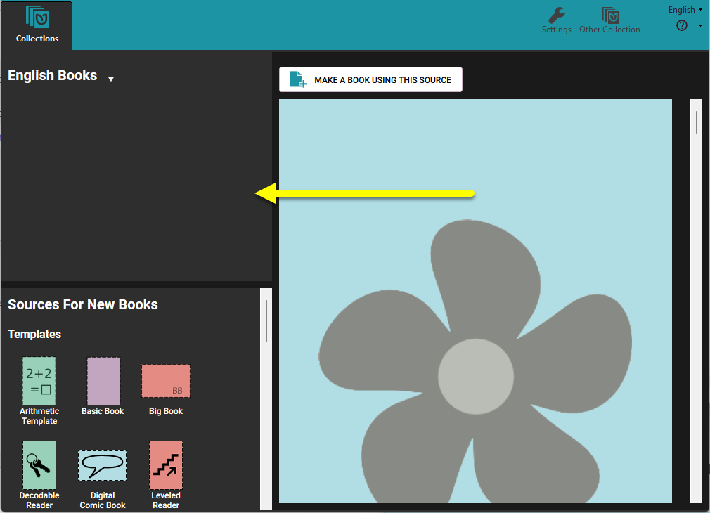

:::tip

There’s a 3-minute training video about creating a Bloom collection: 
**Bloom: Making a Set of Decodable and Leveled Reader Templates - Step 1: Create a New Collection** (available on [Vimeo](https://vimeo.com/showcase/3294468/video/121688803) and [YouTube](https://youtu.be/CQO8PmIYVqY))

:::

## What is a Bloom Collection?  {#90e1bad894004b8ba6f0fd8452b1e6ef}

In Bloom, every book is part of a **Collection**. A collection is a set of books that share certain characteristics. All the books in a collection have the same settings for their languages and book design. You may have a collection of English books, or French books, or books in some other language. 

In the Bloom Editor window, the current collection appears in the upper left-hand corner. 

:::note

Bloom stores all the books in a collection together in a single folder on your computer. You can also have more than one collection of books on your computer.

:::

Because every book must be part of a collection, you must have at least one collection **before** you can create a book.

## Create a New Collection {#1d6b50d3274041feaf260bfd18d07d4f}

To create a collection, Bloom needs to gather some basic information about the books that will be part of the collection — especially, the name of the language the books are written in. Bloom will lead you through a series of screens to gather the information it needs. 

### Create Your First Collection {#c864fe0c9e214a6db969a63de11c6675}

When you start Bloom for the first time, Bloom will show you a window that lets you `Open/Create Collections`_._ 

- Click `Create New Collection`.

:::note

If this is your first time running Bloom, Bloom will also show you a welcome screen. 

- If you see this welcome screen, click `Next`.

:::

Now Bloom is ready to gather the information it needs about your collection. 

:::note

**If you are using Bloom 5.4 or earlier,** Bloom will ask you to select a `collection type`.  In almost every situation, you will want to use a **Local Language collection**. 

:::

### Choose the Main Language for the Collection {#51ae111e027546e7b7151d05d85ccec2}

Bloom will show you a long list of languages. 

1. **Scroll through the list, OR begin typing the language name in the search bar.**
	1. Bloom will show you a list of one or more languages that match what you type.
2. Click on a **language name** to select it.
3. **Change** how the language's name is **displayed** in your collection (optional).
4. Specify which script or dialect your collection uses by clicking on `Script and Variant` (optional).
5. If you can’t find your language in the list, click `Can’t find your language?` for more help.
6. Click `Next`.

### Select the Font To Use for the Main Language (Optional) {#5bef2bd549244665987d586bdd788586}

You can tell Bloom which `Font and Script` to use for the books in your collection. By default, Bloom uses the **Andika** font, which is a good font for new readers. You can change the font and script settings later, either for all the books in your collection or for an individual book.

:::note

Bloom versions prior to 5.5 use Andika New Basic as their default font. 

:::

1. **If** you want to use a **different font**, select the font you want to use from the **drop-down** list of fonts that are installed on your computer.
2. **If** the language’s script is written right to left (like Arabic), **tick the checkbox** next to `This script is right to left like Arabic, Hebrew, and Urdu.`
3. **If** the language’s script uses stacked diacritics, **tick the checkbox** next to `Use Special line spacing`.
	1. Then, select the `Default line spacing` (or a taller spacing) from the drop-down list.
4. Click `Next`.

### Add Language Location Information (Optional) {#6997d5fc0d0b40488a0427e710294aff}

You may add details about the Language Location (`Country`, `Province`, and/or `District`).

This step is optional, and you can also add this information later in the **Collection Settings**.

:::note

The language location will appear on the **title page** of books in this collection.

:::

1. Type the `Country` for this language.
2. Type the `Province` for this language.
3. Type the `District` for this language.
4. Click `Next`.

### Name the Collection {#79d1ab39f9ef4b5fb6b41e5401e60b15}

You need to give each collection a name. The `Collection Name` is used for the folder that contains your collection’s books.

1. Type a `Collection Name` for your collection.
2. Click `Next`.

:::note

The `Collection Name` must be different than all your other project names. If you choose a collection name that already exists on your computer, Bloom will prompt you to choose a different name.

:::

### Finish Creating the Collection {#822aba30c20e40829966ca01e2bf4546}

Now you are `Ready To Create Your New Collection`.

- Click `Finish`.

Bloom will create your collection.

## Now You Are Ready To Make a Book! {#c8dab090b53045d287c08826526bcd44}

After Bloom creates your collection, Bloom will show you the **Bloom Editor** window.

The **Collection pane** (in the upper-left corner of the screen) is empty — ready for you to fill it with books!

See [Create a New Book](/creating-a-new-book) to learn about creating books.

## Learn More About Collections {#f0459dea41314721be50cf07647e463e}

To learn more, see [The Collections Tab](/collections-tab).

