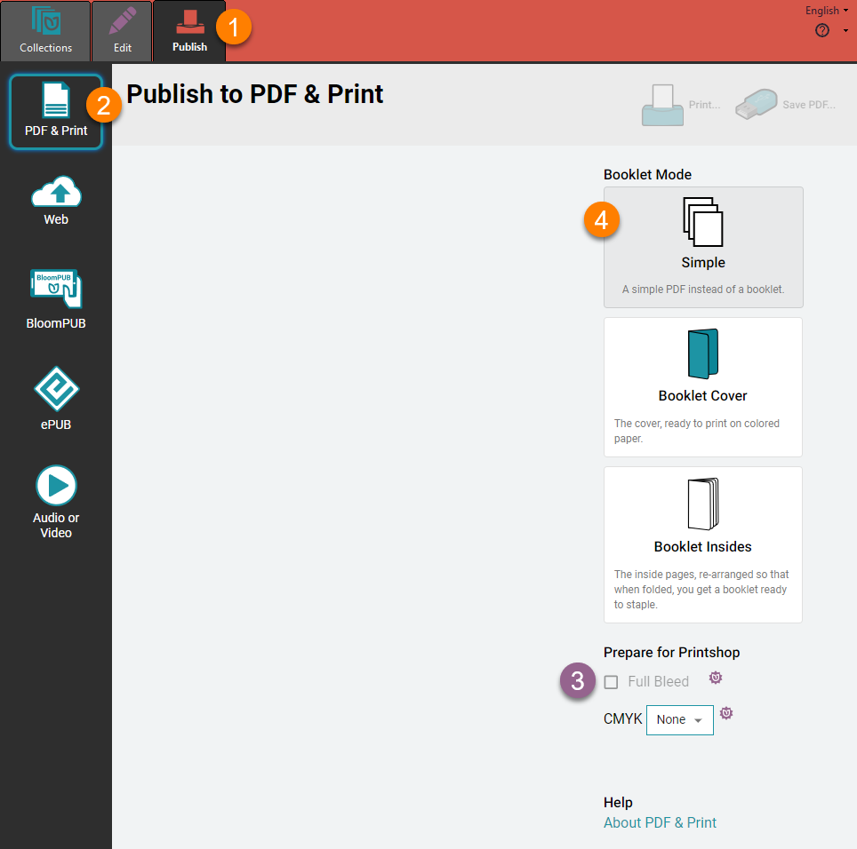
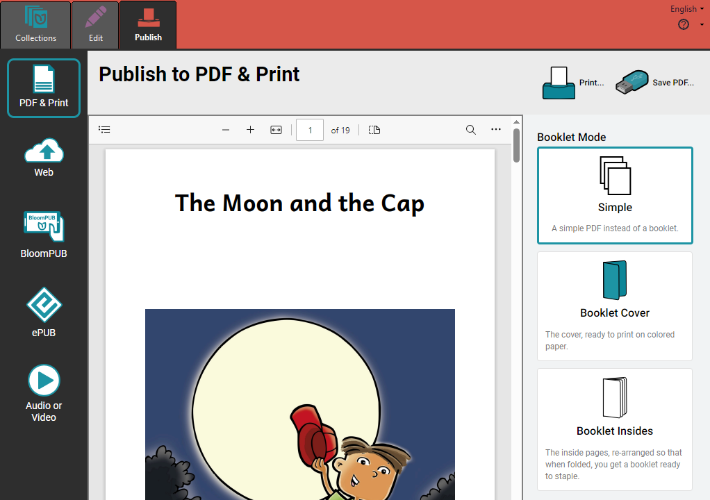
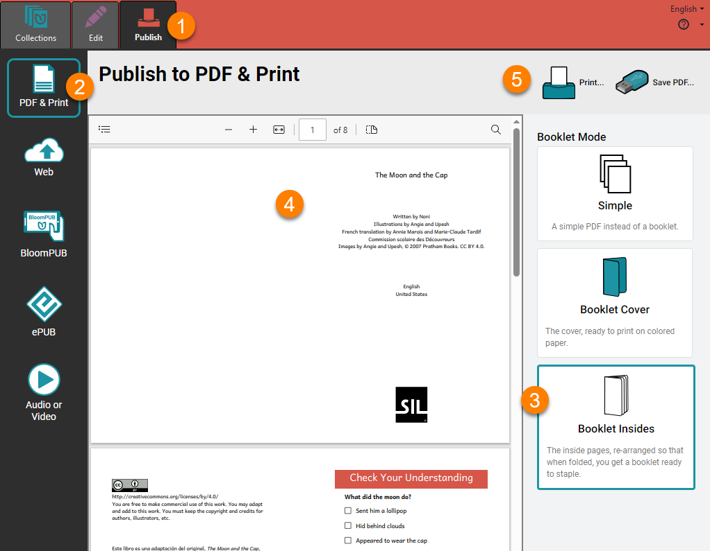

Printing a book is a two-step process in Bloom:

1. First, you use Bloom to create a **PDF** version of your book.

	:::note
	
	A **PDF file** is a computer file that looks like a printed document, with text and graphics.
	
	:::
	
	

2. Then you print and share your book with others.

## Choose a Page Size and Orientation {#b434d49e12b94563ac526dc97b40fb6d}

To get your book ready to print:

1. **Open (Edit)** the book you want to print.
2. Select a **page size** and **orientation** from the toolbar.

	:::note
	
	Choose a paper size that your printer supports. (In this example, we have chosen **A5Portrait**.
	
	:::
	
	

:::note

**Portrait** orientation is taller than it is wide. **Landscape** orientation is wider than it is tall.

:::

## The Publish Tab {#ba243c4f82814779a43df5ed5840620f}

Now click on the **Publish tab:**

This will show you the **Publish tool**. Bloom gives you several options for publishing your book:

1. PDF & Print

2. Web (upload to Bloom Library)

3. BloomPUB

4. ePUB

5. Audio or Video

We will look at the **PDF & Print** option below.

To learn more about the **other options**, see [The Publish Tab](/publish-tab).

## Printing Options {#22eef5a0908e49ad902b4092ba582f83}

Bloom lets you **print/share** your book in several ways:

- [Simple PDF](/printing-your-book#abcd05d5bf7a40cb80c9e13feaf3877a)
- [Booklet Form](/printing-your-book#413953d2bca94e89b08c2d3bfd7732ff)
- [Save and Share a PDF File](/printing-your-book#7f0a0560655f46789a976488bd04a379)

## Create a Simple PDF {#abcd05d5bf7a40cb80c9e13feaf3877a}

The **Simple** option will create a PDF that looks like the pages of your book. If you print the Simple PDF, each page of your book will be printed on a separate sheet of paper.

1. Click the `Publish` tab (you may have done this already)
2. Click the `PDF & Print` button in the left-hand toolbar.
3. **Bloom Enterprise users** can choose to create a PDF with full-bleed images and CMYK four-color separation.
4. Click the `Simple` button in the right-hand toolbar.

When Bloom has finished making the PDF, it will show you a **preview** of the PDF.

## Make a Booklet {#413953d2bca94e89b08c2d3bfd7732ff}

If you want to print your book in booklet form, you create a PDF for the **Booklet Cover** and **Booklet Insides** separately. The booklet cover is separate because it is often printed on heavier or colored paper.

### Create a PDF of the Booklet Cover {#4f0c1bd07b5842bb884fe86c22e0b0d5}

1. Click the `Publish` tab (you may have done this already)
2. Click the `PDF & Print` button in the **left-hand toolbar**.
3. Click the `Booklet Cover` button in the **right-hand toolbar**. Bloom will make a PDF of just the **front and back cover**.
4. Bloom will show you a PDF of the booklet cover, ready to print double-sided.
5. Click the `Print…` button in the **upper-right-hand** corner of the Bloom window.

### Create a PDF of the Booklet Insides {#90196101e03743f7b1cf3d3f5b52123e}

1. Click the `Publish` tab (you may have done this already).
2. Click the `PDF & Print` button in the **left-hand toolbar** (you may have done this already also)
3. Click the `Booklet Insides` button in the **right-hand toolbar**. Bloom will make a PDF of just the **inside pages** of your book.

	:::tip
	
	Bloom will reorder the pages so that when you it double-sided and fold it, you will have a booklet. 
	
	:::
	
	

4. Bloom will show you the PDF of the booklet cover, ready to print double-sided.
5. Click the `Print…` button in the **upper-right-hand** corner of the Bloom window.

## Print {#9ffb5c176a1a4c42a0da205ab84ab915}

After you click `Print…`, Bloom will display a `Print` dialog box:

1. Select the **printer** you want to use from the **printer drop-down menu**.
2. **Adjust** your **printer settings** as needed.
	1. If you are printing a **Booklet Cover** or **Booklet Insides**, Bloom will show you a banner at the bottom of the screen with advice about the **printer settings** you should use:

	

3. Click `Print` to send your book to your printer:

	

:::tip

If you are printing a booklet, your book should come out of the printer ready to be folded and stapled or sewn.

:::

## Save and Share Your Book as a PDF File {#7f0a0560655f46789a976488bd04a379}

### **Save a PDF** {#2ecc690394c94e5cb9ce34ac651a6a62}

You can save your PDF after you have created it. This is true whether the PDF is for a **Simple** book, **Booklet Cover** or **Booklet Insides**.

1. Click on `Save PDF` on the toolbar:

	

2. Bloom will ask you where you want to save your PDF file.
	1. Browse to a location on your computer where you will **save** your PDF.

		

3. Click **Save** to complete the process.

### **Share a PDF** {#3a614bc8728341c0b44572aaf602b6ef}

If you want to share your PDF with someone:

1. Open **File Explorer** on your computer.
2. **Browse** to the **folder** where the PDF file is saved.
3. Find the PDF file(s) you want to share:

	

4. Share the PDF file(s) using email, an online service or messaging app, or a USB flash drive.
