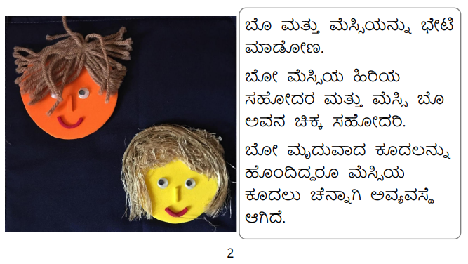
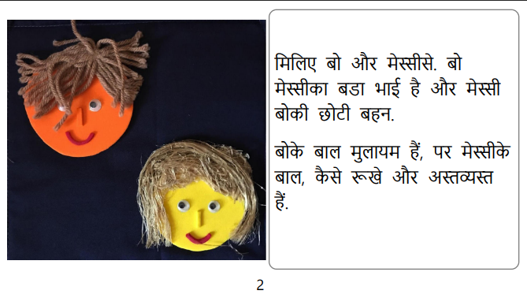
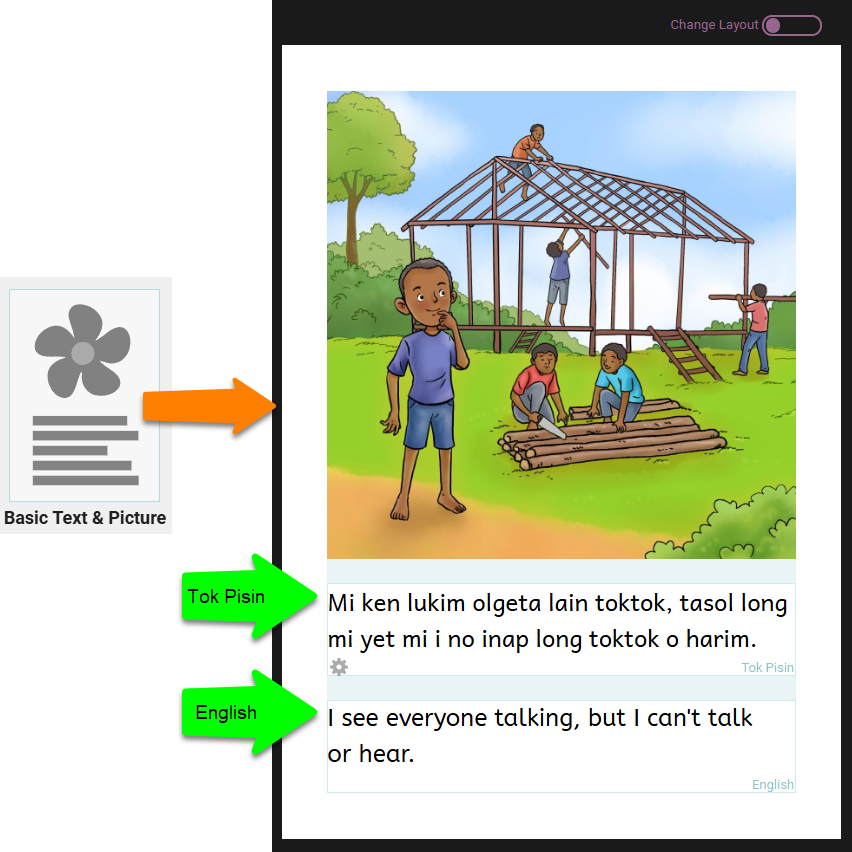
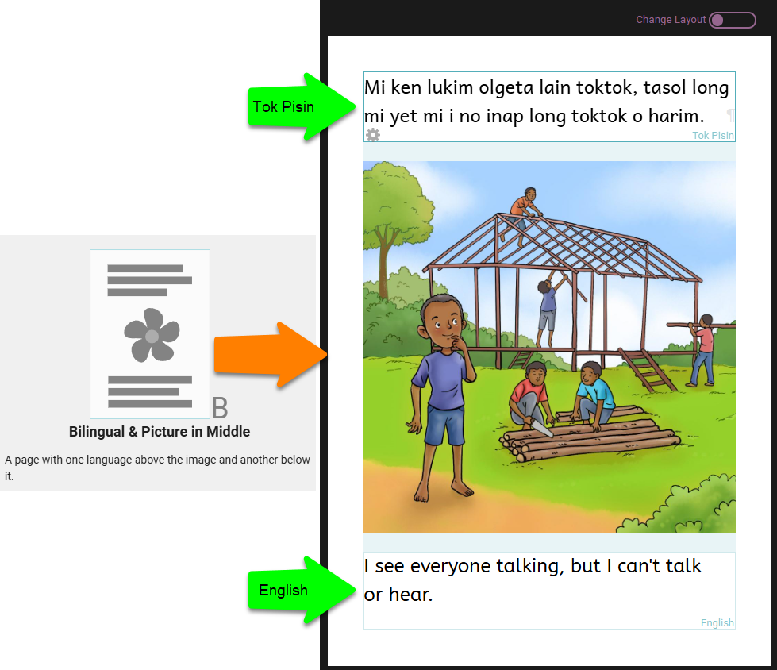
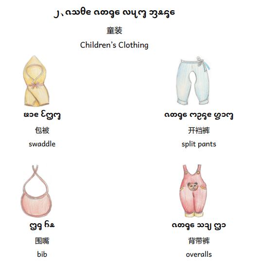
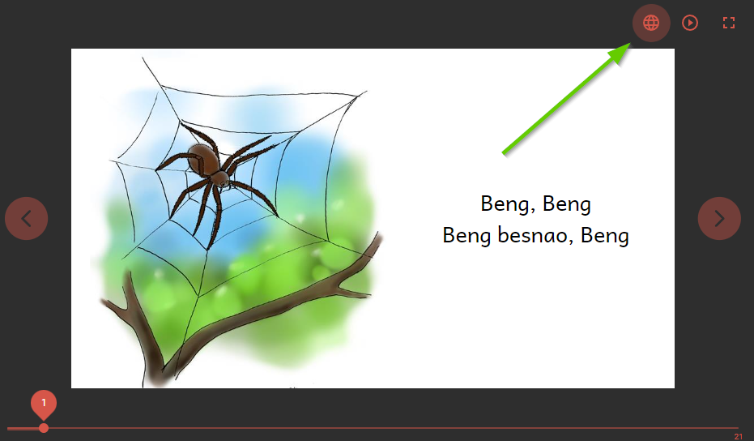
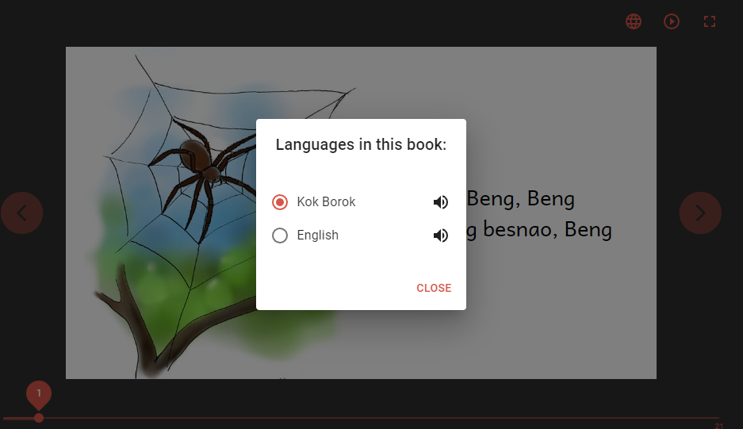

Bloom can be used to create monolingual, bilingual, and trilingual paper books. Additionally, Bloom can also publish digital books in its native BloomPUB format with any number of embedded languages. 

1. [Monolingual Paper Books](/bilingual-trilingual-books#2944bb19df1280c5aef0e84947eb3830)
2. [Bilingual Paper Books](/bilingual-trilingual-books#2944bb19df12807c8dffe571eadcfffa)
3. [Trilingual Paper Books](/bilingual-trilingual-books#2944bb19df1280429739ec445583e4de)
4. [Switchable Language BloomPUBs](/bilingual-trilingual-books#2944bb19df1280d2be72ce0b50d6e03d)

## Monolingual Paper Books {#2944bb19df1280c5aef0e84947eb3830}

Bloom is primarily used to publish simple storybooks. And since most readers only want to read these stories in one particular language, most books are published monolingually. When only one language is shown on a page at a time, that is called a **monolingual** book. Usually Bloom, it is easy to publish multiple versions of the same story in different languages. 

For example, the story “Bo, Messy, and Shampo” is published in Kannada [here](https://bloomlibrary.org/language:kn/book/bw5ofhYNAz?lang=kn):

And Hindi [here](https://bloomlibrary.org/bookHash:8-0DB453F282C25AD4/book/V7mZn7lCcV?lang=hi):

And various other languages. But in each case, only one language is shown on the story pages.

## Bilingual Paper Books {#2944bb19df12807c8dffe571eadcfffa}

In contrast, **bilingual** books show two languages on the story pages at the same time. 

There are two main models for displaying bilingual text. The first model shows the two languages one after another inside of a single Bloom text box:

In the second model, the first language is positioned above the image in one text box, and the second language is placed in a separate text box below.

This model uses the **Bilingual & Picture in Middle** page template:

Bilingual books are a popular format in bilingual education programs.

## Trilingual Paper Books {#2944bb19df1280429739ec445583e4de}

**Trilingual** books show three languages at the same time. Trilingual books are a popular format for reference books like dictionaries:

## Switchable Language BloomPUBs {#2944bb19df1280d2be72ce0b50d6e03d}

BloomPUBs are Bloom’s native format for book publication. BloomPUBs can be viewed online in Bloom Library or offline using Bloom Reader or BloomPUB Viewer for Windows. 

BloomPUBs can handle all of Bloom’s advanced features such as recorded narration, image description, and games. When viewing a BloomPUB, if there are multiple languages have been included (embedded), the reader can switch from one language to another by clicking the globe icon in the top right:

### Related Topics {#2944bb19df12806e861df66a05d5b3ad}

- [Format Text Boxes](/formatting-text-boxes)
- [Book Settings](/book-settings)
- [Collection Settings](/collection-settings)
