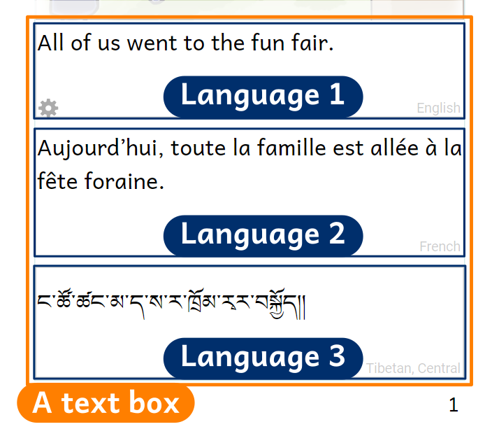
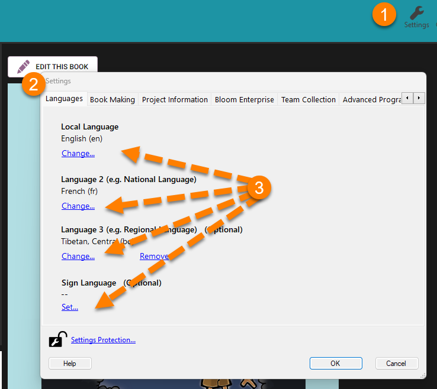
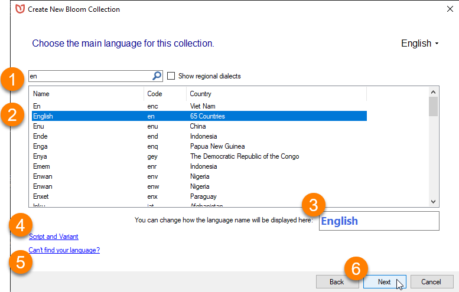
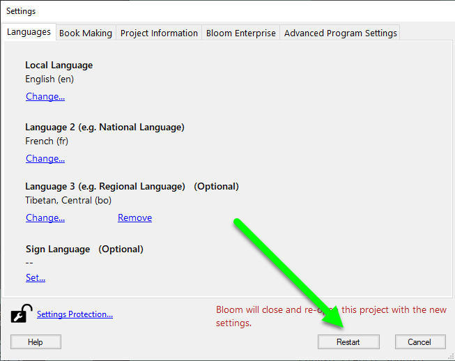
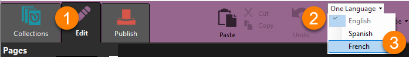
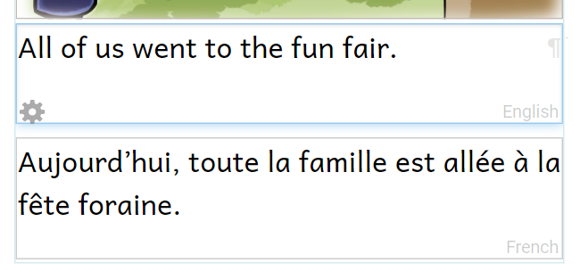
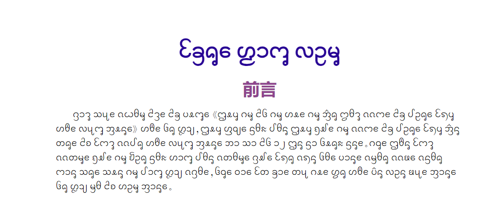
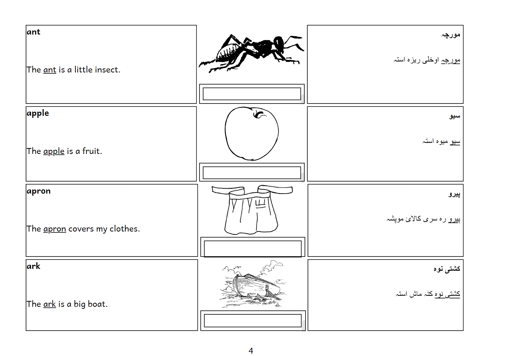

# Bloom Books can Contain Many Languages {#52142f4b0c1843819209f8ec43b35f54}

Bloom makes it easy to print your book in one, two, or even three languages.

# Kinds of Multilingual Books {#ed0db1c7ccbb43b3a442829209b39185}

:::note

Coming soon…

:::

# How Bloom Stores Text in Different Languages {#3e2d9282dc804409a4b3a54bd3d89181}

First, we need to understand how Bloom keeps text in different languages.

The text of a Bloom book is contained in a series of text boxes. Each text box contains a collection of texts: you can think of them as little boxes inside the larger boxes. Each little box is labeled with the language of the text it contains.

Bloom doesn't care how many little boxes there are in a book. A book that you just wrote might have only one language. A book that has been translated many times might have many languages.

Usually, you edit the text in one language at a time.  Other languages in the book appear in the light purple-colored boxes to the right of the page.

The languages that can appear on the page (as opposed to in the pink balloons to the right of the page) are listed in the **Collection settings**. We'll take a look at those next to see how we can make two or even three languages appear on the page.

# Set Your Collection Languages {#ebaa4254627348a7b05c6f642f5c0f6c}

To change the list of languages you can see in your printed book, you need to leave the Edit tab and go to the Collections tools. 

If you are in Edit or Publish mode, first click on the Collections tab, 

1. **Click on the Settings icon in the top toolbar.**
2. **Click on the Languages tab in the Settings dialog box.** Here you can set the languages for your collection.
	- **Language 1** is the "local language": the primary language of your book.
	- **Language 2 (e.g., National Language)** is usually used for the national language.

		:::note
		
		Language 2 is the language that will appear on the book’s front cover to identify the main language of the book. Language 2 is also the language that will appear on the Credits page.  It's OK for Language 2 to be the same as Language 1. 
		
		:::
		
		

	- **Language 3 (e.g., Regional Language) (Optional):**  You don't need to set Language 3 to anything, but you can add it if you want. Often this is used for a regional language.
	- **Sign Language (Optional)** If your book contains a sign language, you can specify that here.
3. **Click one of the** **`Change`** **or** **`Set`** links to change the settings for Language 1, Language 2, Language 3, or Sign Language for your collection.

Bloom will show you a long list of languages. 

:::caution

Remember: this will affect ALL the books in the current Collection!

:::

## Choose a Collection Language {#a475514cec7d46059c898497f89bbb0b}

When you click on a `Change` or **`Set`** language link, Bloom takes you to the same list of languages that you see when you [create a new collection](/create-a-new-collection#51ae111e027546e7b7151d05d85ccec2).  

1. **Scroll through the list, OR begin typing the language name in the search bar.** Bloom will show you a list of one or more languages that match what you typed.
2. **Click on the language's name to select it.**
3. **Change how the language's name is displayed in your collection** (optional).
4. **Specify which script or dialect your collection uses by clicking on** **Script and Variant** (optional).
5. If you can’t find your language in the list, click **Can’t find your language?** for more help.
6. Click **Next**.

If you make any changes to the languages in the Collection Settings, Bloom will need to re-start. 

- Click the **`Restart`** button.

# Choose Your Publishing Languages {#c7dcbf134f37412e8435a7f0eca9cf1f}

Now you can choose which languages from your Collection's list of languages to include in your book. 

1. If you are not already in Edit mode, **click on the Edit tab in the top tool bar to edit your book.**
2. **Click on** **`One Language`** **in the toolbar.**

	:::✅
	
	If there are already two or three languages selected, the tool bar item will say “Two Languages” or “Three Languages”.
	
	:::
	
	

3. **Click one of the languages in the list to add it to your book.**

:::✅

If a language is already selected and you want to remove it from your book, you can click its item in the list to de-select it. You can even remove “Language 1”, and show only Language 2 or Language 3 in your book! 

:::

Now your book displays two languages. 

:::✅

You can even choose all three languages! 

:::

# Make a Book with “Fixed” Languages {#18913e39b4d14c7b9ff60964d4243056}

Bloom lets you flexibly choose whether to show one, two, or three languages. The text boxes for each language are stacked on top of each other. 

(This behavior is controlled by the “Normal” language text box format: In a monolingual book, “Normal” = show language 1; in a bilingual book, “Normal” = show Language 1 and Language 2; in a trilingual book, “Normal” = show Language 1, Language 2, and Language 3. See [Formatting Text Boxes](/formatting-text-boxes#757491e5eef849f7aa33a3e28eaa5912) for more details about text box Language settings.) 

Sometimes you want something different, though. For instance, this page has its main text in Dai, but one text field is in Chinese. 

Bilingual dictionaries often require a special layout where each text box has a fixed language: 

If you need to make a text box that has a fixed language, follow the directions in [Formatting Text Boxes](/formatting-text-boxes#757491e5eef849f7aa33a3e28eaa5912) to set the language of each text box as Language 1, Language 2, or Language 3. (You may also need to follow the directions in [Working with Page Layouts](/working-with-page-layouts) to adjust the layout of your page.) 

# More About Bilingual Books {#72c1ddd76a6541f8b9713d8a58ea9077}

[Monolingual, Bilingual, or Trilingual Books](/bilingual-trilingual-books) 

