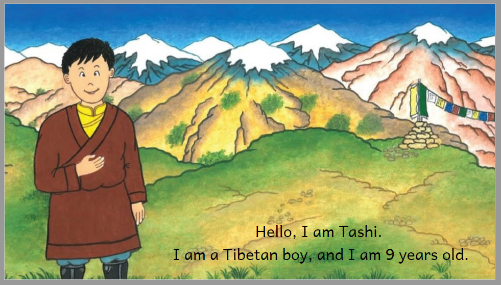

Books can be formatted in a variety of ways and some of those ways are better than the others.

What do we mean by “better”?

We mean that some ways of formatting your book will **better** suit the needs of your intended readership and will communicate your story more effectively to them, while others will not. 

A few simple examples:

- A small font size would not be an appropriate choice if your book is intended for an early reader because an early reader will struggle to read the text; a large font size would be a **better** choice.
- A small picture would likely not capture the interest of most children who are learning to read; a large, colorful picture would be a better choice.

This article will outline some basic considerations for designing your book to most effectively reach your intended audience and most effectively “show off” your book and let it shine!

# Making Wise Layout Choices: an example {#affd985f60df4b03865f5c7d2b6422aa}

Consider, for example, the book “[I Am Tashi](https://bloomlibrary.org/topic:Culture/book/NXVaHwbNTH?lang=bo)” from Bloom Library. 

All of this book’s illustrations are wide, yet the author chose to layout this book in A5 **Portrait**. The author probably chose the A5 Portrait because they needed a format suitable for printing. 

However, if A5 Portrait was not an essential requirement, other formats would probably be a better choice. This is because a portrait orientation does not really “show off” or “highlight” the beautiful illustrations in this wonderful book. Note, for example, the amount of white space in this sample from the PDF and the very small size of the illustration:

Now compare that exact same page should we choose a **Landscape** layout:

Here, the generous space given to the beautiful illustration allows the reader to better appreciate the artwork.

In addition, there are also several ways we might consider to improve the text of this story. 

For example, since this simple story only features very short sentences, we might consider centering the text (both vertically and horizontally), and making each sentence a separate paragraph would make for a more attractive book:

But we have not yet exhausted our options with this book.

Using Bloom Zero Margin eBook theme (see [Page Themes](/page-themes-catalog)) along with Bloom’s Overlay Tool, we could choose to make the illustration fill the entire page like this:

Beauty, of course, is in the eye of the beholder; there are no hard and fast “rules” you must follow when making your books in Bloom.

The point of the above example is simply to encourage you to explore and examine all options for your book — layout orientation, paper size, font size, font choice, etc. — in order to evaluate which of these options will best serve the needs of your intended audience and will allow the story in your book to be fully appreciated.

With this goal in mind, in this article, we will now discuss a number of areas you would do well to explore and evaluate when designing a new book in Bloom. 

# Portrait vs. Landscape Orientation {#f569232f17c64104888da3c0c69cc156}

If your book’s illustrations are all taller than they are wide, typically, this would call for a Portrait layout of your book.

If, however, your illustrations are wider than they are tall, typically, a Landscape orientation would be the best choice. 

This, of course, is just a general rule of thumb based on artistic reasons only. 

However, many Bloom users like A5 Portrait printing because it allows for “[saddle-stitch](https://www.onlineprinters.co.uk/magazine/comparison-binding-types/)” binding. This printing method can often be the more viable and affordable **local** printing solution in some parts of the world.

But what do you do if your images are in landscape orientation, but you really want to take advantage of the saddle-stitch binding available for portrait books?

Well, who says you can only publish one version of your book? 

That’s the question Education for Life asked themselves for their “[Cat and Dog](https://bloomlibrary.org/EFL-education-for-life-org/EFL-CatandDog)” series. Most of the images in this series are indeed landscape (i.e. wider than they are tall):

The solution to this dilemma was to produce **both** a landscape e-book version as well as an A5 portrait print version of the above book:

Here is a page from the landscape e-book:

And here’s the portrait (print) version:

Notice how the print version adapts the material, essentially putting two digital (landscape) pages on one print page.

:::tip

The Bloom editor allows you to easily change the page size and layout, font choices etc. of your book. Take time to experiment with various options and evaluate which will better serve your target audience. 

You can also easily duplicate a book if you decide you need to publish two different layout options for your book. 

:::

# Print vs. Digital Format {#cf4e1c5fdddd46a8a860445ba6ce4a94}

The above section shows how you do not have to choose between print or digital when making Bloom books. In fact, most books designed for print will also display very nicely in digital format (called “Device 16x9” format) without making an extra special version for digital. However, it is important to note that a digital book (16x9) cannot be printed.

:::tip

Most Bloom books designed for printing will display fairly well — but not perfectly — in digital format in Bloom Library or Bloom Reader.

Bloom books designed for digital consumption (i.e. Device 16x9 format) will display perfectly (what-you-see-is-what-you-get) in Bloom Library and Bloom Reader, but such books cannot be printed.

:::

However, if you want your book optimized for print and digital, then you may want to follow the model shown above: publishing two separate versions of your book title.

In addition, there are also some very practical considerations to keep in mind here as well, namely, if you want your books to be printed, you will need to consider the availability of printers for your intended audience (or your project funder).

Moreover, even if printers are available, you should investigate the capabilities and limitations of those printers. 

Here are some crucial questions to ask:

- Does the printer allow double-sided (duplex) printing
- Does the printer allow color or just black-and-white?
- Does the printer allow printing all the way to the edge of the paper (called full-bleed printing)?
- How costly is it to print?

For digital books, of course, all of the above concerns are non-issues. So, if there are significant obstacles to printing your books, you may wish to consider going digital. 

In addition to avoiding the complications and expense of printing, digital BloomPUB books can include narration, image descriptions, and language-switching. 

And with Bloom Library, you have a ready-made distribution portal. 

Finally, with the Bloom Reader app, your books can be enjoyed off-line on any Android device.

Carefully evaluate which format — print or digital — will **best** serve your target audience.

# Separate Text-Boxes vs. Overlay? {#5935062ad6744160ab30dc9f2ec73a43}

Bloom’s [Overlay Tool ](/about-overlays)gives you the ability to add speech bubbles, captions, and transparent text over images. This opens up new possibilities for books published to Bloom’s native format, BloomPUB.

For example, the first page of this story from Pratham Book’s [Story Weaver](https://storyweaver.org.in/) …

… has been recast as a “comic” book in [this Bloom adaptation](https://bloomlibrary.org/comics/book/1ayWSnUb1v?lang=en). Note how the dialogue in the above text box (”Go and buy books,” he said”) has been recast into a speech bubble below (Here children, go and buy some books.). Additional adaptations (freely permitted by Pratham licensing) were also made:

Of course, this is not an either-or choice, you can also have separate text boxes in addition to overlay text:

:::caution

Note: If your intended readership need to reader your books in ePUB format, be aware that some ePUB readers do not handle Overlays. See [Limitations of ePUB Readers](/ePUB-notes). 

:::

## Conclusion {#2924bb19df1280edadbef8fd10bb3223}

:::tip

There are no “right” and “wrong” format choices for Bloom books; rather, there are a number of important, yet often competing format considerations you must evaluate in light of the target readership or community you wish to reach.

:::

## Related Articles {#2924bb19df128067a572c840d916c1b8}

- [BloomPUB vs. ePUB: What’s the Difference?](/compare-bloomPUB-ePUB)
- [Limitations of ePUB Readers](/ePUB-notes)
- [Page Layouts in Bloom](/working-with-page-layouts)
