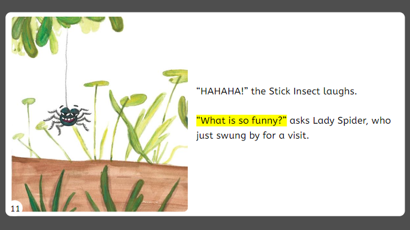

Bloom offers “Page Themes” that you can apply to your book. This catalog describes each theme and shows you what it looks like.

:::tip

Page Themes are available starting in Bloom 6.0

:::

# Default {#b552e6f9633048a79814e34d6ed09524}

The _default_ page theme is a reasonable choice for all books.

This theme uses [larger margins](/margins) for large layout sizes and narrower margins for smaller ones.

:::tip

If you turn off page numbering in the “Default” Page Theme, the page automatically adjusts to give more space at the bottom.

:::

# Zero Margin Ebook {#bc7e6d0c6d214aef9f489c572a4f5be3}

This theme takes advantage of the fact that eBooks don’t really need margins. However, like all of Bloom’s Page Themes, it uses “smart padding” to keep the text from touching up against the screen edges.

This theme looks best when your images are

- square

- wide (with portrait page)

- tall (with landscape page)

:::tip

When you use the Zero Margin theme, it is important that you adjust the image sizer until it says “Fit Image”. If you don’t do this, the page will look ugly with white margins on the edges of the image.

:::

## Rounded Border Ebook {#f652b1beb927406495bbecda3430d921}

This theme has a rounded border with a page number in a circle.

## “Legacy 5.6” {#bb5fbb6e20604d8db26a3645cb9ad73b}

This Page Theme maintains the margins and page numbering from Bloom 5.6 and earlier. You should only use it if you have no other options.

Bloom will automatically use this theme with some older Front/Back Matter packs.

Bloom will automatically use this theme if it detects a `customBookStyles.css` that is not compatible with Bloom 6.0 and onward.

