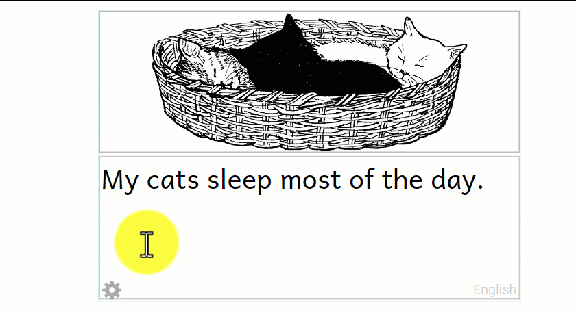
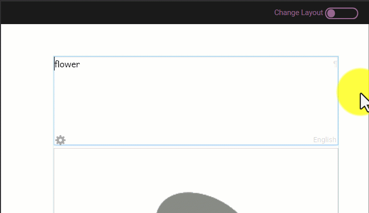
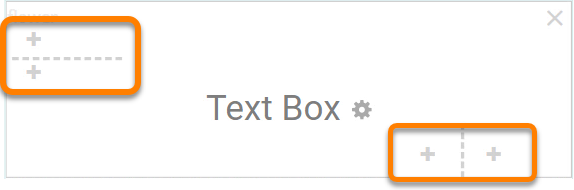
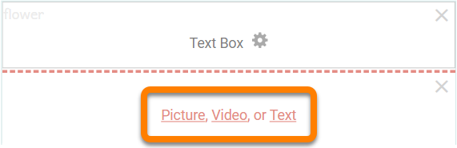
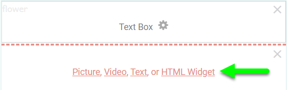
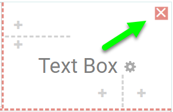
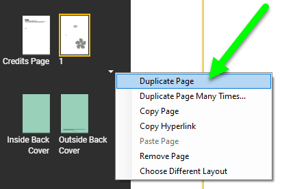
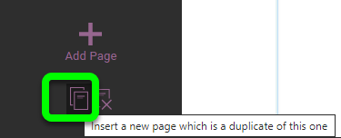
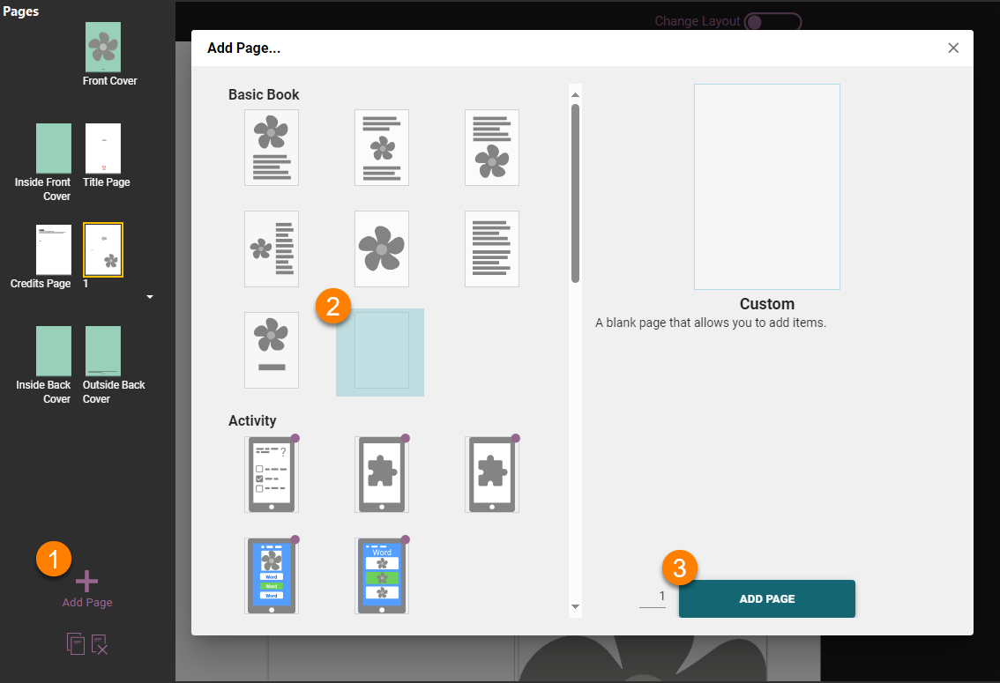

In most circumstances, you will add one of the standard page layouts to your book. But if you want something that looks a little different, there are several ways to customize a page. You can change the sizes of text boxes and images, and you can also add or remove boxes from any page. Finally, you can add a Custom Page and create the boxes that you want on it.

## Choosing a different layout for a page {#d1ee5d7a3bb742998048fc04ce028015}

:::note

Coming soon…

:::

## Changing the size of page sections {#c25724c33e0a4fc5ae36d53d0f0f1361}

You can customize a page by changing the size of the sections. To do this, place your mouse cursor over the **gap between the two sections**. You will see the mouse pointer change to a **double headed** **arrow**. Click and drag the line to change the sizes of your sections.

## Edit a page layout: change, add, and delete page sections {#cc6864f50f4841778838e1da5d6722e5}

You can use the **`Change Layout`** button to add and remove text boxes, image boxes, and boxes for videos and HTML widgets. 

The **`Change Layout`** button is a “slider” button located above the upper right-hand corner of the page. 

1. **Click the Change Layout button.** Your text (if any) will become gray, and the layout controls will become visible.

	

You can use the **"+"** symbols to add new sections. When the **divider line** is **horizontal,** the **"+"** sign adds a section **above** or **below** the existing one. When the **divider line** is **vertical**, the "**+"** sign adds a section **beside** the existing one. 

When you click the "**+"** symbol, the new section is added. Once you have added the new section, you need to tell Bloom if you want a **picture**, **video**, or **text** in that section. Click the option you want.

:::note

[Bloom Enterprise](/bloom-enterprise-overview) subscribers can also insert an HTML widget block. HTML widgets are small, self-contained programs that users can interact with. 

:::

Every time you add a section, Bloom divides the previous section into two equal parts. If you want to have a larger and a smaller section, use the divider to [change the size of the sections](/working-with-page-layouts#c25724c33e0a4fc5ae36d53d0f0f1361).

You can delete a section by clicking the red **X** button in the top right-hand corner of the section.

When you have finished customizing the page, turn off the **Change Layout** mode.  To do this, click the **Change Layout** "slider" button.  Now you can edit the page as usual.

## Duplicating a custom page {#e35588fa93d4455096cc521d2e796d74}

If you want to re-use your layout within your book, click the **down** **arrow** shown below the page on the left, then click **`Duplicate Page`**. (If you want to make multiple copies of your page, you can click **`Duplicate Page Many Times…`**.Bloom will make a copy of your page. Then you can drag the new page and place it where you want it in the book.

:::tip

You can also duplicate the page by clicking on the icon to “Insert a new page that is a duplicate of this one”. The icon is in the lower left-hand corner of the Edit screen, below the “Add Page” button.  

:::

## Creating a custom page layout {#304da51136e548e9b86b8d41597e8ae3}

A third way to customize a page is to choose the **Custom Page** layout when you add a new page. This is an entirely blank page that you can customize using the **Change Layout** controls you have learned how to use.

1. **Click the** **`Add Page`** **button** in the lower left-hand corner of the Edit window
2. **Select the blank Custom page template from the gallery of page layouts**
3. **Click the** **`ADD PAGE`** **button.**

When you add a Custom Page, **Change Layout** mode is turned on for you automatically.  This is because you need to make some choices before you can add content to the page.

