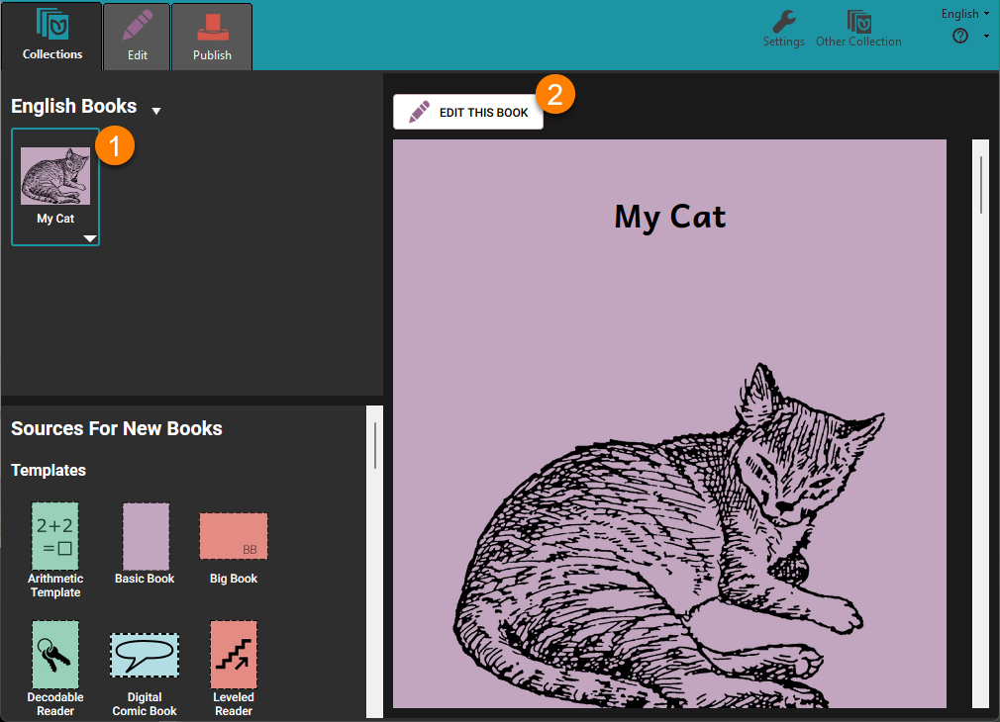
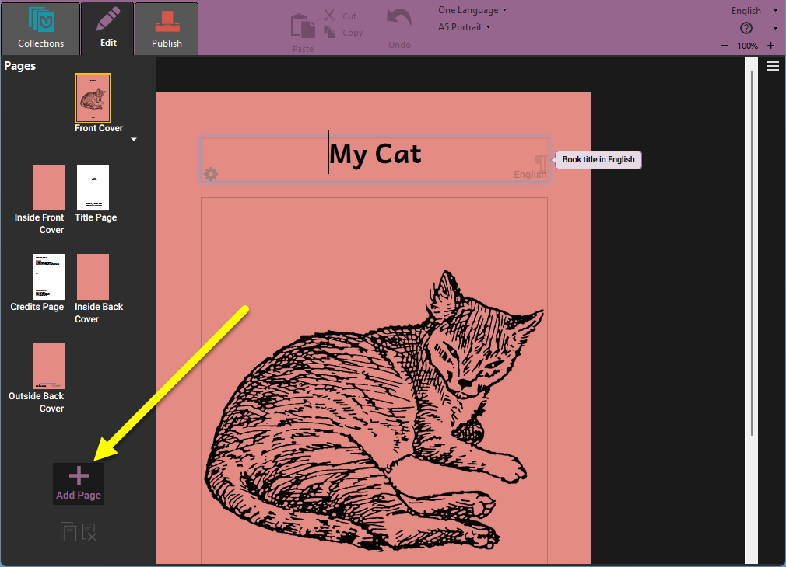
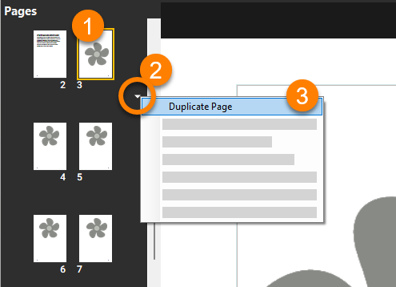
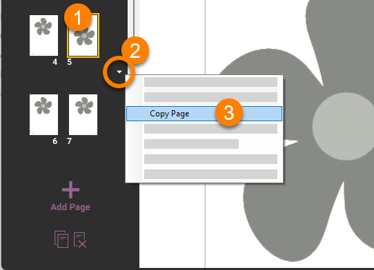
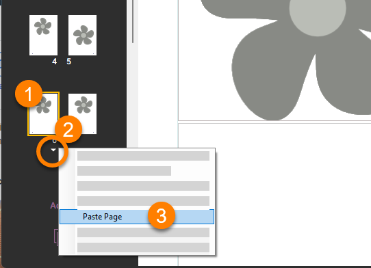
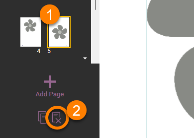
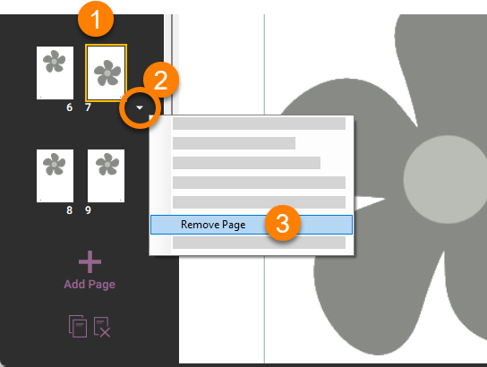
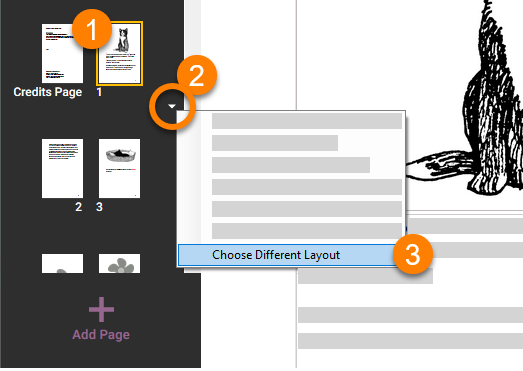

# Bloom is page-oriented {#3e3ea400b9c4424697aee55d151c5e92}

## How to add a page to a book {#7044c9f42b2749d280a4c0e4953fe0fb}

To add a page to your book, you must be in **Edit mode.**

In the **Collections view**:

1. **Select the book you want to edit on the left-hand pane.**

2. **Click** **`Edit this book`** **in the right-hand pane.**

:::tip

Alternately, you can **double-click** the thumbnail image of the book in the Collection pane. 

:::

In the **Edit view:** 

- Click the **`+ Add Page`** button at the bottom of the thumbnails on the left side of the screen.

Next, Bloom will display the **Add Page...** **dialog box** with a choice of **page layouts.**

1. **Click on a page layout in the left-hand side of the dialog box to select it.**

2. **Put the number of pages you want to insert into the number box** (optional).

3. **Click** **`ADD PAGE`**.

:::note

The first time you add a page to your book, Bloom places it just after the Credits Page. When you add more pages, Bloom puts them just after the currently selected page.

:::

## How to reorder a page {#00e14253dc234f85a6e57400a43238b6}

You can reorder a page by **clicking and dragging** its thumbnail icon in the Pages pane. 

## How to duplicate a page {#28bab62b643e46b6b157452cb55e286f}

Sometimes you may want to duplicate a page. Perhaps it has a picture that you want to use on another page, or you have changed the formatting or layout of the page and want to use the same kind of page again. 

1. **Click the thumbnail image of the page you want to remove.**

2. **Click the small triangle below the page.**

	:::note
	
	You can also right-click on the page to show the menu. 
	
	:::
	
	

3. **Choose** **`Duplicate Page`** **from the small menu that appears.**

## Copying and pasting pages {#995d145615764df9a366149c5f9e819a}

You can also duplicate a page by copying and pasting it. 

1. **Click the thumbnail image of the page you want to copy.**

2. **Click the small triangle below the page to invoke the context menu. (**You can also right-click on the page to show the menu.)

3. **Select** **`Copy Page`** **from the small menu that appears.**

4. **Select another page in your book. The page you copied will be pasted after this page.**

5. **Click the small triangle below the page, or right-click the page.**

6. **Select** **`Paste Page`** **from the small menu that appears.**

## Copying and pasting pages to a different book {#09df31db69d74979badbe42cec5ba2e2}

:::note

You can copy a page from one book using this method:
1. Copy the page

2. Open a different book

3. Paste the page into the other book.

:::

## How to remove a page {#3e659e2ddbb348a7a64a3f78dc3bf8b7}

1. **Select the page you want to remove from the list of pages.**

2. **Click the** **`Remove Page`** **icon in the lower left-hand part of your screen.**

Alternately, you can use the page’s context menu: 

1. **Click the thumbnail image of the page you want to remove.**

2. **Click the small triangle below the page to invoke the context menu.** You can also right-click on the page to show the menu.

3. **Choose** **`Remove Page`** **from the small menu that appears.**

## How to choose a different page layout {#51be4fab3b284c94b1e075322d0e7829}

Sometimes you may want to choose a different layout for your page. Maybe you chose a layout with text above a picture, but now you want the text to appear below the picture. 

:::caution

**Changing the layout of a page can cause content to be lost.** It's best to try this first on a copy of the page you want to change.

:::

To choose a different page layout for the selected page:

1. **Click the thumbnail image of the page whose layout you want to change.**

2. **Click the small triangle below the page to invoke the context menu.** You can also right-click on the page to show the menu.

3. **Select** **`Choose Different Layout`**. Bloom will show you the page layout chooser.

4. Choose the layout you want.

Bloom lets you customize your page layout beyond the templates provided in the page layout chooser. See [Working with Page Layouts](/working-with-page-layouts) to learn more.

