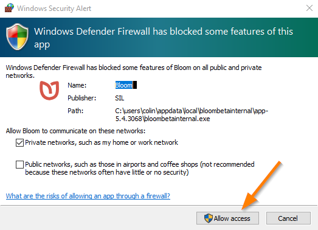

In Bloom, when you Publish your book to BloomPUB, there are three available publishing options:

- **Save BloomPUB File** to your computer
- **Share over Wi-Fi** to a device
- **Send over USB Cable** to a device

The second option allows you to share your BloomPUB to an Android device which has Bloom Reader installed on it. 

When you do this action for the very first time, the “[Firewall](https://en.wikipedia.org/wiki/Firewall_(computing))” on your computer will initially block the action. 

For example, Windows Defender Firewall will show the following alert:

To allow Bloom to share books over Wi-Fi to devices (phones or tablets), you need to click the “Allow access” button. 

You will need to do this once for each new version of Bloom you install.

