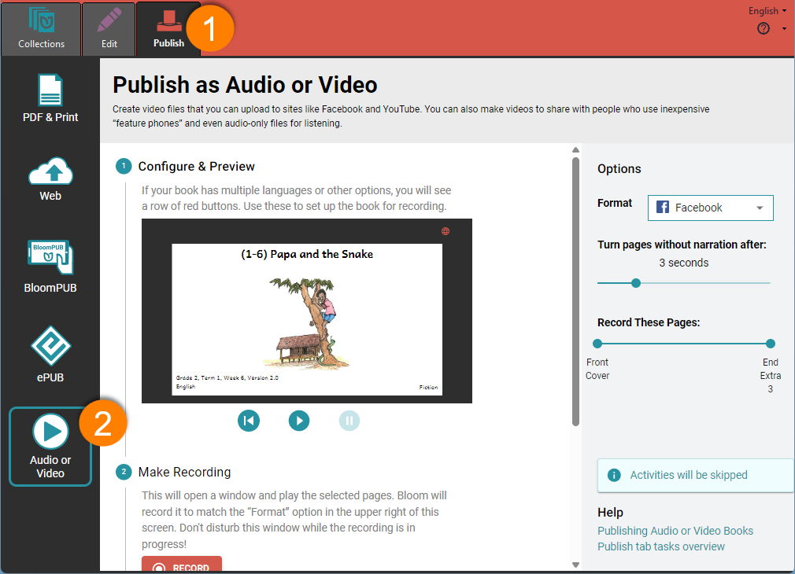

:::note

This is a Bloom subscription feature. For more details, or to subscribe, see [About Bloom Subscriptions](/about-bloom-subscriptions). 

:::

Creating an audio or video version of your book can make it more accessible and engaging for a broader audience. Whether you’re adding narration, background music, or sign language, these features help bring your stories to life. This is especially helpful for those who prefer listening or watching over reading, making your book versatile and inclusive.

:::caution

Videos created from Bloom books have certain limitations. For more info, see: [Limitations of “Publish as Audio or Video”](/publish-audio-video-notes) 

:::

## How To Create an Audio or Video Book {#24f1b539d2804336b4a73518b777930e}

1. **Open the Publish Tab**
1. Click on **Audio or Video**

	

2. **Choose the Format:** Click the **Format** down arrow and select the format you need—**Facebook, Feature Phone, YouTube,** or **MP3 Audio**. (If your book does not have any audio, the **MP3 Audio** option will not be available.)
3. **Select the Language:** If your book includes multiple languages, you will see a small “globe” icon in the preview window.
	1. Click the globe icon to to open the **Languages in this book** dialog box.
	2. Select the language you want to use for the audio or video.
	3. Click **Close** to save your selection.
4. **Preview the Book:** Click the **Play** button to preview your book.
5. Adjust the **Turn pages without narration after** slider if you need to change the timing between page turns.
6. Click the **Record** button to begin recording. 
A small recording window will appear and close automatically when finished. **DO NOT CLOSE THIS WINDOW WHILE THE RECORDING IS BEING MADE!**
7. **Check Recording:** Click the **Play Recording** button to open and review your recording in the default viewer.
8. **Save the File:** Click **Save**, select the folder where you want to save the file, and click **Save** again.
