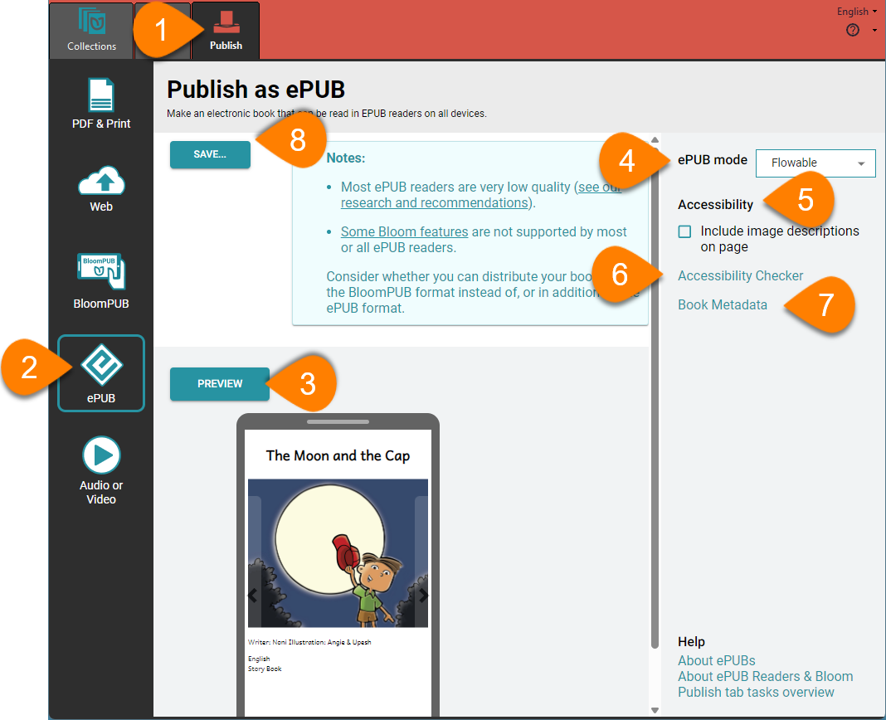

Creating an ePUB version of your book allows it to be read on various electronic devices, including smartphones, tablets, and computers. This flexibility helps you reach a wider audience and ensures that your content can be accessed anytime, anywhere. ePUB files are compatible with a range of ePUB readers, allowing for a more personalized reading experience. Depending on the device and reader, users can adjust text size, layout, and even enjoy added features like recorded audio. 

:::note

The ePUB format is widely used, but many ePUB reader applications are of low quality, and some Bloom features are not supported by ePUB readers. You may want to consider whether you can distribute your book in the BloomPUB format instead of, or in addition to, the ePUB format. See [BloomPUB vs. ePUB: What’s the Difference](/compare-bloomPUB-ePUB) for more details. 

:::

## Steps to Create an ePUB {#360a405630b64c9898bd9567ee13a747}

1. **Open the Publish Tab.**
2. **Select ePUB.**
3. **Click the** **`PREVIEW`** **button** to see a preview of your book (optional).
4. **Click the** **`ePUB mode`** control and choose between **`Fixed`** or **`Flowable`** mode.
	- **Fixed** mode displays pages exactly as seen in Bloom and requires ePUB readers that support ePUB3.
	- **Flowable** mode allows the ePUB reader to adjust the layout, which can be useful for readers who want to change font size.
5. **Include Image Descriptions (optional)**
	- If you selected **Flowable** mode, you can choose to include or exclude image descriptions.
6. **Click** **`Accessibility Checker`** to ensure your book meets accessibility standards **(optional)**. This step is crucial for making your book readable by a broader audience, including those with disabilities.
7. **Click** **`Book Metadata`** to add important information about your book, such as the title, author, and keywords **(optional)**
8. **Click the** **`SAVE...`** **button to save your ePUB file.**

## Related Topics {#7cfe3037c71c4689af46f343988954a9}

- Accessibility
- Bloom Accessibility Checker dialog box
- Book Metadata dialog box
- ePUB Readers
- Publish tab tasks overview
