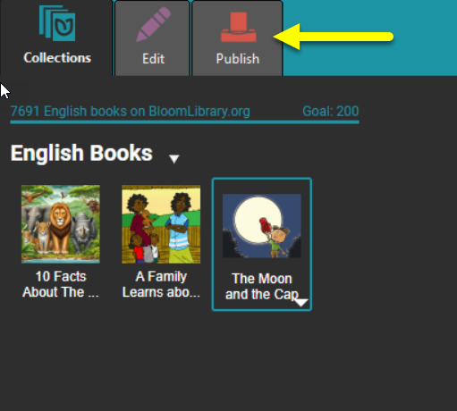
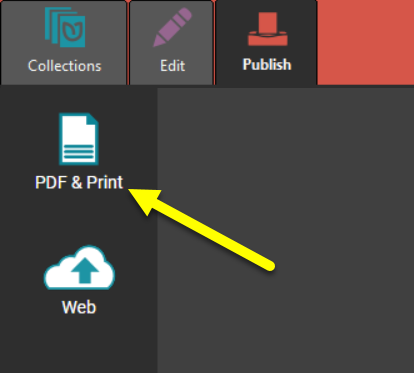
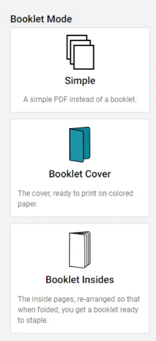
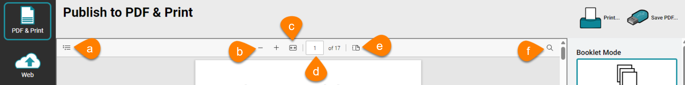

---

Publishing your Bloom book as a PDF file allows you to easily print or share your book. 

:::tip

**Digital Publishing**: Please note that a PDF cannot contain a video, only a still image. So, if your work contains videos, consider digital publishing options like BloomPUB or ePUB.

:::

### Steps to Publish Your Book as a PDF file {#da0528b5c0aa4d24b88d6c217e10207f}

1. In the **Collections** tab, click the book you want to publish. Then, click the **Publish** tab.

	

2. In the left pane, choose **PDF & Print**

	

3. In the right pane, choose one of these options:
	- **Simple**: Creates a simple PDF file of the entire book.
	- **Booklet Cover**: Creates a PDF of only the cover pages. This is useful if you want to print the cover separately — for instance, on heavier-stock paper.
	- **Booklet Insides**: Creates a PDF of the inside pages, arranged for easy booklet folding and stapling.

		

		:::note
		
		If the page size and orientation don’t allow a booklet format, the **Booklet Cover** and **Booklet Insides** options will not be available.
		
		:::
		
		

4. In the center pane, a preview of the PDF file will appear.

	:::note
	
	The preview pane includes a number of toolbar controls: 
	1. Click **Contents** to hide or show the table of contents (if your book has a table of contents).
	
	2. Click the minus or plus signs to **zoom out** or **zoom in** on the displayed page.(You can also use the keyboard shortcuts **Ctrl + Minus** or **Ctrl + Plus**.)
	
	3. Click **Fill width** to make the pages fill the center pane. (Use Ctrl + \ as a shortcut.)
	
	4. Edit the **page number** in the box. Use Ctrl + Alt + G to select and edit the page number.
	
	5. Click **Page view** and choose to display one page or two pages. For two pages, you can show the cover page separately.
	
	6. Click to open a search box and type the word(s) you want to **find**.
	
	
	
	:::
	
	

5. **Prepare for Printshop** (Optional; requires Bloom Enterprise)
If you have a Bloom Enterprise subscription, you can take advantage of additional features to prepare your book for professional printing
	- **Full Bleed**: This adds a bleed box to the pages. (Note that this is available only if your book was created using the `Paper Comic Book` template, or your Enterprise subscription includes Full Bleed.)
	- **CMYK**: Convert the color space of your book from RGB to CMYK. The current options are `None` (which keeps the colors in RGB) or `U.S. Web Coated (SWOP) v2`.
6. Save the file or print it directly.

### Related Topics {#c5a58d59118146afb7ef85b120ca295d}

- Publish tab tasks overview
- Save PDF file

---

