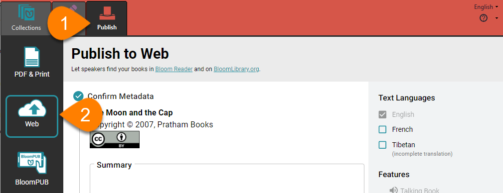
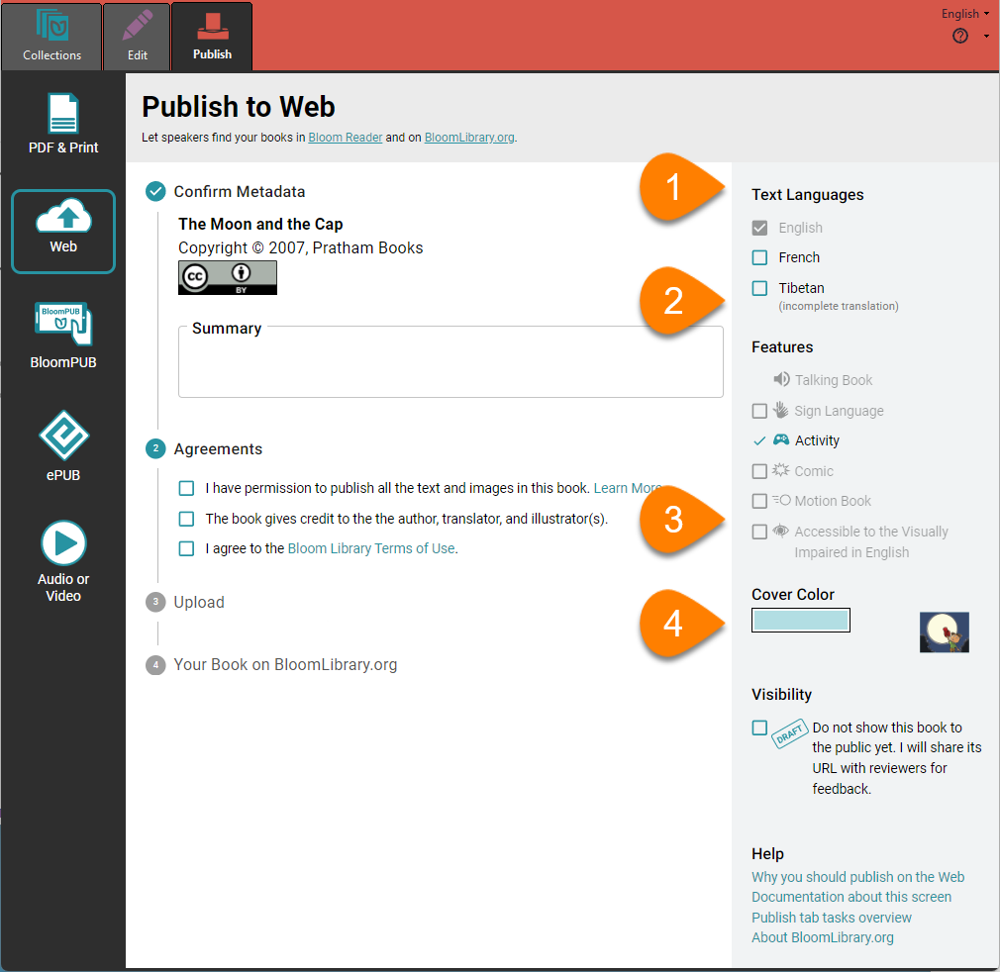
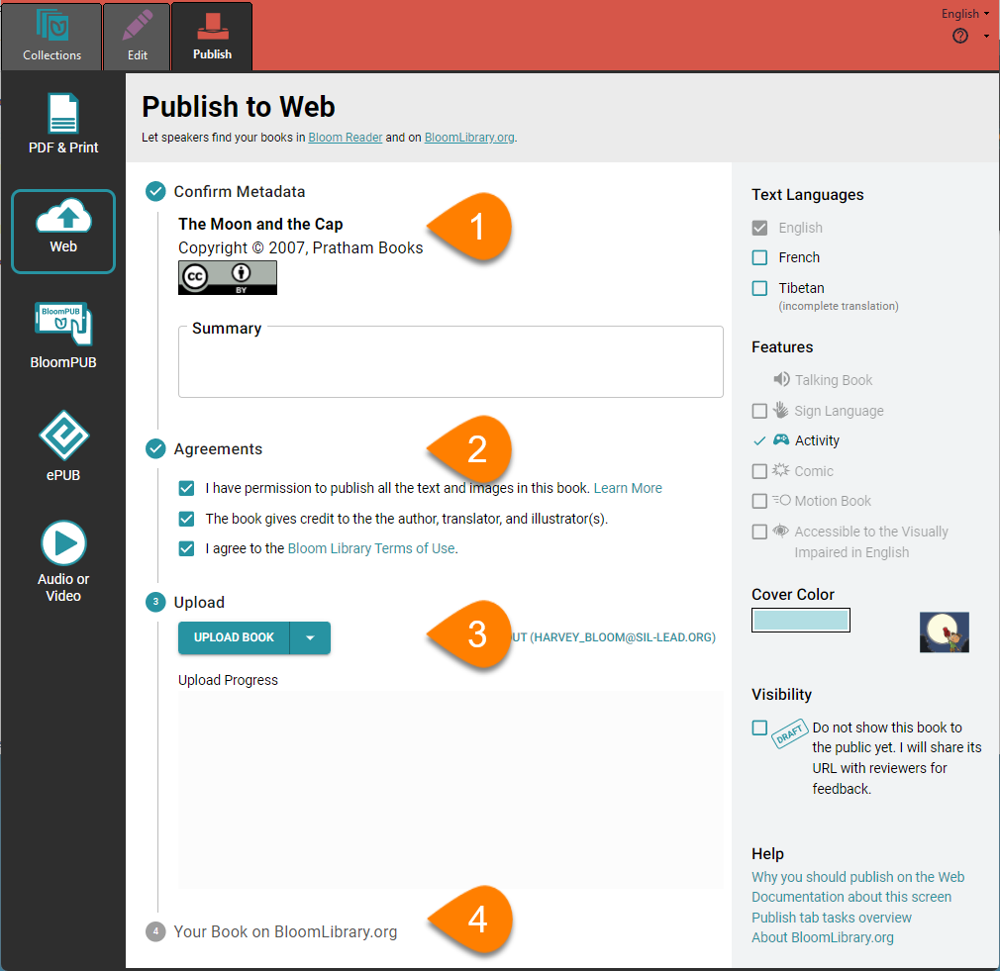
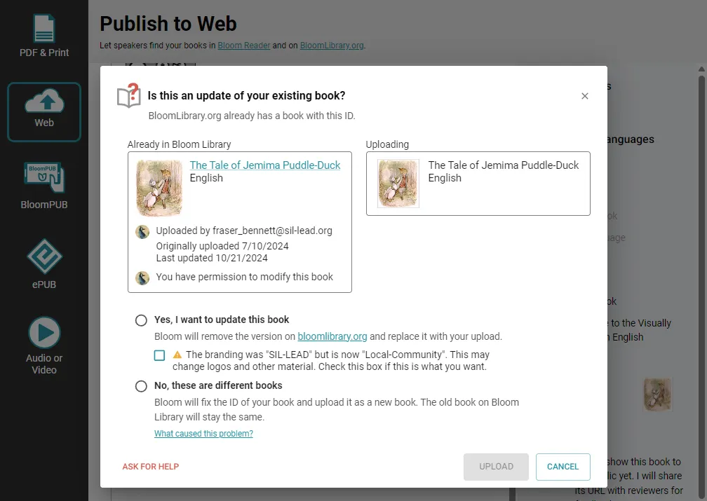

## Publish to the Web on Bloom Library {#1e0f14666f3a4162bb084dcb87c4d883}

Bloom was made for sharing! By sharing your work on [BloomLibrary.org](http://bloomlibrary.org/), you can make your content accessible to anyone with an internet connection. Whether you're sharing educational resources, stories, or instructional materials, publishing to the web makes your book available in multiple formats, increasing its impact.

## Before You Begin {#c92160876a4c431e8396cda3cca84275}

- Ensure you have an active internet connection.
- Ensure that you have an account on [bloomlibrary.org](https://bloomlibrary.org/)
- Check your Bloom Enterprise Status if you want your book to appear in a specific Bloom Library collection.

## **How To Publish Your Book to Bloom Library** {#1dc76e9180f94dc4a07c1cebcc5759df}

1. **Click the** **`Publish`** **tab.**
2. **Select** **`Web`****.**

## Set options {#87b48402d11d433bb00d0314a0292cfa}

Next, you can set some options for the book you will upload. 

1. **Select the languages** you want to include in your book by checking or unchecking the boxes in the `Text Languages` section of the right-hand pane.
2. **Select the book features** you want to include by checking or unchecking the boxes in the `Features` section of the right-hand pane.

	:::note
	
	Only languages and features you have included in your book can be checked: if you have not used any of the features shown, all of them will be inactive.
	
	:::
	
	

3. **Cover Color:** Choose a color for the cover of the book (optional).
4. **Visibility:** Select **`DRAFT`** if you only want those with the URL to see the book.

	:::note
	
	Once you're ready to make your book public, you can re-upload it with the “Draft” option cleared, or change the `Draft` setting in the Bloom Library website.
	
	:::
	
	

### Upload your book {#5bee772705204fe890ad955cd1d023e4}

Finally, you can upload your book! 

1. **Confirm Metadata:** Ensure all metadata is accurate and add a book summary.
2. **Agreements:** Read and agree to the necessary statements.
3. **Upload**
	- **Ensure that you are logged in to your** [**bloomlibrary.org**](https://bloomlibrary.org/) **account**
	- Click `UPLOAD BOOK`

		:::note
		
		Bloom Enterprise customers can choose whether to upload a single book, the entire collection, or a folder of collections. 
		
		:::
		
		

4. **Your book on BloomLibrary.org:** Bloom will show you a link to your book’s page on [bloomlibrary.org](https://bloomlibrary.org/). Click the link, and Bloom will open your web browser and navigate to the page. There you can view and manage your book.

## Updating a book on Bloom Library {#5b078502785c4a3092b3025f3316a69d}

If Bloom Library already has a book with the same ID number, you must specify whether the book you are uploading is an update to the existing book, or a different book. 

- Choose **Yes, I want to update this book** if your book is a new version of the book that is already in Bloom Library. Your new book will replace the older version.
- Choose **No, these are different books** if you are uploading a different book. Bloom will assign a new ID number to your book and add it to the library. The older book will remain in the library.

	

## **Managing Your Published Books on bloomlibrary.org** {#126df12515e2423e85dfdcd007702751}

 You can manage your book from the [bloomlibrary.org](https://bloomlibrary.org/) site. You can…

- Set or clear the “Draft” status of a book
- Show or hide which download formats are available to others (PDF, ePUB, or BloomPUB).
- Delete your book from Bloom Library.

Note that you must be logged in to your [bloomlibrary.org](http://bloomlibrary.org/) account to manage your book. For more details see [My Books](/my-books). 

