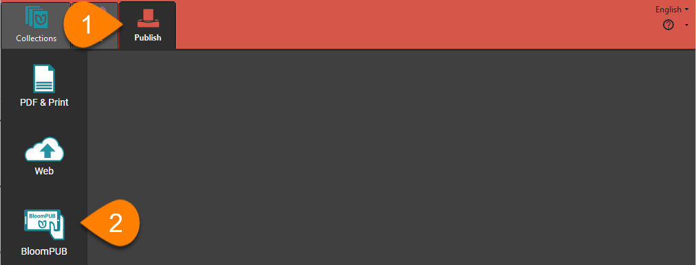
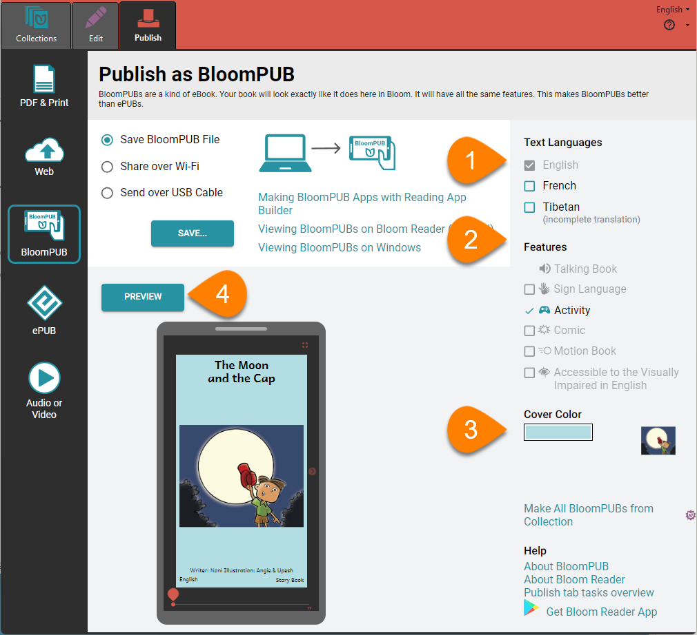
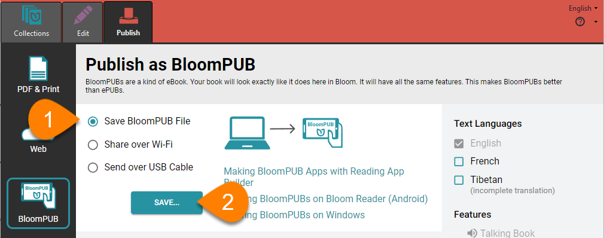
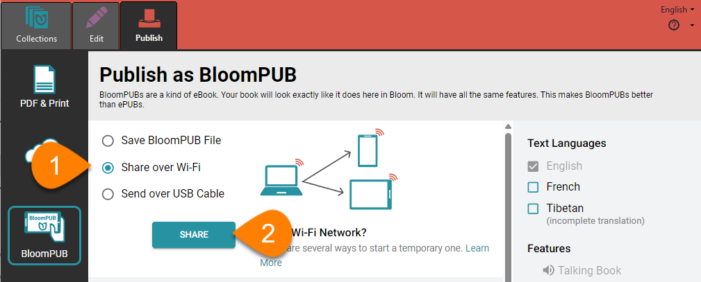
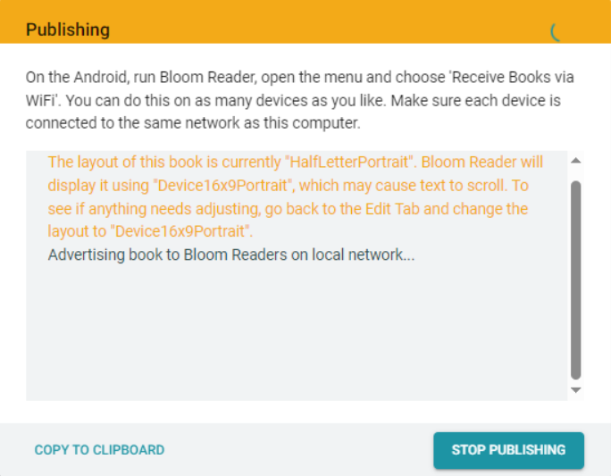
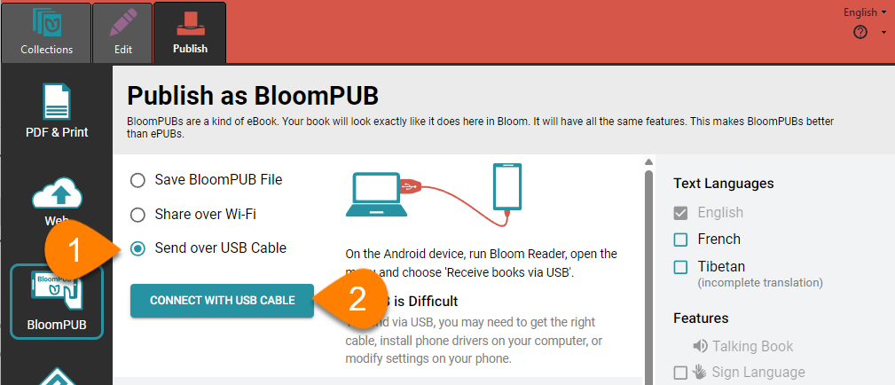

**BloomPUB** is Bloom’s own format for viewing digital books on Android and Windows devices. BloomPUB faithfully reproduces all the features of Bloom Editor, including Talking Books, sign language books, books with multiple languages, motion, and activities. 

:::note

For more information on BloomPUB and how it differs from the widely-used ePUB standard, see [BloomPUB vs. ePUB: What’s the Difference](/compare-bloomPUB-ePUB). 

:::

## How to make a BloomPUB file {#8f81df1a6f04441db2c305dc6af5fa6d}

To make and share a BloomPUB of a book, select the book you want to publish. Then: 

1. Click the Publish tab.
2. Click `BloomPUB` in the left-hand pane.

### Set Options and View Preview {#ac5af366d9dd4d33ad862d10657f3370}

Next, you can set some options for the book you will upload. 

1. **Select the languages** you want to include in your book by checking or unchecking the boxes in the `Text Languages` section of the right-hand pane.
2. **Select the book features** you want to include by checking or unchecking the boxes in the `Features` section of the right-hand pane.

	:::note
	
	Only languages and features you have included in your book can be checked: if you have not used any of the features shown, all of them will be inactive.
	
	:::
	
	

3. `Cover Color`: Choose a color for the cover of the book (optional).

1. Click `PREVIEW` to view a preview of your book (optional, but recommended)

## Sharing Your BloomPUB {#f7fc4f8b51d3458f9427d2a0c654e22d}

Bloom gives you multiple ways to share your BloomPUB book.

### Save BloomPUB file {#6e7ebbbc73df46bfb94e791442c8aef3}

The surest way to share a BloomPUB book is to save it as a file. Then you can send the file to someone else by email or WhatsApp, save it to an SD card, or any other way you can share a file. You can also view the BloomPUB file on a Windows computer by using the BloomPUB Viewer application. 

1. Click `Save BloomPUB File` in the center pane of the Publish tab
2. Click `SAVE...` to save the BloomPUB file to your computer

### Share a BloomPUB over Wi-Fi {#cde8582f3e33455b91d106ab4a0cc716}

You may be in a setting where other users can connect to a temporary wi-fi network—for instance, if you are leading a workshop. Bloom can use your computer’s Wi-Fi to create a temporary network for sharing a BloomPUB book. 

1. Click `Share over Wi-Fi`
2. Click `SHARE`

	

	1. Important Note:

		:::caution
		
		If your computer’s firewall software prevents you from sharing by Wi-Fi, see [Share a BloomPUB Over Wi-Fi (Firewall Permissions)](/bloom-firewall).
		
		:::
		
		

3. You should see a window like this:

	

4. Follow the steps in [Receive books via Wi-Fi](/get-books-bloom-reader#9fce48475dce400ba9ff71c9870976d7) to receive the book on your Android device.

### Share a BloomPub over a USB cable {#ceafe81bd00f47e4be62323b7581e8a9}

You can connect an Android device to your computer with a USB cable and save your BloomPUB directly to the device. 

1. Click `Send over USB Cable`
2. Click `CONNECT WITH USB CABLE`

	

	1. Important notes:

		:::caution
		
		The Android device must have the [Bloom Reader App](https://bloomlibrary.org/page/resources/bloom-reader) installed.
		Some Android phones do not allow file transfer with a USB cable. If you are unable to transfer via USB, check the drivers on your computer, the settings on your phone, or try to transfer the BloomPUB file another way.
		
		:::
		
		

3. Follow the steps in [Receive books via USB](/get-books-bloom-reader#06a74e83b8f54577b359ee12885f45eb) to receive the book on your Android device.
