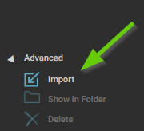
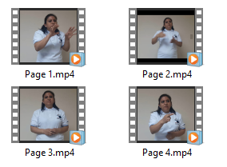

:::caution

This page was written for an older version of Bloom and may contain outdated content.

:::

You can also choose to make your video recording outside of Bloom and then **import** it into Bloom after editing.  

To import a video, click on **Advanced**, then click **Import**.

Your file browser will open. Use the browser to navigate to the video that you would like to import, click on it, and then click Open. 

A thumbnail of the imported video will now appear in the video section of the page.

