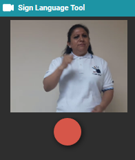
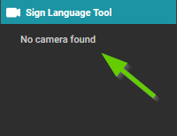
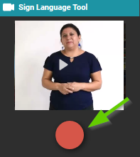
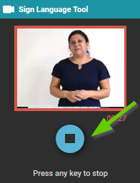
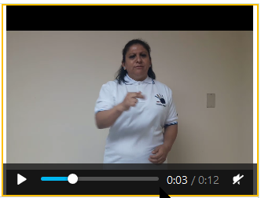

# How to Use the Sign Language Tool {#bb64d2d90ab14799b4a69849c0231491}

You can use the Sign Language Tool to record video directly in Bloom, using your computer’s camera.

When you initially make a Sign Language book, the Sign Language Tool — located on the far right-hand side — will open automatically. What is being captured by the video camera device your computer is using will appear in the tool window. 

If Bloom can not find your video camera, you will see a message, “No camera found”. You will need to consult a computer technician to resolve that problem.

# Record Video in the Sign Language Tool {#80f3aee15fd94098bb2c6ec7f536d0f3}

To begin recording video of you or the individual signing, click on the **round record icon**. 

A 3-2-1  will begin. When the countdown finishes, recording will begin. 

When you are finished recording, click the record icon again to stop recording, or touch any key on the keyboard. 

:::tip

Note: The Sign Language Tool does not record audio.

:::

# Review Your Video {#f3c16337f74a445db62a3304abddede7}

A thumbnail of the video you have recorded will now appear in the video section of this page. If you hover your mouse over the video thumbnail on the page, a play icon will appear. This indicates that a video file has been successfully inserted into this page.

Click the play icon to review your video.

# Import Video {#673262d5d17b4904878359c342b09b2b}

You can also import video into the Sign Language Tool. See [Import Video](/5a3f789a-d372-4f3d-b22a-39adcf6b6927).

