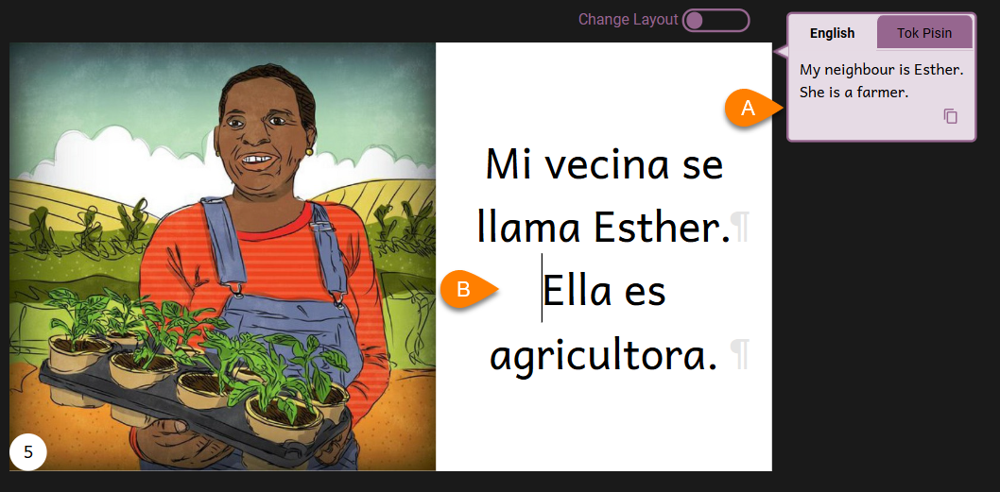
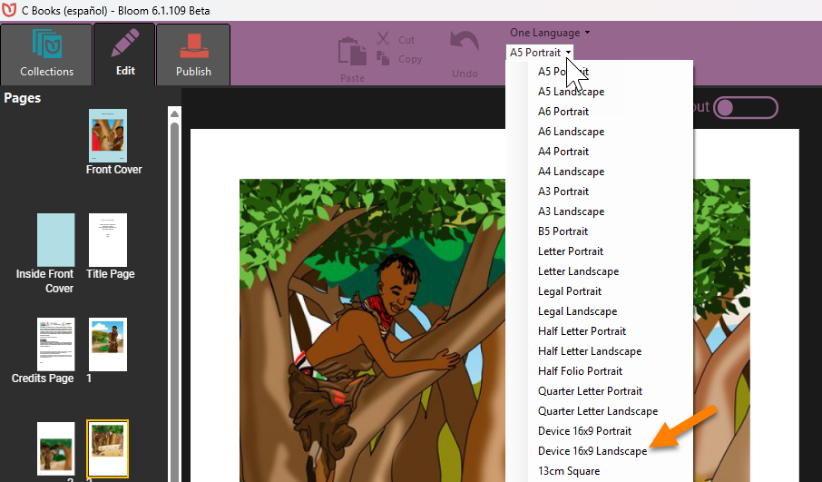
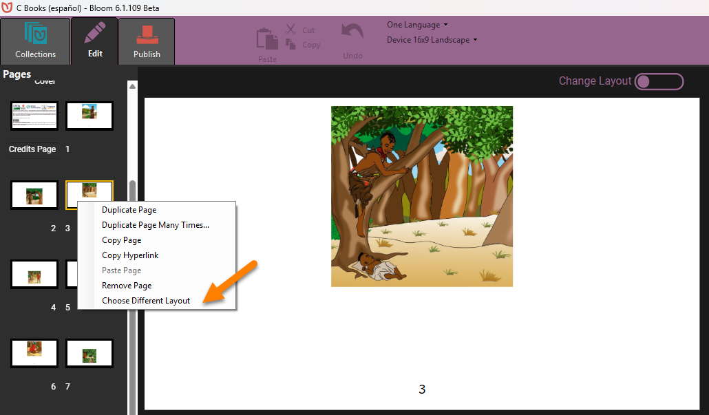
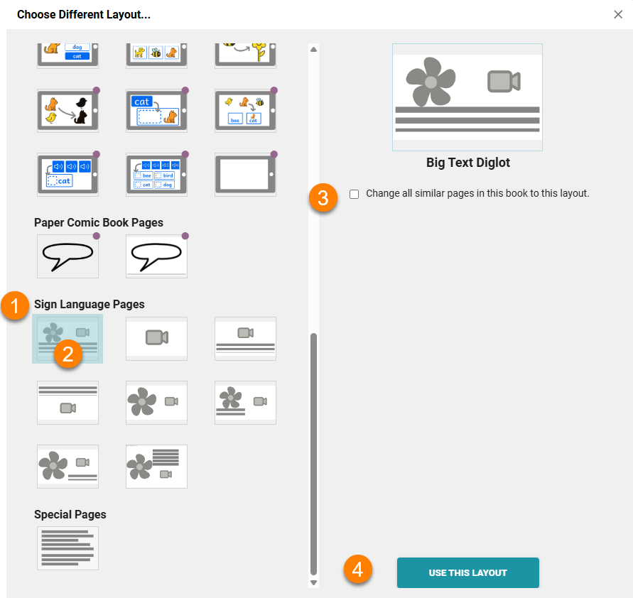

Bloom Library contains 20,000+ [shell books](/shell-books-in-bloom) that can be easily adapted from one written language into another written language by using source language from the original book as a guide to translate the book into your new language:

But what if you want to translate a shell book from some written language into a Sign Language? How do you do that?

Fortunately, Bloom makes it easy to transform a written books into a Sign Language book. 

If the source book is not using the Device Landscape page format, the first step is to change the book to Device Landscape:

Next, you need to change the layout of the pages to include a placeholder for a Sign Language video. To change the layout of a page, right-click on any page and click "Choose Different Layout":

Next, you need to:

1. Scroll down to the section with has Sign Language Pages.
2. Choose the Sign Language page layout that you prefer.
3. Tick this box if you wish to transform all similar pages to the new layout.
4. Click the button to confirm and apply the change in layout.

:::tip

Some of the page templates for Sign Language include a placeholder for text, while others do not. The choice of whether to include text in a Sign Language book is a personal decision that should be based on a careful reflection of the target audience you have in mind and your publishing goals.

:::

