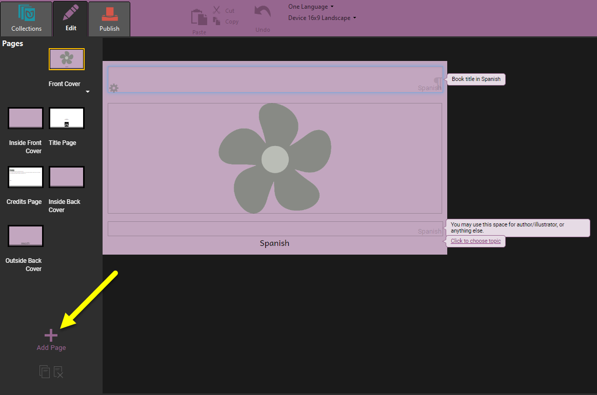

# Create Sign Language Books {#f5582800b9b64e1b8205b3f02c298618}

People who are Deaf* communicate using sign language. Video is one medium that is commonly used for recording sign language communication. Bloom’s Sign Language book template has a placeholder to add sign language video. A page can contain only a sign language video or a sign language video combined with images, text, and/or audio.

:::tip

When “deaf” is spelled with a lower case “d”, it refers to the fact that someone cannot hear. When it is spelled with a capital “D”, it refers to Deaf culture and community. In this module we are referring to those who identify themselves as Deaf and communicate using sign language.

:::

# What To Expect in This Module {#5978372cdf994e5fa6555e5f1991641d}

In this training module, you will learn how to:

1. [Choose the Sign Language Book Template](/sign-language-books#8626cc2f6f744298b6c66ef4eb657a32)
2. [Choose a Page Design that Contains a Place for Video](/sign-language-books#e50de5517fac4c5d90446c8f03d53c2c)
3. [Add Video to Your Pages](/sign-language-books#0c978d99256d4dfcbd24cafe6054610e)

# Choose the Sign Language Book Template {#8626cc2f6f744298b6c66ef4eb657a32}

1. Begin by choosing the **Sign Language** book template.

	

2. Then click `MAKE A BOOK USING THIS SOURCE`.

# Choose a Page Design that Contains a Place for Video {#e50de5517fac4c5d90446c8f03d53c2c}

1. Click on the **Add Page** button in order to select from several page templates that contain a place for video:

	

	Under the **Sign Language** section, you can recognize these are sign language page templates because they contain the icon of a video camera. 

2. Click on the thumbnail of the page template that you would like to use.
3. A larger thumbnail of the template will appear at the right.
4. Optional: Change how many times to insert this page template.
5. Click **Add Page** to use this template page in your book.

	

6. If Bloom asks to `use your camera(s)`:

	

	- Click `Allow`.

## How to Use a Page Design that Contains a Place for Video {#2b13b14a9a1c418eb9f9702029164e61}

After you choose a video page, a blank page will be added to your book:

Now you can add content to the page. You can add things like:

1. Picture(s)
2. Video (see [Add Video to Your Pages](/sign-language-books#0c978d99256d4dfcbd24cafe6054610e))
3. Text

# Add Video to Your Pages {#0c978d99256d4dfcbd24cafe6054610e}

Next, you need to add video to the page. There are two ways to do this:

1. [Record video using your computer's camera](https://www.notion.so/hattonjohn/Record-Video-in-the-Sign-Language-Tool-1e35bcc6c4c94f4cacb449a337828de9)
2. [Import a video from your computer](/import-video)

# Change Tools {#d8b4db9d96424e698a5b1bfc898e8da8}

When working on a Sign Language book, you may want to change from using the Sign Language to the Talking Book Tool or to some other tool.

Play this video to learn how to change to a different tool:

