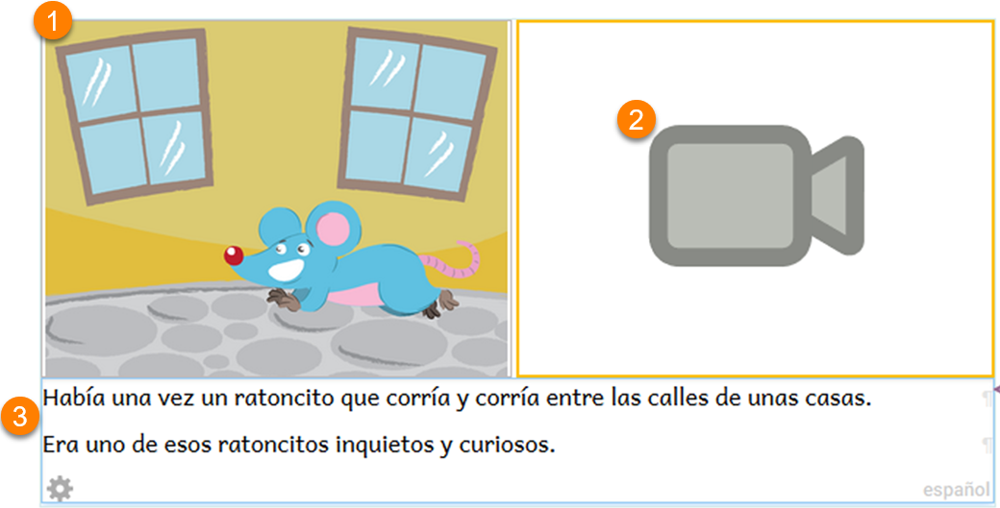

# Create Sign Language Books {#f5582800b9b64e1b8205b3f02c298618}

People who are Deaf* communicate using sign language. Video is one medium that is commonly used for recording sign language communication. Bloom’s Sign Language book template has a placeholder to add sign language video. A page can contain only a sign language video or a sign language video combined with images, text, and/or audio.

:::tip

When “deaf” is spelled with a lower case “d”, it refers to the fact that someone cannot hear. When it is spelled with a capital “D”, it refers to Deaf culture and community. In this module we are referring to those who identify themselves as Deaf and communicate using sign language.

:::

# **What to expect in this module** {#5978372cdf994e5fa6555e5f1991641d}

In this training module, you will learn how to:

1. [Choose the Sign Language book template](/sign-language-books#8626cc2f6f744298b6c66ef4eb657a32)
2. [Choose a page design that contains a place for video](/sign-language-books#e50de5517fac4c5d90446c8f03d53c2c)
3. [Record video using your computer's camera](/record-video-sign-language-tool)
4. [Import video that has already been recorded using some other software or device](/5a3f789a-d372-4f3d-b22a-39adcf6b6927)

# Choose the Sign Language book template {#8626cc2f6f744298b6c66ef4eb657a32}

1. Begin by choosing the **Sign Language** book template.

	

2. Then click `MAKE A BOOK USING THIS SOURCE`.

# Choose a Page Design that Contains a Place for Video {#e50de5517fac4c5d90446c8f03d53c2c}

- Click on the **Add Page** button in order to select from several page templates that contain a place for video:

	

Under the **Sign Language** section, you can recognize these are sign language page templates because they contain the icon of a camera. 

Click on the thumbnail of the page template that you would like to use. A larger thumbnail of this template will then appear at the right. 

To confirm that you want to use this template, click on **Add This Page**.

## How to Use a Page Design that Contains a Place for Video {#2b13b14a9a1c418eb9f9702029164e61}

After you choose a video page, a blank page will be added to your book:

Insert a picture and type in the text in the appropriate sections of the page:

# Change Tools {#d8b4db9d96424e698a5b1bfc898e8da8}

When working on a Sign Language book, you may want to change from using the Sign Language to the Talking Book Tool or to some other tool. This video shows how to do that:

