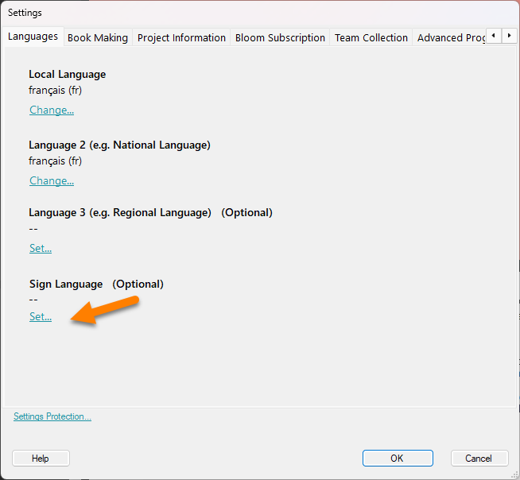

:::note

Because Bloom was first developed with a focus on spoken languages, setting up a collection for signed languages is not as intuitive as we would like. 

A future version of Bloom will make this process more intuitive. 

:::

To set up a Sign Language collection in Bloom, there are three steps:

1. Identify which **written** language will be used to write the titles of your Sign Language books. This is called the main written language.
2. Set up a collection for that main written language (see [Create a New Collection](/create-a-new-collection)).
3. Set the Sign Language for the collection in the collection settings.

