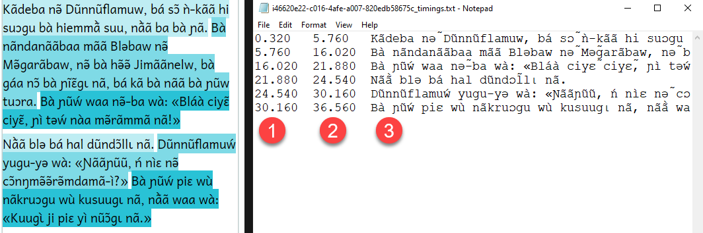

## Edit Aeneas Timings {#0f1ab59b97584e72bd3d0ebb7c29436d}

There are two recording modes in Bloom’s **Talking Book Tool**: 

- recording **By Sentence**
- recording **By Whole Text Box**

When a user records their Bloom book using the **By Whole Text Box** recording mode, typically, they also choose to **Split** the text using the Aeneas sHHoftware. In this way, Bloom can highlight sentences during audio playback.

After splitting the text, you can **Listen to the whole page** and evaluate how well Aeneas has done in determining where sentence boundaries should be placed in your recorded audio. 

If you are _not_ satisfied with how Aeneas has split up your audio, then you may choose to manually edit the “timings file” to make audio highlighting more accurate. 

The purpose of this article is to outline the steps needed to do this. Since the easiest way to do this is in tandem with the audio editing software called [Audacity](https://www.audacityteam.org/), the steps described below will employ this software.

:::note

Editing the timings file is a feature available starting in Bloom [version 5.5](/release-notes-5-5).

:::

For the steps below, we assume you have text which has already been recorded **By Whole Text Box**, and the recording has been **Split**, and you have determined that there is a problem with the timings.

## Edit the Timings File {#80f27d0a313d4e7895e1f3a60a3db0bf}

With the Talking Book Tool open: 

1. Click the arrow to open up the **Advanced** section of the tool.
2. Click **Split** the audio.
3. The button **Edit Timings File** will illuminate. Click this button.

	

4. A message will display (example shown below). Click **OK**.

	

## The timings file {#d3fd21b8b9bf439980bec34665709f8b}

The timings file will open in Notepad. 

:::tip

Hint: The name of this text file begins with a really long list of random numbers and letters, followed by “_timings.txt”. 

If you wish to use Audacity (see below) to fine-tune your timings file, please note that the corresponding file name for the audio recording (the .mp3 file) will _match_ this long list of numbers and letters.

:::

The timings file is composed of three columns. These columns show the start time (1), the end time (2), and the corresponding sentence (3) for each sentence in the text. 

For example:

This file can be edited directly, but doing this work in Audacity is often much easier.

## Using Audacity {#953d7e13c9ae4a078c35abbdb1f72bd5}

:::caution

This section assumes you already have a good grasp of using the program Audacity.

:::

1. In the Audio folder of your book, find the audio file identified in the message in step 4 above, and open it in Audacity.
2. Import the corresponding timings file as a Labels file (File &gt; Import &gt; Labels).
3. Close Notepad.
4. Listen to the recording in Audacity and adjust the audio timings by sliding the start and end points of each label to the right or the left as necessary.

	:::caution
	
	Hint: select the _circle_ shown below to move _both_ start and end points at the same time. 
	
	:::
	
	

	

5. Export the labels file (File &gt; Export &gt; Labels) and _overwrite_ the old timings file.

	

6. Back in Bloom, click **Apply Timings File**, select your newly edited timings file, and click Open.
