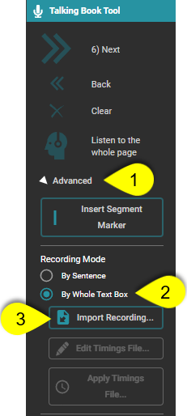

You may want to record your audio separately and then bring the pre-recorded audio into Bloom. This allows you to have finer control over your audio recording quality, or to use recordings from speakers who are not present with you. 

:::note

Bloom can import only MP3 audio files. If your audio file is in a different file format, you can use a program such as [Audacity](https://www.audacityteam.org/), [VLC](https://www.videolan.org/), or [ffmpeg](https://www.ffmpeg.org/) to convert it to an MP3 file. 

:::

1. In the Talking Book tool, click the `Advanced` button.

2. Set the Recording Mode to `Whole Text Box` to enable the `Import Recording…` button.

3. Click the `Import Recording…` button. Bloom will show you a standard file choosing dialog box. Choose the audio file you want to import into Bloom for this text box.

Since audio files are imported for the entire text box, you will probably want to split the file into sentences or smaller chunks. See **[Problem Internal Link]** for details. 

