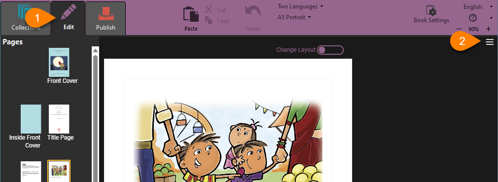
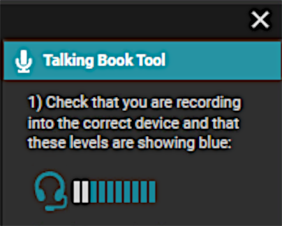

## The Talking Book Tool {#79db45a29f4e4a4aa273a4829e8c4a72}

To make a talking book, 

1. Open the book for editing.
2. On the right side, open the `tool panel` by clicking on the three lines.
3. Click on the **`Talking Book Tool`**.

## Identify your microphone {#ea2f4b28dcda438d8d9f9a6cddd7fbb8}

In the Talking Book Tool, you should see a microphone icon. This shows that Bloom has found your microphone. 

Bloom shows an icon indicating the source from which it will record sound. You may see one of the following icons.: 

External microphone

Headset microphone

Webcam

Laptop computer microphone

Line audio

Digital recorder

If Bloom cannot find any microphones to use, it will display a warning sign. 

:::tip

If Bloom cannot find a microphone, or if it is not using the microphone you want to use, open your computer’s **Settings** or **Control Panel** and find the Sound settings. Look for the **Input** section of settings, and select the microphone you want to use. 

:::

## Test your microphone {#014584ac45224d01a1094f48a9f99a48}

If your microphone is working, as you speak, you will see bars next to the microphone or laptop icon. The number of bars highlighted depends on how loud you are speaking. Once your microphone is set up, you are ready to record. 

## Recording Mode {#2994bb19df128041af63f7887edd189c}

Bloom provides two modes for recording audio:

1. **`By Sentence`**
2. **`By Whole Text Box`**

The default recording mode is **`By Sentence`**. In this recording mode, you record one sentence at a time. This recording mode is available to all Bloom users.

Recording **`By Whole Text Box`** is an advanced Bloom feature available for [Bloom subscribers](/about-bloom-subscriptions). In this mode, you record all of the text in a given text box at one time.

:::tip

If you change the recording mode, Bloom remembers that preference and will keep it until you change it.

:::

