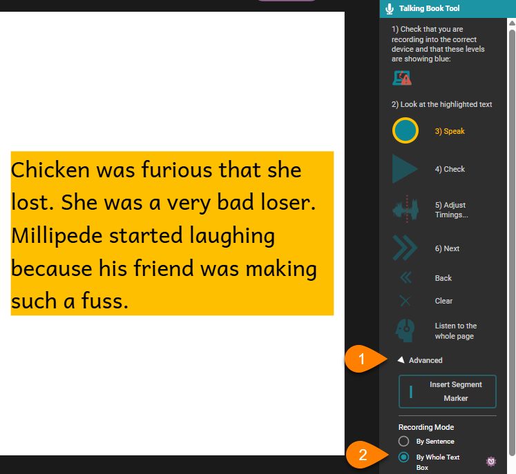
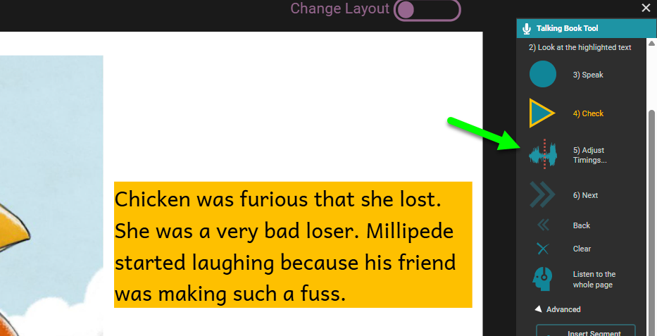
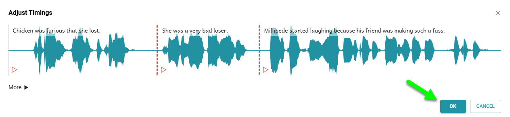
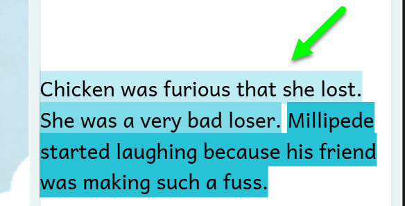
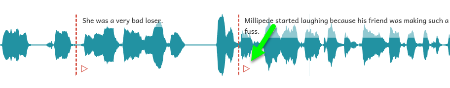
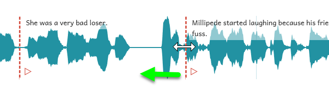
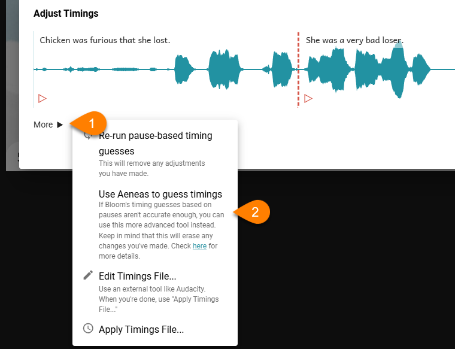
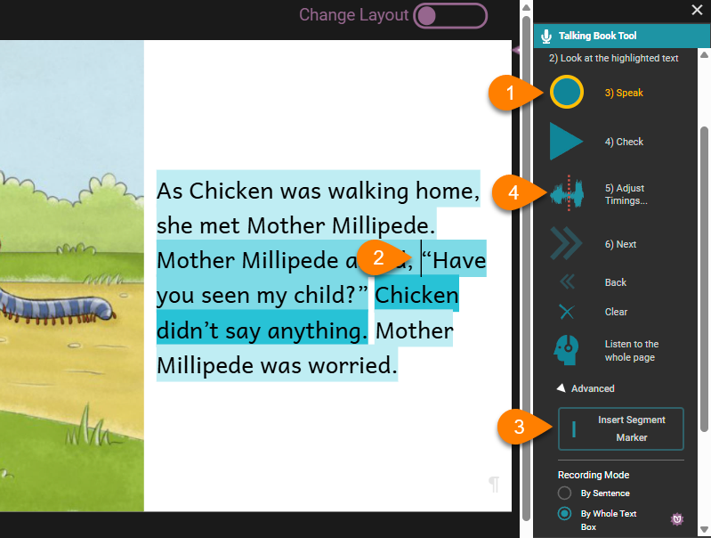
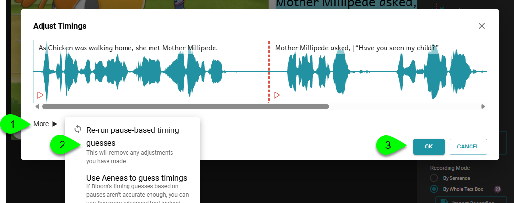

:::note

Recording by Whole Text Box is an advanced feature available for Bloom subscribers. 
See [Bloom Subscriptions](/about-bloom-subscriptions).

:::

By default, the Talking Book Tool lets you record one sentence at a time. It is often more natural to record an entire text box at once, however. 

## Enable Whole Text Box Recording Mode {#758d8d42ceee471a9d2d4ecb3bea8ba6}

To record an entire text box at once, you must first switch the Recording Mode: 

1. Click on the `Advanced` button in the Talking Book tool.
2. Select the `By Whole Text Box` radio button control in the `Recording Mode` section.

	:::note
	
	When you change the recording mode to `By Whole Text Box`, Bloom highlights the entire text box for recording. 
	
	:::
	
	

## Record the Whole Text Box or Import Recording {#2994bb19df128029b6d9fe2530769711}

Once the Recording Mode has been set to By Whole Text Box, you can either record the text directly in Bloom using the **`Speak`** button, or you can [Import a Recording](/import-audio).

## Split the text box recording {#e5a2f2d09ef841faa50963131076bcba}

To prepare your recorded text for highlighting during playback, the text must be run through Bloom’s speech Timings analyzer. To do this:  

- Click the `Adjust Timings` button.

The **Adjust Timings Editor** will be presented. This editor presents a waveform graph of the recording, along with estimates of the start and end points for each sentence.

If your recording is a high-quality recording, and your language is a typical, then you can click **`OK`** and the job is done! 

Your text will now show various shades of blue to indicate that Bloom has split the recording into segments to match the sentence breaks in the text:

 To verify the accuracy of the guesses of the sentence breaks, click the **`Check`** button.

## Fine-tuning the timings using Bloom’s built-in Timings editor {#2994bb19df128060884dc5b03aae025a}

If you are not satisfied with the accuracy of the guesses which Bloom made, click on **`Adjust Timings`** button again and listen to the segment whose timing seems incorrect by clicking on the red arrow:

After listening to the segment, click and drag the red vertical line to adjust the boundary to the correct location:

## Aeneas {#2994bb19df1280449de6dfde8fb283d0}

The above-mentioned method uses Bloom’s built-in Timings analyzer. This analyzer uses a **pause-based** approach to guessing sentence boundaries. This new feature is available starting Bloom 6.2. This is the preferred and recommended method; it will usually produce good results.

:::tip

If Bloom’s built-in, pause-based, Timings analyzer **consistently** produces poor results with your language, then the Bloom team would like to know about it. 

Please [Report a Problem ](/report-problem) with a sample book along with a description of the problem and the team will look into it.

:::

If the built-in method produces poor results for your language, you can also choose to try the Aeneas program. Aeneas is an extra software program. To install Aeneas, please follow the instructions [here](/installing-aeneas).

If Aeneas is already installed, you can use it to split audio as follows:

1. In the Adjust Timings Rditor, click **`More`**.
2. Click **`Use Aeneas to guess timings`**.

Aeneas will adjust the timings. If you are not satisfied with the timings, you can fine-tune them interactively as [explained above](/record-and-split-audio#2994bb19df128060884dc5b03aae025a). This is the preferred method.

Alternatively, you can edit the timings manually or use Audacity, as explained [here](/edit-timings). This method is much more difficult and is not recommended.

## Add audio splits with segment markers {#1b934d5a7cdd47048e84e43b940d3b8d}

Bloom splits a text box recording into sentences by looking for sentence-ending punctuation ( . ? ! ). You can add extra breaks: 

1. Record or import the audio recording for the text box.
2. Place the cursor where you want a break.
3. Click the `Insert Segment Marker`.

	:::note
	
	You can also insert a segment by typing a vertical bar character ( `|` ). 
	
	:::
	
	

4. Click the `Adjust Timings` button to enter the Timings Editor.

## Re-run pause-based timing guesses {#29a4bb19df12807b941be8c82259d939}

Whenever you change the number of sentences in a text, or add or remove segment markers, you must re-run the Timings analyzer to split the audio into additional segments:

1. Click **`More`**.
2. Click **`Re-run pause-based timing guesses`**.
3. Click **`OK`**.

:::tip

Click the `Check` button to make sure that Bloom has properly divided the audio. 

:::

## Special sentence-ending punctuation {#2994bb19df12802bac95c377f215cf84}

For non-standard sentence-ending punctuation, please follow [these instructions](/sentence-ending-punctuation).

## Audio Splitting Best Practices {#24f4bb19df12804d86ccf08e8cb10cb1}

There are several essential “best practices” to achieve the best results when splitting your audio in Bloom. 

1. We strongly recommend that you finalize your text before adding audio (either recording directly or importing). Major changes to the text, particularly, any changes to sentence boundaries will necessarily cause the alignment to go off.
2. Above all, avoid pasting in additional text from another text box into an already-split text box. This can cause major problems.
3. Never copy text from a text box with associated audio and paste in elsewhere.
4. In regards to character formatting -- italic or bold -- bad things can happen if character formatting crosses sentence boundaries, or segments marked by |. So, if at all possible, it would be best to apply character formatting after the text and audio is "perfect".
5. Lastly, if you do need to adjust sentence punctuation or add/remove/move a new segment marker to text which already has audio, you will need to re-run the splitter. (But see point #1).
