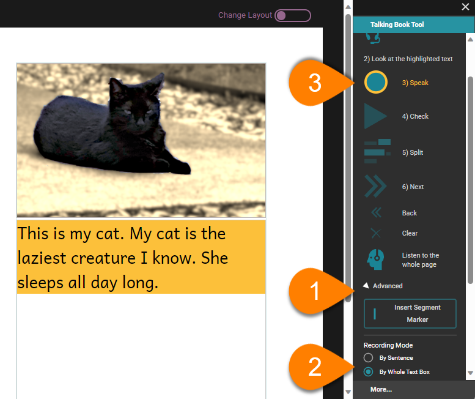
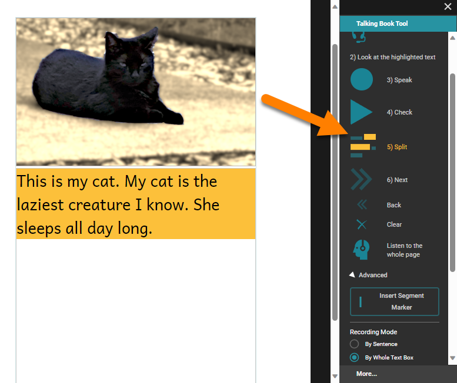
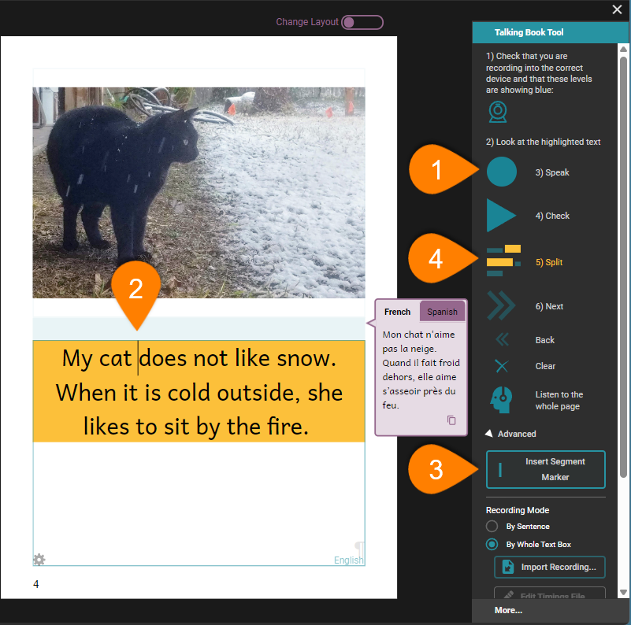

:::note

For basic information about Talking Books and microphone setup, see [Record Audio](/record-audio). 

:::

By default, the Talking Book Tool lets you record one sentence at a time. It is often more natural to record an entire text box at once, however. 

## Recording a whole text box {#758d8d42ceee471a9d2d4ecb3bea8ba6}

To record an entire text box at once: 

1. **Click on the** **`Advanced`** **button in the Talking Book tool.**
2. **Select the** **`By Whole Text Box`** **radio button control** in the `Recording Mode` section.

	:::note
	
	When you change the recording mode to By Whole Text Box, Bloom highlights the entire text box for recording. 
	
	:::
	
	

3. Record the text using the `Speak` button.

## Splitting a text box recording {#e5a2f2d09ef841faa50963131076bcba}

When you play a Talking Book, Bloom highlights each recorded sentence. If you have more than one sentence in a text box, you may want to split your recording so that each sentence is highlighted in turn. 

When you set the recording mode to Whole Text Box, Bloom adds a `Split` button to the Talking Book Tool, between the `Check` and `Next` buttons. 

To split a recording for an entire text box:  

- **Click the** **`Split`** **button.**

Bloom will divide your recording into sentence-sized chunks. 

:::note

Bloom relies on an extra software program called [Aeneas](https://www.readbeyond.it/aeneas/) to split your recording into sentences. If Aeneas is not installed on your computer, please follow the instructions here: 
[Install aeneas](/installing-aeneas)

:::

## Adding audio splits with segment markers {#1b934d5a7cdd47048e84e43b940d3b8d}

Bloom splits a text box recording into sentences by looking for sentence-ending punctuation ( . ? ! ). You can add extra breaks: 

1. Record or import the audio recording for the text box.
2. Place the cursor where you want a break.
3. Click the `Insert Segment Marker`.

	:::note
	
	You can also insert a segment by typing a vertical bar character ( `|` ). 
	
	:::
	
	

4. Click the `Split` button to (re)segment the audio recording.

:::tip

Click the `Check` button to make sure that Bloom has properly divided the audio. 

:::

## Fine-tuning audio splits: Editing a timing file {#a62a23674e38472e909d9a9d2d8b40bb}

Sometimes Bloom does not split the text box audio exactly how you would like it. You can manually edit the timings that control the audio highlighting, to fine-tune how the text is highlighted as the audio is played back. If you need to do this, see [Edit Aeneas Timings](/edit-timings) . 

