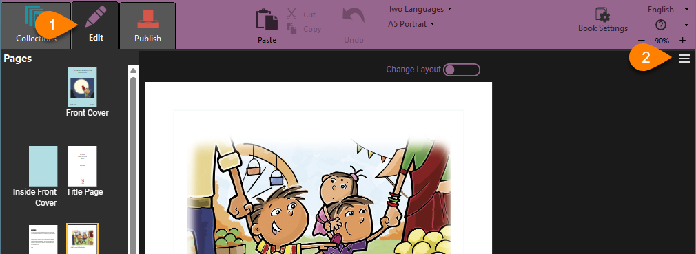
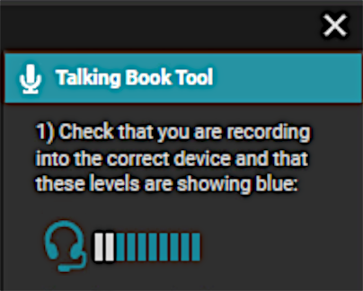
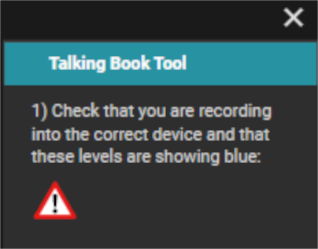
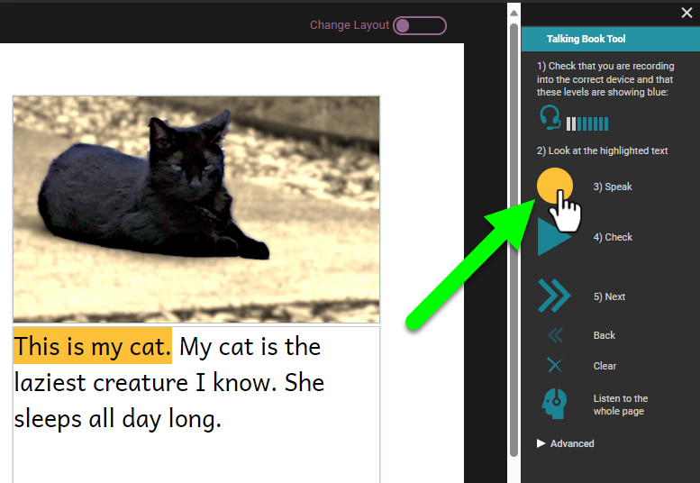
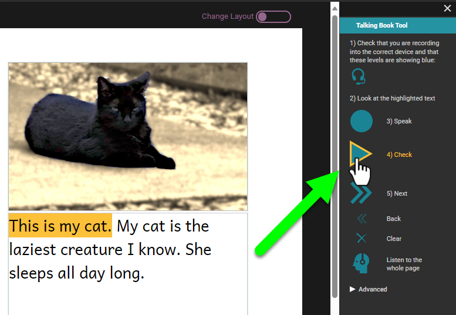
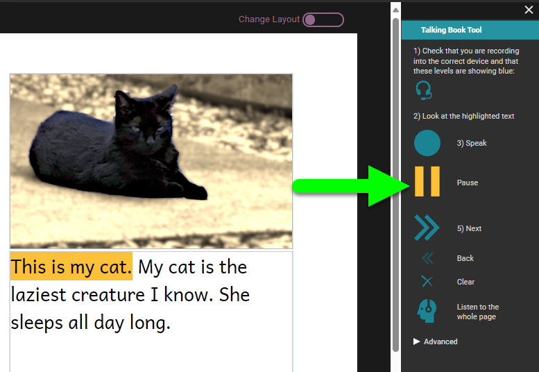
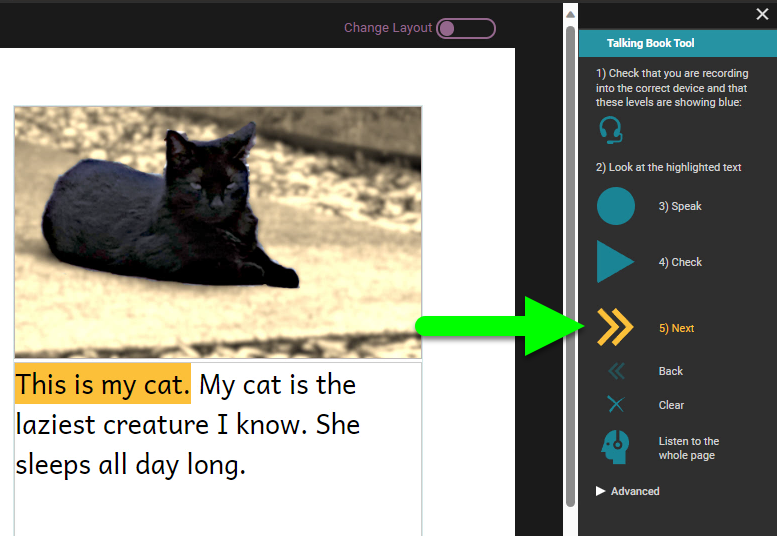
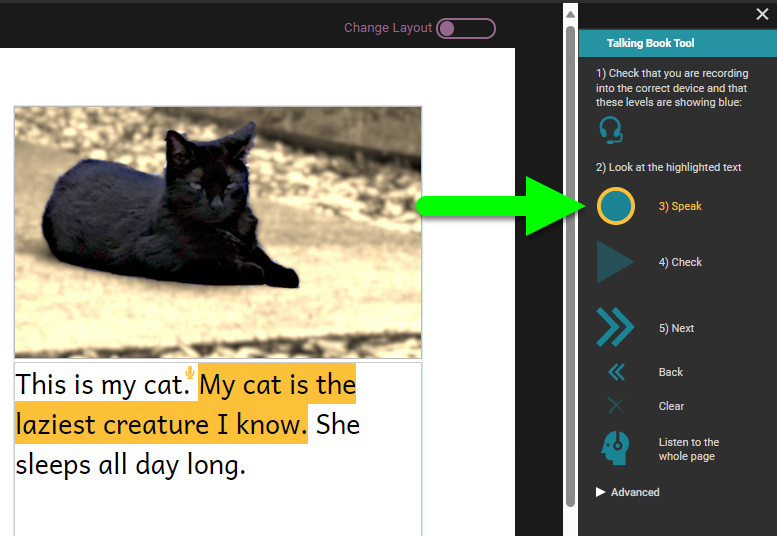

Record Audio in the Talking Book Tool

## The Talking Book Tool {#79db45a29f4e4a4aa273a4829e8c4a72}

To make a talking book, 

1. Open the book for editing.
2. On the right side, open the `tool panel` by clicking on the three lines.
3. Click on the **`Talking Book Tool`**.

## Identify your microphone {#ea2f4b28dcda438d8d9f9a6cddd7fbb8}

In the Talking Book Tool, you should see a microphone icon. This shows that you that Bloom has found your microphone. 

Bloom shows you an icon to indicate the source from which it will record sound. You may see one of the following icons.: 

External microphone

Headset microphone

Webcam

Laptop computer microphone

Line audio

Digital recorder

If Bloom cannot find any microphones to use, it will display a warning sign. 

:::tip

If Bloom cannot find a microphone, or if it is not using the microphone you want to use, open your computer’s **Settings** or **Control Panel** and find the Sound settings. Look for the **Input** section of settings, and select the microphone you want to use. 

:::

## Test your microphone {#014584ac45224d01a1094f48a9f99a48}

If your microphone is working, as you speak, you will see bars next to the microphone or laptop icon. The number of bars highlighted depends on how loud you are speaking. Once your microphone is set up, you are ready to record. 

## Record each sentence {#fb04aedb1c6141f7abee4691b8df7f14}

When the Talking Books tool is open, Bloom will highlight the first sentence it finds on the page. 

1. **Click and hold the blue** `Speak` **button**. The button will turn yellow. Now you can record the sentence. When you are finished, release the mouse button.

	

2. After you have recorded your sentence, the `Check` button will have a yellow outline, to prompt you to listen to your recording. **Click the** `Check` **button.** The Check button will change to a yellow Pause button while Bloom replays your recording for you to hear.

	

	

	If you are not satisfied with your recording, you can click the Speak button again to discard your first recording and record the sentence a second time.  

3. If you are happy with your recording, **click the** `Next` **button** to move the highlight to the next sentence.

	

	Now you can record the next sentence, using the same procedure as you used with the first one. 

	

Continue recording until you have recorded all the text on the page. Then you can go to the next page and record its text also. 

### Additional controls {#3e2cdccfbdaa438ca808da5e849544d3}

There are two additional controls in the main section of the Talking Book Tool. 

- `Clear` lets you discard the recording for a sentence without recording anything to replace it.
- `Listen to the whole page` lets you listen to all the recordings on the page played in sequence.

## Other ways to add audio to your Talking Book {#f2ef7d95c91148e6b2a5522847c1f4db}

See [Import Audio](/import-audio) for directions on how to import pre-recorded audio files into Bloom. 

See [Record and Split Audio](/record-and-split-audio) for directions on how to record an entire text box at once, and then split the recording into sentences. 

