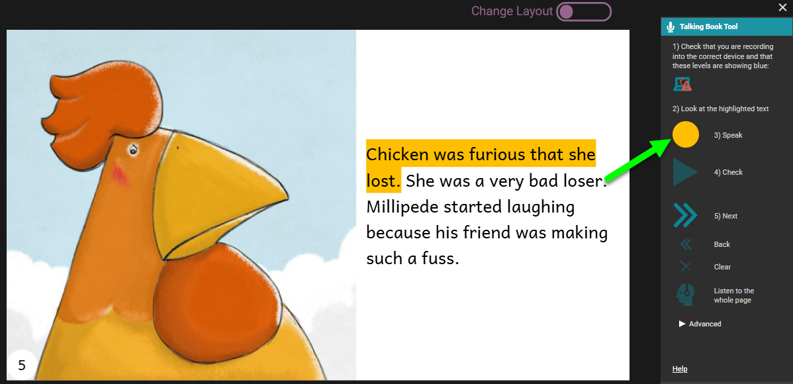
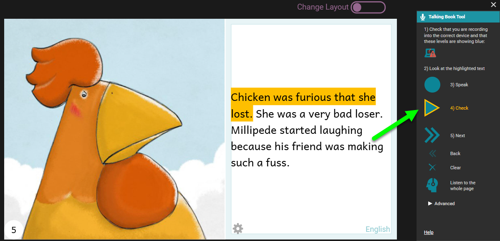
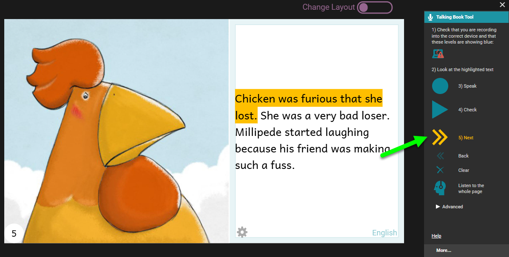
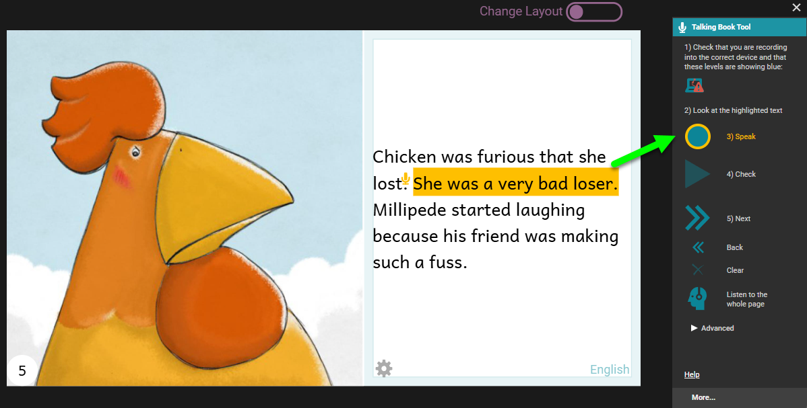

The default recording mode in Bloom is **`By Sentence`**. This mode is pre-selected automatically when you create a new collection. This recording mode is available to all Bloom users.

## Record one sentence at a time {#2994bb19df12814885e3fd924d57f78e}

When the Talking Books tool is open, Bloom will highlight the first sentence it finds on the page. 

**Click and hold the blue** `Speak` **button**. The button will turn yellow. Now you can record the sentence. When you are finished, release the mouse button. 

After you have recorded your sentence, the `Check` button will have a yellow outline, to prompt you to listen to your recording. **Click the** `Check` **button.** The Check button will change to a yellow Pause button while Bloom replays your recording for you to hear.

:::tip

If you are not satisfied with your recording, you can click the Speak button again to discard your first recording and record the sentence a second time.

:::

If you are happy with your recording, **click the** `Next` **button** to move the highlight to the next sentence. 

Now you can record the following sentence, using the same procedure as you used with the first one. 

Continue recording until you have recorded all the text on the page. Then you can go to the next page and record its text also. 

### Additional controls {#2994bb19df128123ad8ed6fccfe2dd86}

There are two additional controls in the main section of the Talking Book Tool. 

- `Clear` lets you discard the recording for a sentence without recording anything to replace it.
- `Listen to the whole page` lets you listen to all the recordings on the page played in sequence.

## Other ways to add audio to your Talking Book {#2994bb19df128173be27c22f38420064}

- See [Record by Whole Text Box](/record-and-split-audio) for directions on how to record an entire text box at once, and then split the recording into sentences.
- See [Import Audio](/import-audio) for directions on how to import pre-recorded audio files into Bloom.
