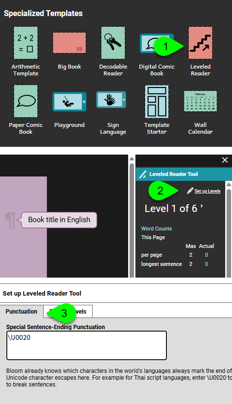

Bloom’s audio-splitter assumes your language uses standard sentence-ending punctuation ( . ? ! ).

Some languages, like Thai, use spaces to mark sentence boundaries. The inform the audio-splitter to look for non-standard sentence-ending punctuation for your talking book, do the following:

1. Create a book using the Leveled Reader Template
2. In the Edit Tab, Leveled Reader Tool, click “Set up Levels.”
3. On the Punctuation tab, type “\U0020” which is the Unicode representation of a normal space.
4. Click OK to close the dialog.

The Adjust Timings should now recognize the new sentence-breaking character.

