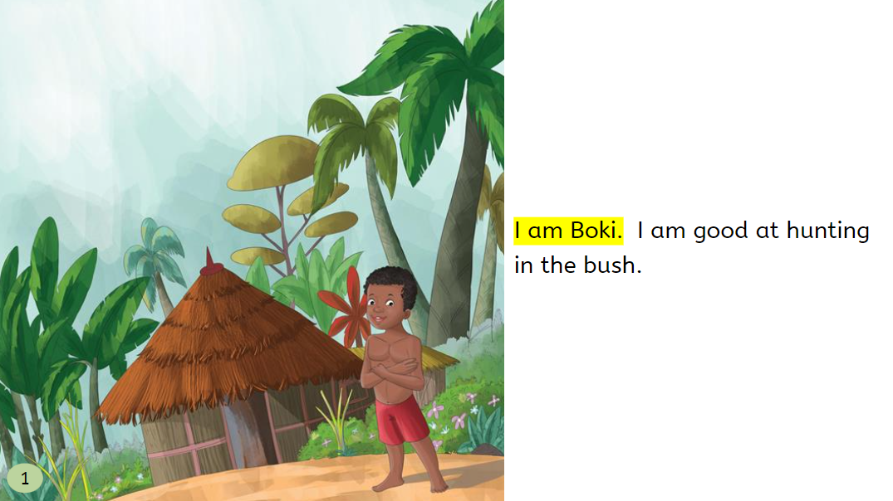
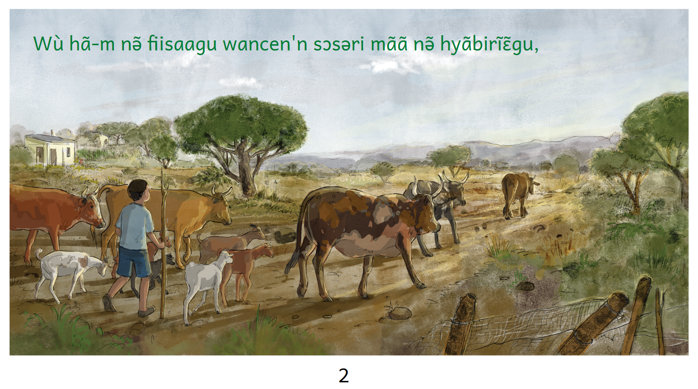
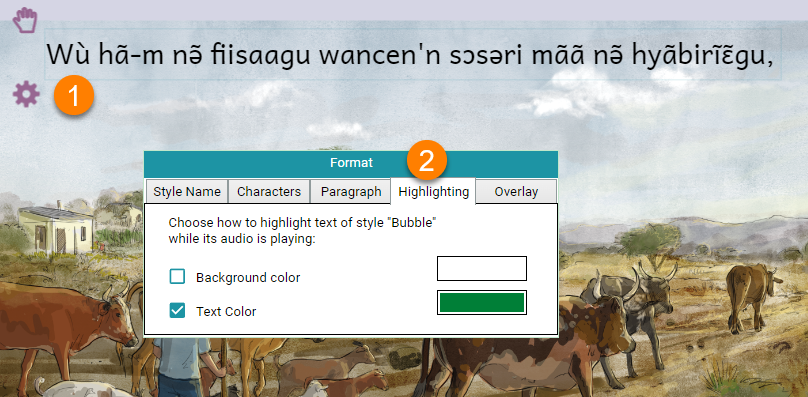

When you play a Bloom Talking Book, the corresponding text will be highlighted with a yellow or orange background color:

This color suits most user’s needs, but sometimes, the aesthetics of a book call for a different color scheme.

This is particularly true when using Overlays. For example, in this book, the author choose to change the color of the text itself to green, and use no background coloring:

To change the default highlighting to something else

1. Click on the gear icon of the text box you wish to change.
2. Click on the Highlighting tab.

	

Following this, you may:

- select or deselect the `Background color` or the `Text Color`.
- click on the color sample box to choose a different color.
