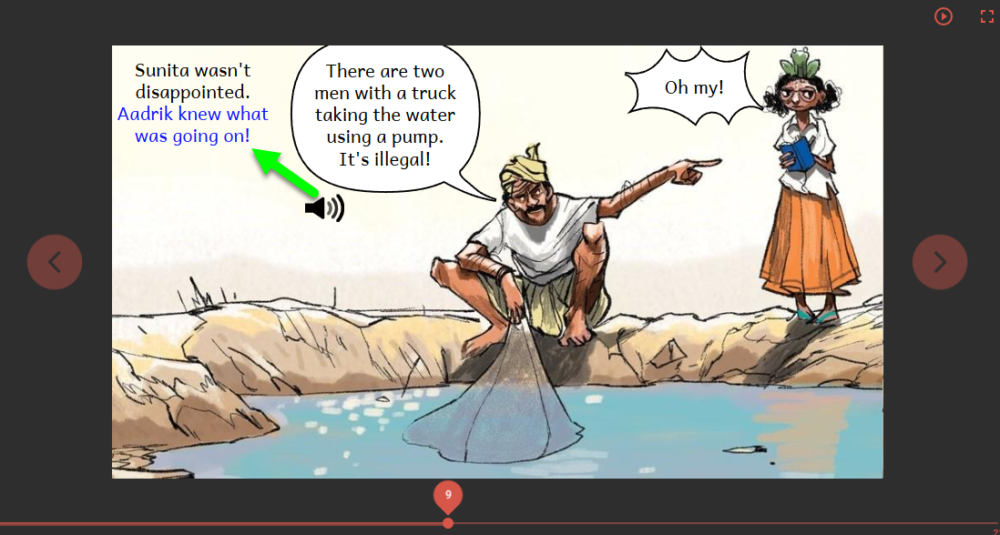
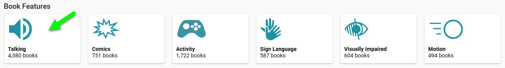
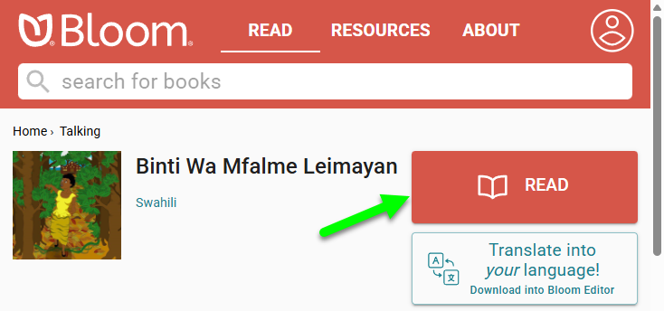

# About Talking Books {#a544182174f3411fbed34044e720ff5c}

**Talking Books** are digitally published e-books that highlight the text while the recorded narration is played. Text can be highlighted with a background color, or a text color as in this example:

Of all of Bloom’s advanced features, the Talking Book is the most popular feature on [Bloom Library](https://bloomlibrary.org/read):

Is there a Talking Book in your language on Bloom Library? Why not check out [Talking Books](https://bloomlibrary.org/talking-books) right now and see? Once you find a book in your language, click on the red READ button to experience the book for yourself:

## Why Talking Books? {#29a4bb19df12809c9d8dc4c2e701ccbd}

:::caution

To be developed.

:::

## ePUB vs. BloomPUB {#29a4bb19df128082b416f0930afd6664}

There are two e-book formats for enjoying Bloom Talking Books: ePUBs and BloomPUBs. 

**BloomPUBs** can be read online in [Bloom Library](/what-is-bloom-library), or offline with [Bloom Reader](/about-bloom-reader) or [BloomPUB Viewer ](/bloompub-viewer)for Windows. BloomPUB is the native version to publishing e-books using the Bloom Editor.

**ePUBs** can be read using a wide variety of ePUB viewers. Some ePUB viewers faithfully playback recorded narration; others do not. Please consult [Limitations of ePUB readers](/ePUB-notes).

To understand more about the differences between these two e-book formats, please refer to [BloomPUB vs. ePUB](/compare-bloomPUB-ePUB).

## Recording Audio in Bloom {#27a99fe5952642e6a4e14e611138ee1b}

You can record your book's audio directly in Bloom, or add audio to an existing book that doesn’t have any yet.

[Prepare to Record Audio](/prepare-to-record)

[Add Audio to an Existing Book](/add-audio-to-an-existing-book)

[Record by Sentence](/record-by-sentence)

## Importing Recordings {#edf102c96ed74ca49292c2ec1c2870a0}

You can import prerecorded audio recordings into Bloom. 

[Import Audio](/import-audio) 

## Recording Audio by Text Box {#307badfedd994db1abda86d46336fc06}

By default, Bloom records audio sentence-by-sentence. You can also record (or import) the audio for an entire text box, and split the recording into sentence-sized chunks. 

[Record by Whole Text Box](/record-and-split-audio) 

## Format Talking Book Highlights {#2902a7c25e784571a7c5641eddad76e5}

You can change the color the Bloom uses for highlighting the text being played by a Talking Book. 

[Highlighted Text Styles in Talking Books](/talking-book-highlighted-text-styles) 

## Publish a Talking Book {#e35c16085ae64ce38032851215d3aa02}

Bloom gives you many ways to publish your Talking Book. 

[Publish to BloomPUB](/publish-to-bloompub) 

[Publish as ePUB](/publish-as-epub) 

[Publish to the Web on Bloom Library](/publish-to-bloom-library) 

