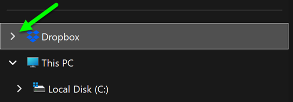
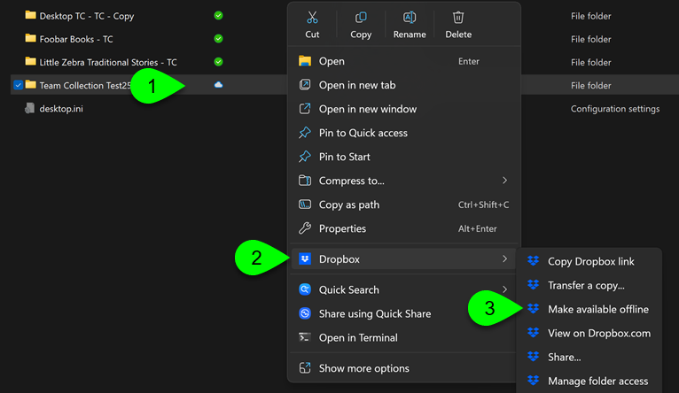

A number of users are experiencing issues with syncing their Team Collections.

After investigating, we believe this is caused when one or more team members have their Dropbox sync settings set to “online-only”, or are using the new feature to “save hard drive space automatically”.

Either of these will cause problems with Bloom’s Team Collections.

To fix this problem:

1. Access the Dropbox app from your Windows tray:
2. Click on your avatar.
3. Click **`Sync & storage`**.
4. In the box, **Choose how you store files**, click **`Manage`**.
5. Ensure the slider **Save hard drive space automatically** is turned off.
6. Ensure your **Default sync preference** is set to “**`Available offline`**”.

:::caution

After changing these settings, request that all files are made available offline explicitly.

:::

Open Windows File Explorer and locate Dropbox. Click the left arrow to expand and view its content.

 

Examine the contents of all of your Team Collection folders. Folders which are available offline have a green checkmark under the “Status” column. This is what you need. But folders which are only available online have a cloud symbol beside them. **This is not what you need.**

For each and every folder which has the cloud symbol Status, do the following:

1. Right-click on the folder.
2. Click **Dropbox**.
3. Click **Make available offline**.

