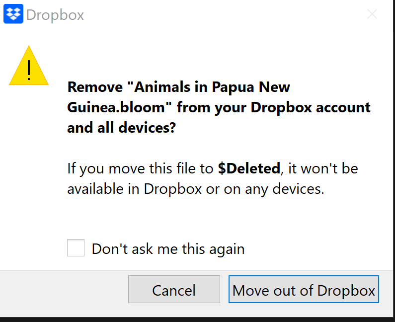

What happens if I want to edit a book but I cannot get online?

If you already have the book checked out, you can edit it. If you do not have the book already checked out, you cannot check it out or edit it. 

Does everyone on the team have to have the same version of Bloom?

No. The members of a team can use different versions of Bloom, with one limitation: if one team member adds a book that uses a new Bloom feature, other team members will not be able to edit that book until they update Bloom on their computers. (This is how Bloom works in general, not just for Team Collections.) 

What happens if I drag a Bloom Book folder into my Team Collection folder?

Bloom will notice that the book is not yet part of the Team Collection, and automatically add the book to the Team Collection as a “checked in” book. 

How can I remove a book from a Team Collection? 

To remove a book from a Team Collection, do the following: 

1. **In Bloom:** Check Out the book. (Remember, you need to check the book out to make changes.)
2. **In Bloom:** _While the book is still checked out to you,_ right-click on the book’s thumbnail and choose **Delete Book**.
3. **Dropbox** will ask whether you want to “Remove (book title) from your Dropbox account and all devices?” Click “Move out of Dropbox”. If you do not want to see such notices in the future, you can tick the box “Don’t ask me this again”.

	

What happens if I rename a book in a Team Collection?

Bloom treats renaming a book in a Team Collection as a _deletion_ followed by an _addition_. 

Suppose you check a book out, and while you have the book checked out you change its name.  Until you check the book in, the _local_ book and folder will have the new name, but the corresponding file in the Team Collection’s “shadow collection” will have the _old_ name. 

When you check the book in, Bloom will remove the book from the shadow collection, and add a new book (with the new name) to the shadow collection. The next time your teammates synchronize their team collection files, Dropbox (or your LAN) will remove the old book and add the new ones to their team collection files. 

If one of your teammates checks a book out and renames it, the same thing happens: the old book is removed, and a new one is added. But this time, the change starts on _their_ computer, and Dropbox (or your LAN) and Bloom propagate the change to your computer. 

In the Team Collection history log, Bloom will report that the book has been renamed. 

# Troubleshooting Team Collections {#ee0a0ca48de34ecbb448a64e48614bae}

If you have further issues with Team Collections, see [Team Collections - Troubleshooting](/team-collections-problems).

