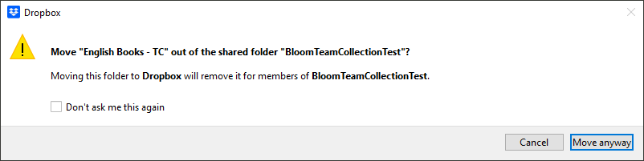
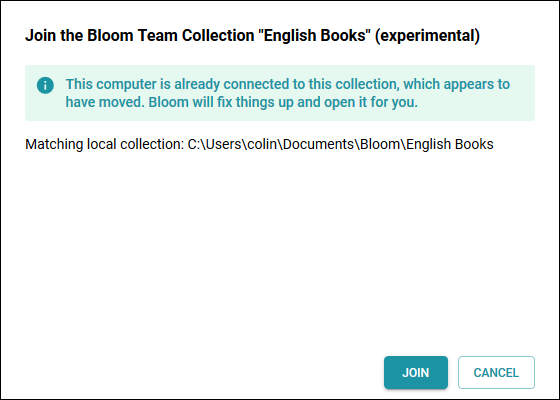
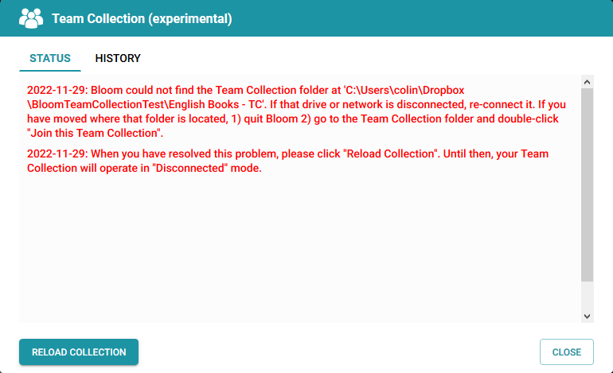

Moving a book from one collection to another

Sometimes a book needs to be moved from one collection to another. For example, suppose you have multiple Team Collections organized according to grade levels or difficulty. After reassessing a book’s level of difficulty, you decide it needs to be moved to a different collection.

The procedure to do this is as follows:

1. **In Bloom:** Check Out the book. (Remember, you need to check the book out to make changes.)
2. **Using Windows File Explorer:** Copy the book’s _local_ folder (not the Dropbox or LAN folder), to the new collection folder.
3. **In Bloom:** _While the book is still checked out to you,_ right-click on the book’s thumbnail and choose **Delete Book**.

Locking down a book to prevent further modifications

There are several ways you can “lock down” a book to prevent further modification: 

- The Administrator can permanently Check Out the book.
- The Administrator can move the book out of the team collection (see [Moving a book from one collection to another](/team-collections-advanced-topics#fd16939ea0684005a34727444964a436)).
- The Administrator can “retire” the entire Team Collection (see [Retiring a Team Collection](/team-collections-advanced-topics#3a6243f616134809b5b9c06e5748094f)).

(In a future version of Bloom, we may add the ability to “lock down” a book. )

Retiring a Team Collection

The team collection Administrator may wish to “retire” a particular Team Collection in order to prevent accidental book modification or deletions. This might happen if a team has completed work on a book collection, or if collaboration on the book collection is no longer needed or desired. 

The team collection Administrator can change the Team Collection back into a regular Bloom collection. The procedure to do this is as follows:

1. **In Bloom:** Ensure all books have been checked in.
2. Close Bloom.
3. **Using Windows File Explorer:** delete the following files from the Team Collection **local** folder:
	- `lastCollectionFileSyncData.txt`
	- `log.txt`
	- `TeamCollectionLink.txt`
4. **Using Dropbox:** Delete or un-share the shared **Dropbox** folder containing the Team Collection. (If you are using a LAN for file sharing, delete or un-share the shared LAN folder.)

Changing the name of a Team Collection

When you [create a Team Collection](/team-collections-getting-started#6035d8998d5d42a4b66a19e86590d845), you are warned that you will not be able to change the name of the collection later. This is not _exactly_ true: it is possible to change the name, but it’s painful. If you find yourself in dire circumstances and must change the Team Collection name, here is how you can do it: 

1. The Team Collection Administrator “retires” the Team Collections, following the instructions in [Retiring a Team Collection](/team-collections-advanced-topics#3a6243f616134809b5b9c06e5748094f) above. (Note that this requires that all books be checked in.)
2. The Team Collection Administrator deletes shadow folder, so that it is removed from all team members’ computers. If for some reason the Administrator cannot delete the shadow collection from the team members’ computers, the team members should be sure they have removed the shadow collection from their computers.
3. The Team Collection Administrator renames the retired Team Collection (which is now a “regular” Bloom collection).
4. The Team Collection Administrator follows the regular instructions to create a Team Collection from the collection (see [Getting Started with Team Collections](/team-collections-getting-started)).

Moving a Team Collection’s shadow collection folder to a different location

When you [create a Team Collection](/team-collections-getting-started#6035d8998d5d42a4b66a19e86590d845), you choose a Dropbox (or LAN) folder for the Team Collection’s shadow collection folder. If you later decide you need to move the shadow collection folder to a different location, here is how you can do it:

1. **Close Bloom.**
2. **In Windows Explorer,** navigate to the location of the shadow collection folder (in your Dropbox folder). Move the shadow collection folder to its new location.

	:::note
	
	You may get a notice from Dropbox warning you that moving the folder will “remove it for the members of” the folder you are moving it out of. This happens when you rely on the sharing settings of a higher-level folder to share the shadow collection folder with your teammates. 
	
	
	If you see this notice, click the **Move anyway** button. Then re-share the shadow collection folder (or a higher-level folder) with your teammates.
	
	:::
	
	

3. **In Windows Explorer,** re-join the Team Collection by double-clicking the `Join this Team Collection.JoinBloomTC`. (This will alert Bloom to the new location of the shadow collection folder.)
4. **Bloom** will start, and will show this message:

	

5. Click **JOIN**. Bloom should proceed to open the Team Collection.

:::note

If you try to open a Team Collection whose Dropbox folder has been moved, Bloom will show a “disconnected” state in the Team Collection status badge, and display a message which outlines the above steps.  

:::

Retrieving a book from “Lost and Found”

There are a number of situations where conflicts arise between books on different team members’ computers and Bloom cannot decide which one it should treat as authoritative. In these cases, Bloom chooses one version as the “winner” and saves the other one in a special folder called “Lost and Found”. (The Lost and Found folder exists only in the synchronized team collection “shadow folder”, not in your working files.) 

**If you want to rescue a book from the Lost and Found, it’s best to get a Bloom expert to help you.** If you are a confident computer user and want to do the job yourself, here’s how: 

1. Close Bloom.
2. Navigate to the Dropbox (or LAN)-synchronized “shadow folder” (for instance, **`C:\Users\<your username>\Dropbox\My-collection - TC\`**).
3. Now look for a subfolder called **`Lost and Found`**. Inside the `Lost and Found` subfolder you will find one or more files with a **`.bloom`** extension. Each of these is a compressed book folder.
4. Copy the desired `.bloom` file to a different location on your computer, and uncompress it into a new folder. You will probably need to use a zip utility such as [7-Zip](https://7-zip.org/) to do this. (Alternately, you can change the filename extension to `.zip`, and use Windows’ built-in zip tools to uncompress the file into a new folder.)
5. Rename the folder to something which does not match any folder name or book title in your **local** Team Collection.
6. Copy or move your newly uncompressed folder into your **local** Team Collection folder.
7. Launch Bloom. Bloom will recognize that a book has been added to the Team Collection. There will be a message saying, “The book ‘XX’ is no longer in the Team Collection. It has been kept in your local collection.” You may ignore this message. The book will be automatically checked out to you.
8. Check in the book, and Bloom (with a little help from Dropbox or your LAN) will propagate the new book to the other Team Collection computers.

**Now comes the hard part:** you must manually reconcile the two different versions. This means identifying the parts you want to keep from one book (the version you will not keep), and manually moving them into the one you will keep. This can be a painful process! 

After you have finished reconciling the two books, you can remove the one you do not want to keep (see [How can I remove a book from a Team Collection](/team-collection-faq#41000d72c84a4fde8bf3e62f407e4cea) for instructions on how to do this). 

