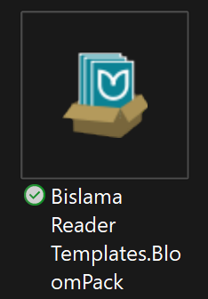
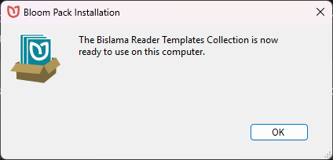
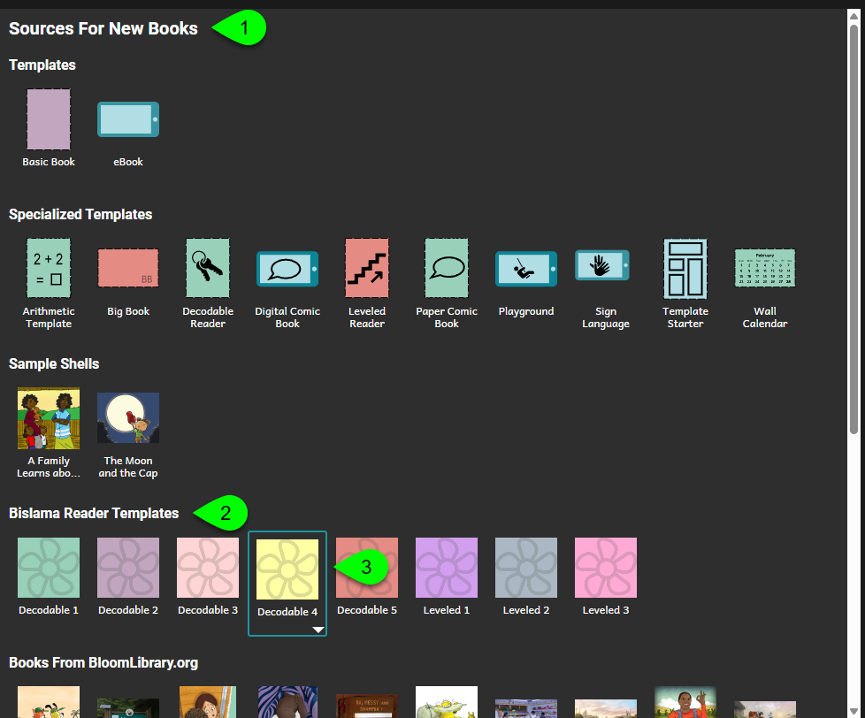

# Install a Reader Template Bloom Pack {#33c4bb19df12800c9109c7c36baf93e3}

After a literacy specialist [creates a series of decodable and leveled reader templates](/make-reader-templates), they can bundle them into a Reader Template Bloom Pack and distribute it to local authors to start creating books that meet the criteria set by those templates.

Follow these steps:

1. If Bloom is running, click the red “X” in the top right corner to close it.
2. Find your Bloom Pack (the name will end in “.BloomPack”). It will look like this (but with a different name):

	

3. Double click on it. You will get a message from Bloom telling you that it is ready to use.

	

	Note: if the person who gave you the Bloom Pack makes a new version and gives that to you, that’s fine. Just repeat these steps. Bloom will confirm that you want to replace your old templates with the new ones.

Bloom will now open. The template books from the installed BloomPack will appear under “Source For New Books”:

