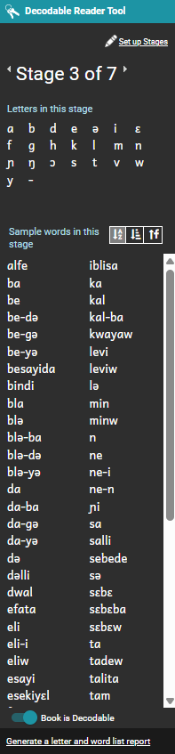
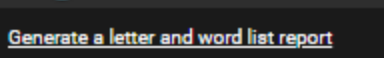

Once you have established your decodable stages, test and experiment to ensure everything is working correctly. 

### Experiment with using decodable stages {#6f4f1d5c75da45ca8960e630cc287bdb}

In another document designed for authors, we will go into detail on using decodable templates to create books. We won’t go into detail here. But at this point, you’ll probably want to play around with your new stages in a couple of sample books.

Here are some of the controls and information you see in the **Decodable Reader Tool**.  

The Stage control. Here is an example:

Click the arrows to move from one decodable stage to another. The arrows are on the sides of the Stage control. To move to a lower stage, click the left arrow. To move to a higher stage, click the right arrow. 

**Letters in this stage.** Under this label, you see letters that are intended to be used in words in this stage. **Words in this stage**. Under this label, you see suggested words. These word are in the files in the **Sample Folder**. They are also words that typed in the 

**Words** list. The suggestions use the letters you set for this stage. Buttons you can use to sort the words in this stage. There are three buttons: 

- The first button sorts the words alphabetically.

- The middle button sorts the words from shortest to longest.

- The last button sorts the words by frequency.

Frequency is based on how many occurrences of the words appear in the files that are in the **Sample Text** folder. For this reason, if you save larger paragraphs or real text you can see the most common words. 

By contrast, if you only save word lists, each word probably occurs only once. You can open a file that shows all the letters and words you have available for suggestions in Bloom. There is control for this. It looks like the image to the right.

It is a link you can click. If you click this link, Notepad opens with a file that Bloom created. It lists all stages and the sets of letters and words you have set for each stage. If you change any of the letters or words, click the link again to open an updated file.

For this training exercise, set this decodable reader book to Stage 1. Later we will make Bloom Pack from this template. Normally, you would want to make five or more templates, with each one of them set to a different stage. Then, the person who receives the Bloom Pack will have templates set for each of the stages. That person could then make books for each stage without the need to change the stages or any of the files in the **Sample Texts** folder.

In the **Pages** pane, on the left side, click the **Front Cover** page. The top box is where you put the book title. In this box, type Decodable Stage 1.

Then, the person who receives this template will know what stage it is for. If you made a template for each stage, you could name them Decodable Stage 2 and so on.

