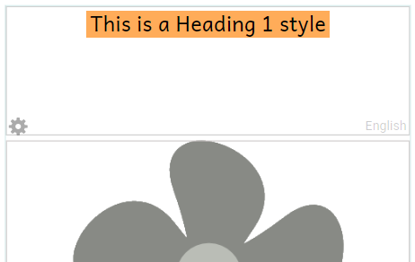

When writing books for people at different levels of reading skill, it is important to choose the right font, font size, line spacing, and word spacing. 

For general guidance on choosing font sizes, setting the number of words per page, and other aspects of leveled book design, see [Books that Children Can Read: Decodable Books and Book Leveling](https://www.edu-links.org/resources/books-children-can-read) (Davidson, 2013).

:::note

This page talks about formatting text styles. For help on formatting text and text boxes, see [Format Text](/formatting-text) and [Format Text Boxes](/formatting-text-boxes).

:::

## Text Box Styles {#feb4fb1700e64099b661c721f9195918}

All text boxes in Bloom have a **style** that defines the appearance for all of the text in that box. Here are a few example styles:

**Normal** (used for standard text boxes)**:**

**Big Words:**

**Heading 1:**

## Change the Style for a Text Box {#bdee63934ba74c7884a283f2a07e6315}

To change the style for a text box:

1. **Click on the text box** where you want to change the style.
2. A blue border will appear around the box, and a small **gear icon** ⚙ will be displayed in the lower-left corner of the box.

	

3. Click the **gear icon** ⚙.
4. A style format dialog box will appear.

	

	1. To exit the _Format_ styles dialog box, click anywhere outside the dialog box.
5. Click on the **Style drop-down**.
6. Choose a different style from the list of styles.

	

### Edit a Style {#1835494c2f8b4a55a73cc35bb2a3be27}

It is also possible to edit a style.

When you edit a style, **all** text boxes in the book with the **same style** will also be modified.

:::note

Editing a style **only** changes the style for **the book you are editing**. It does **NOT** modify the style for the other books in the Collection.

:::

To edit a style:

1. Click on the **gear icon** ⚙ for a text box.
2. Select the style you want to edit from the **Style drop-down**.

	

3. If you would like to create a new style, see [Create a New Style](/formatting-text-styles#d6874abf777043d2813e5ac1c6b2e831).
4. Edit the style using the [Characters](/formatting-text-styles#8ccb26628b554d0585cec6ad4374525a), [Paragraph](/formatting-text-styles#961126a170434b8cbf320dd3c07fb580), and [Highlighting](/formatting-text-styles#1ab99823d15246fa9636cae61c07dd3a) tabs.

### The Characters Style Tab {#8ccb26628b554d0585cec6ad4374525a}

The **Characters** tab gives you formatting options for characters.

1. **Font:** Choose the font to use for the style (from the fonts installed on your computer).

	:::note
	
	**Note:** Bloom books are meant to be shared, so Bloom provides guidance on the **licensing** of each font. A green check mark means that the font can be freely used in books uploaded to the Bloom Library. 
	
	:::
	
	

2. **Font Size: C**hoose how large the type is.
3. **Vertical Spacing:** Choose how much white space there should be between lines of text.
4. **Horizontal Spacing:** Choose how much space there is between letters.
5. **Emphasis:** Choose **Bold**, _Italic_, and/or <u>Underlined</u> text as the default for the style.
6. **Color:** Set the default color for the style.
7. The **Style** you are editing is listed on each tab.

:::note

**Why Andika?**  
Bloom uses SIL’s [Andika](https://software.sil.org/andika/) font as its default font. Andika is specially designed with the needs of new readers in mind, and has complete coverage of the Latin and Cyrillic scripts.
If your language uses a **different script**, you can choose a **different font**. SIL publishes freely available fonts for many scripts at [https://software.sil.org/fonts/](https://software.sil.org/fonts/).

:::

### The Paragraph Style Tab {#961126a170434b8cbf320dd3c07fb580}

The **Paragraph** tab gives you formatting options for paragraphs. 

1. **Indent:** Choose whether the first line of each paragraph should be indented.
2. **Alignment:** Choose whether the text will be aligned to the left, center, or to the right.
3. **Space Between Paragraphs: C**hoose how much extra white space will be between paragraphs.

### The Highlighting Style Tab {#1ab99823d15246fa9636cae61c07dd3a}

The **Highlighting** tab lets you choose the color of the highlighted text when **Talking Books** are played.

### Create a New Style {#d6874abf777043d2813e5ac1c6b2e831}

You can also create a new style by clicking the `Create a new style` link. 

The _Format_ dialog box will show you a field where you can type the name of the new style.

1. Type the name of your new style (in the example below, “NewStyle”).

	:::note
	
	A style name must contain <u>**only**</u> **letters and numbers**. You <u>**cannot**</u> use **spaces or punctuation** in a style name. 
	
	:::
	
	

2. Then click the **`Create`** button.

Now you can set the Character and Paragraph formats of your new style.

