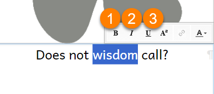

When writing books for people at different levels of reading skill, it is important to choose the right font, font size, line spacing, and word spacing. 

:::note

This page talks about formatting strings of text. For help on formatting text styles and text boxes, see [Format Text Styles](/formatting-text-styles) and [Format Text Boxes](/formatting-text-boxes).

:::

## Formatting selected text {#d54ed7fc181a4263bcc6de863db82652}

Bloom lets you easily make a character, word, or phrase **bold**, _italic_, <u>underlined</u>, or superscript. You can also set the color of a portion of text. 

:::caution

**Do not use this feature to format** <u>**all**</u> **the text in a textbox!** If you need to format <u>**all**</u> of the text inside a text box, you should do this by selecting a different text style, or by changing the style characteristics. See [Format Text Styles](/formatting-text-styles).

:::

1. **Select** the portion of **text** you want to format:
	1. **D****ouble-click** a word
	OR
	2. Put your cursor next to the portion of text you want to select, then **click and drag** the mouse over the text**.**
2. When you select some text, six buttons will appear.

	

3. Click the **button** for the **formatting option** you want.

## The formatting buttons {#13abb4a4972b47f0823d22a9e93ab57d}

The first three buttons are typical character formatting buttons. These buttons also have keyboard shortcuts.

| ❶ | Click the **B** button to make the text **bold**                   | `Ctrl + B` |
| - | ------------------------------------------------------------------ | ---------- |
| ❷ | Click the _**I**_ button to make the text _italic_                 | `Ctrl + I` |
| ❸ | Click the <u>**U**</u> button to make the text <u>underlined</u>.  | `Ctrl + U` |

There are three additional buttons: 

| ❹ | **Click the** **`A²`** **button** to make the text superscript.  (Bloom does not currently provide a subscript option.) |
| - | --------------------------------------------------------------------------------------------------------------------------- |
| ❺ | Click the **link icon** **🔗** to insert a hyperlink from the clipboard.                                                    |
| ❻ | Click the <u>A</u>▼ button to choose a color for the text.                                                                  |

