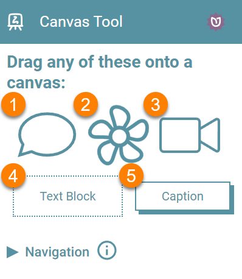
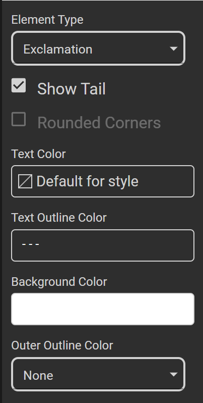
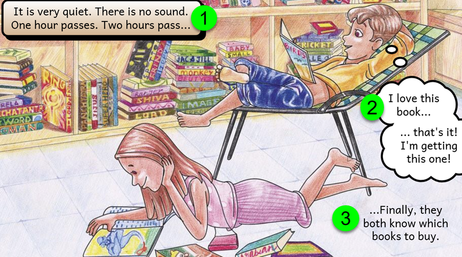
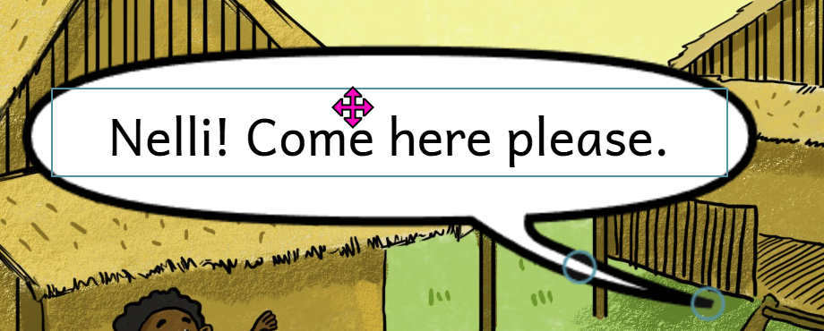
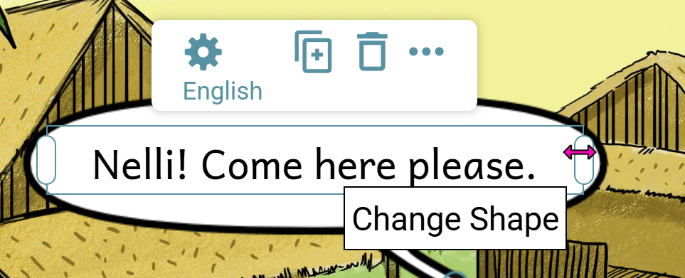
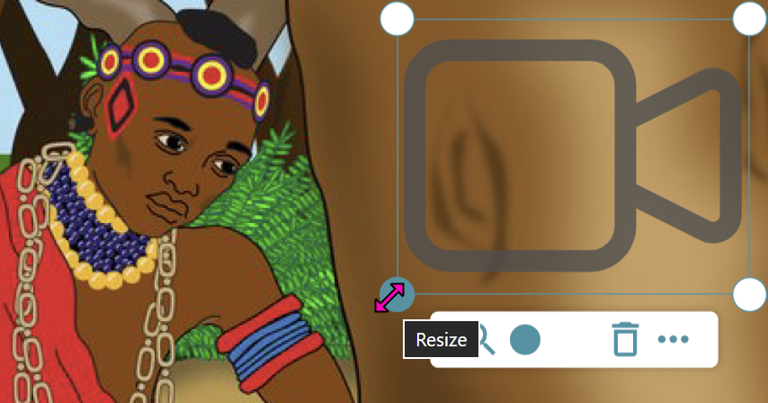
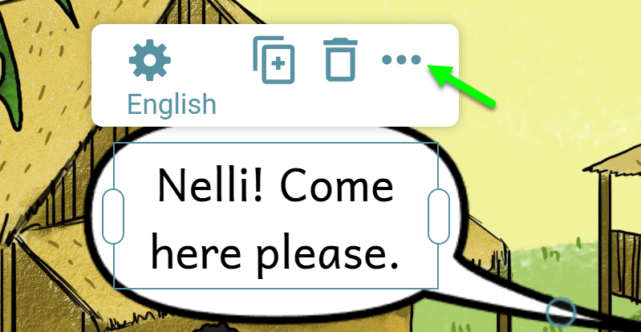
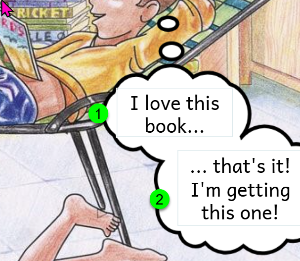

There are five basic overlay types you can put on a canvas:

1. Speech Bubble
2. Image
3. Sign Language Video
4. Text Block
5. Caption

## Adding an Overlay {#3744bb19df1280cf973af0aa1678ddff}

To add an overlay, simply click one of the five basic overlay types, drag it onto the canvas, then release your mouse. 

## Styling  an Overlay Element {#3744bb19df12807e9625d49776435b54}

If you add a Speech Bubble, Text Block, and Caption, these elements can be styled in various ways:

- Element Type

- Show Tail

- Rounded Corners

- Text Color

- Text Outline Color

- Background Color

- Outer Outline Color

For example, on the page below, (1) is a Caption with rounded corners, (2) is a bubble using the Element Type “Thought”, and (3) is a Just Text transparent overlay.

## Edit Mode vs. Selection Mode {#3744bb19df12806d8fd2f29b1eed4a3f}

There are two modes:

- Text-Edit mode: allows you to you enter and format text.
- Selection mode:  allows you to move or reshape an overlay.

Clicking once on an overlay gets you into Selection Mode. 

Clicking again gets you into Text-Edit Mode.

:::note

When you first add a text-based overlay (Speech Bubble, Text Block, or Caption), you will automatically be placed in Text-Edit mode by default. 

:::

## Moving an Overlay {#3744bb19df1280a59710daed3c7009c2}

If you are currently in Text-Edit mode, you will need to click outside the overlay first, then click on the overlay to select it. Drag the overlay to where you want and then release the mouse:

## Reshaping an Overlay {#3744bb19df128001bec4d2552ffe8add}

In Selection mode, click either of the side handles (for text-based overlays) and drag left or right:

For Image or Video overlays, hover your mouse over one of the corner handles and drag inward (to make smaller) or outward (to make larger):

## Advanced Functions {#3744bb19df128017a3f8ccc353fab305}

When you select an overlay, a basic tool menu will appear allowing easy access to the most frequently used functions. In addition, the “…”  gives the advanced menu:

### Auto Height {#3744bb19df1280679a48fbae5bf3dc94}

By default, the height of bubbles is determined automatically. Deselect this is you want control of both the width and the height of a bubble.

### Child Bubble {#3744bb19df12804faffbd8a7831c1470}

Add a child bubble when you wish to indicate a significant break in thought or speech. In this example, (1) is the main thought bubble and (2) is the child bubble:

