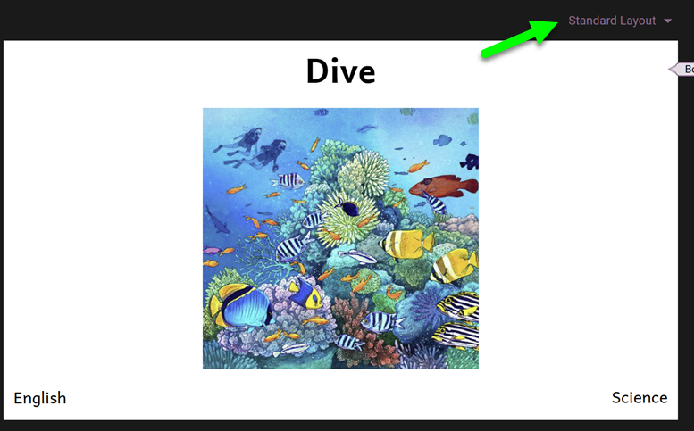
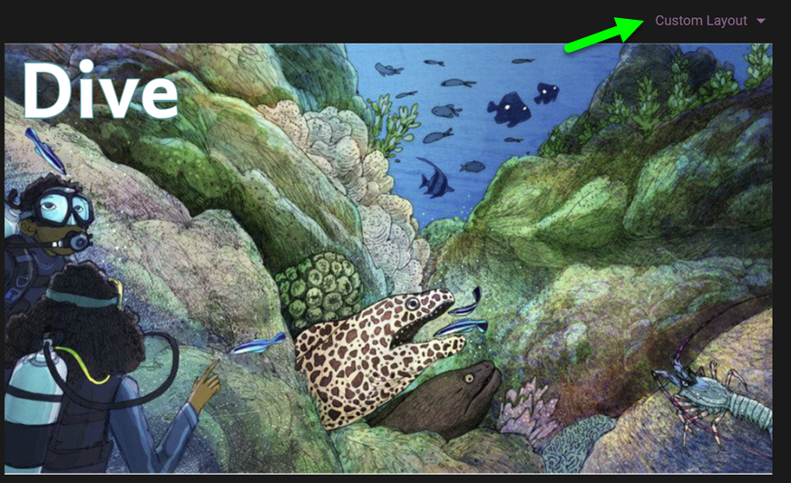
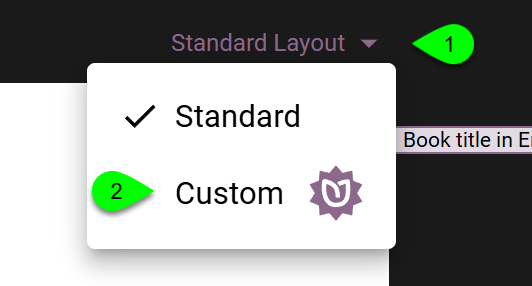
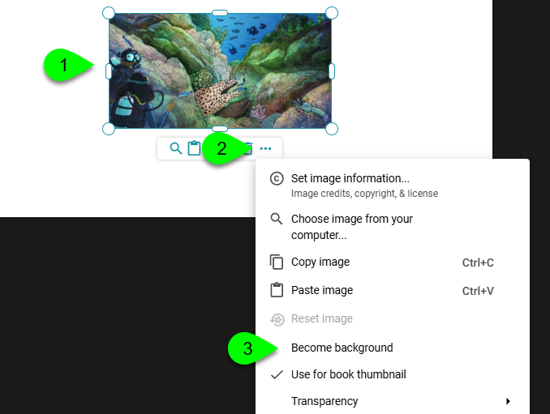
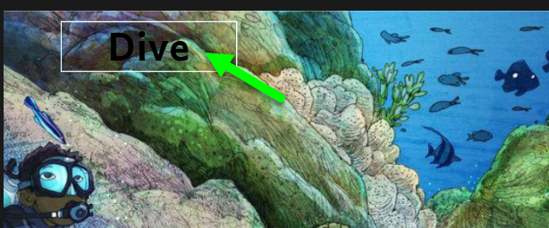
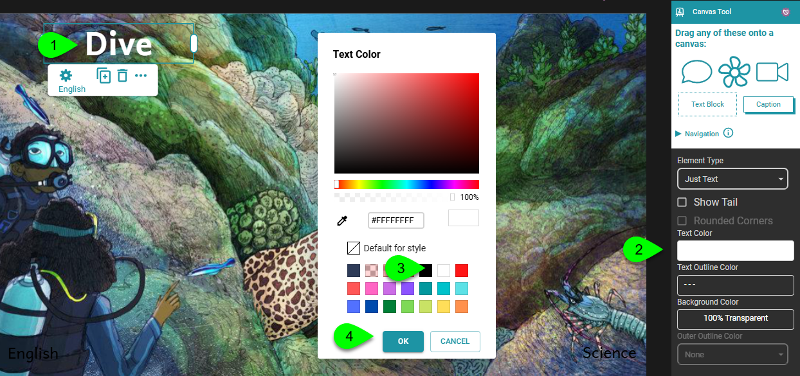
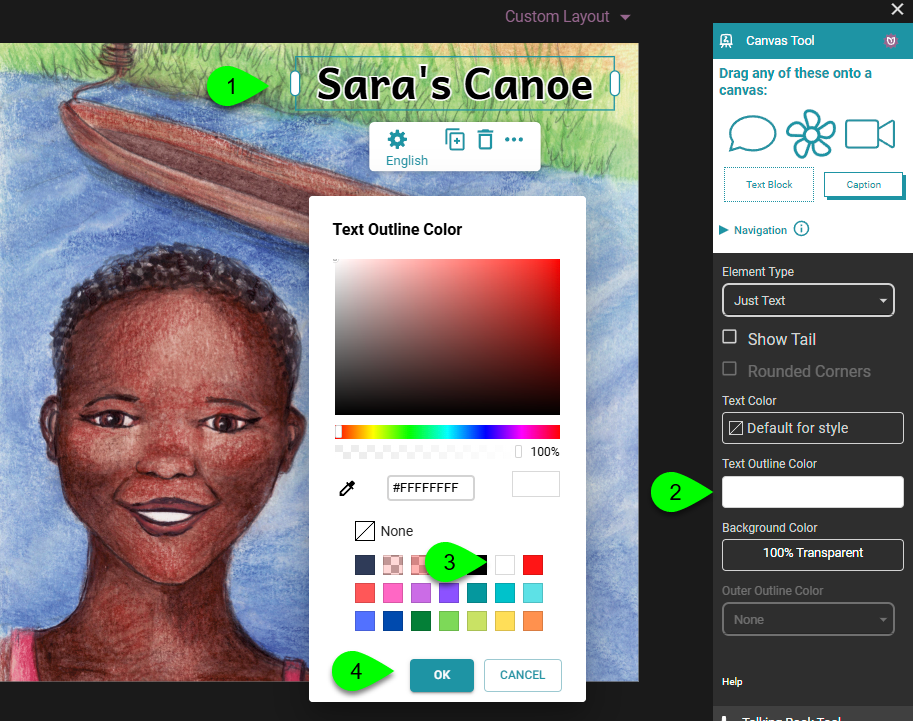
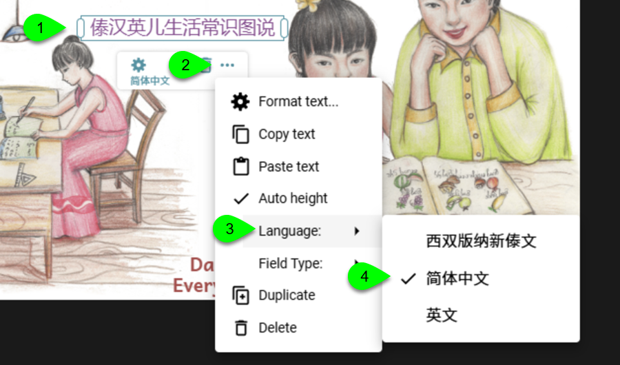

## Standard vs. Custom Layout {/* #3894bb19df1280efad58f699dacaac5e */}

Starting with Bloom 6.4, Bloom subscribers can customize the front and back cover of their books.

We now distinguish between a **Standard Layout** where text and image are separate:

And a **Custom Layout** where the entire front (or back) cover is treated as a Canvas page. This allows text to be placed on top of a background image:

To switch from **Standard Layout** to **Custom Layout**, select from the dropdown list:

## Become Background {/* #3894bb19df1280638fd0f01078e5b838 */}

After changing your cover layout from **Standard** to **Custom**, many users will want the front cover image to expand to fill the entire canvas, edge-to-edge, as in seen above. Here’s how this is done:

1. Select the image you wish to become the background.
2. Click **…**
3. Click **Become background**.

## Changing Text Color {/* #3894bb19df1280ae9498e1863113511f */}

In Standard Layout, black text is on a white background. But when you change to Custom Layout and make the image become the background, the black text color may be difficult to see:

In the above example, white would be a better color for the text:

1. Select the overlay.
2. In the Canvas Tool, click on **Text Color**.
3. Select a color in the Text Color chooser.
4. Click **OK**.

## Text Outline Color {/* #3894bb19df12801fad07d214ee492964 */}

Adding a text outline color can make a title really stand out against its background. Compare, for example, this plain black book title:

With one which has a white outline:

To change the text outline color:

1. Select the overlay.
2. In the Canvas Tool, click on **Text Outline Color**.
3. Select a color in the Text Color chooser.
4. Click **OK**.

## Field Type and Language {/* #3894bb19df12807facacf4e0d0d31340 */}

The canvas overlays on a front cover can carry special significance; for example, they could be the book’s title. And if they represent the book’s title, then you will need to identify the language. 

For example, this custom cover has three canvas overlays, each one a title in a different language:

For the front and back cover overlays, four hold special significance. These are called **Field Types**:

1. Book Title
2. Cover Credits
3. Languages
4. Topic

To change the **Field Type** of an overlay, do the following:

1. Select the overlay.
2. Click **…**
3. Click **Field Type**.
4. Click the Field Type you need.

To change the **Language** of an overlay, do the following:

1. Select the overlay.
2. Click **…**
3. Click **Language**.
4. Select the language fromt the list.

:::tip

N.B. The languages presented will match those in the Collection Settings.

:::

