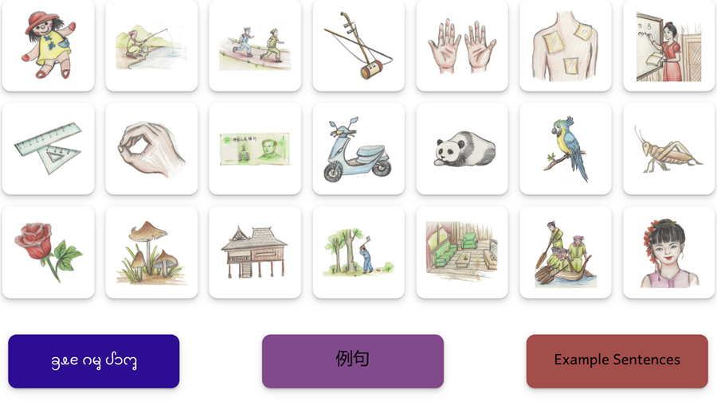
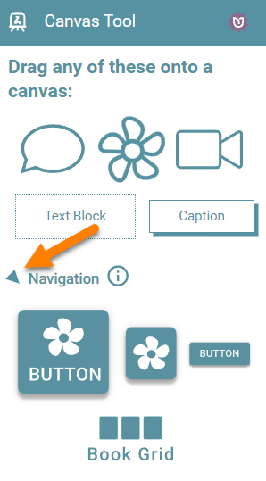
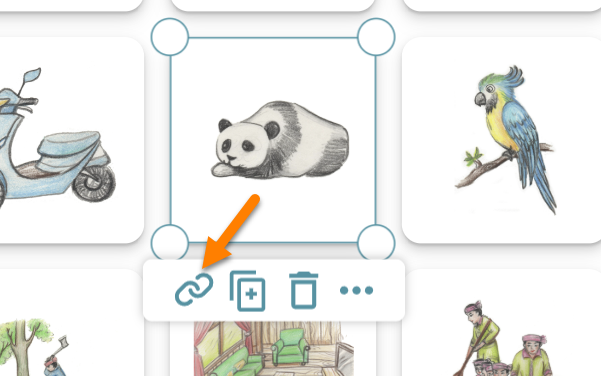
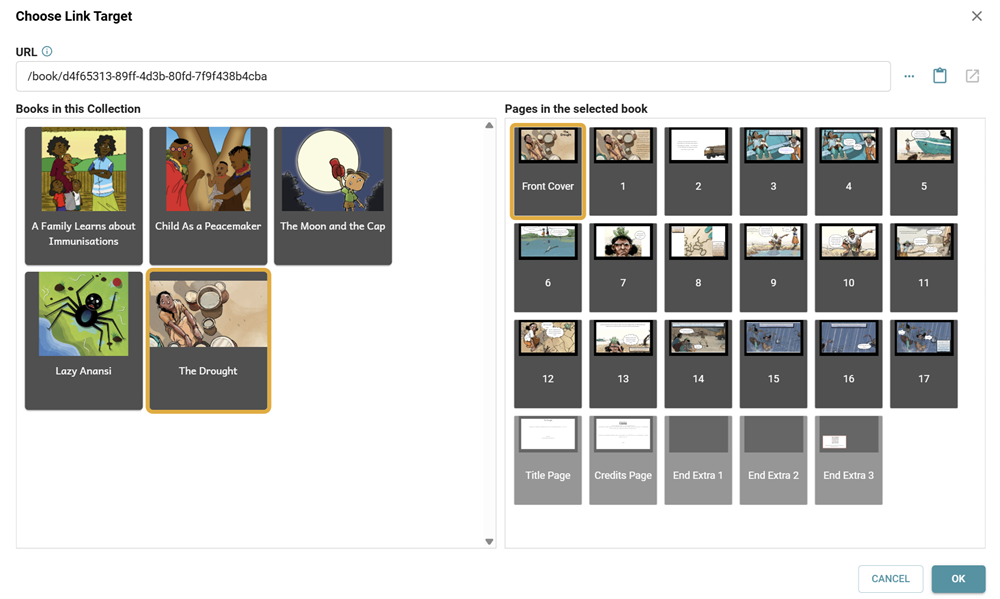
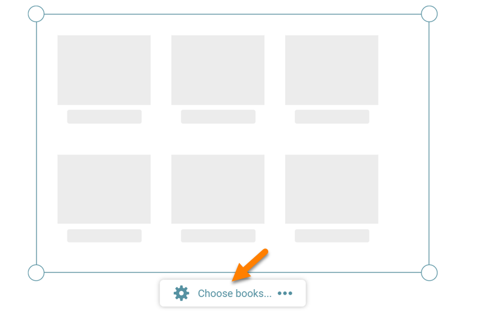
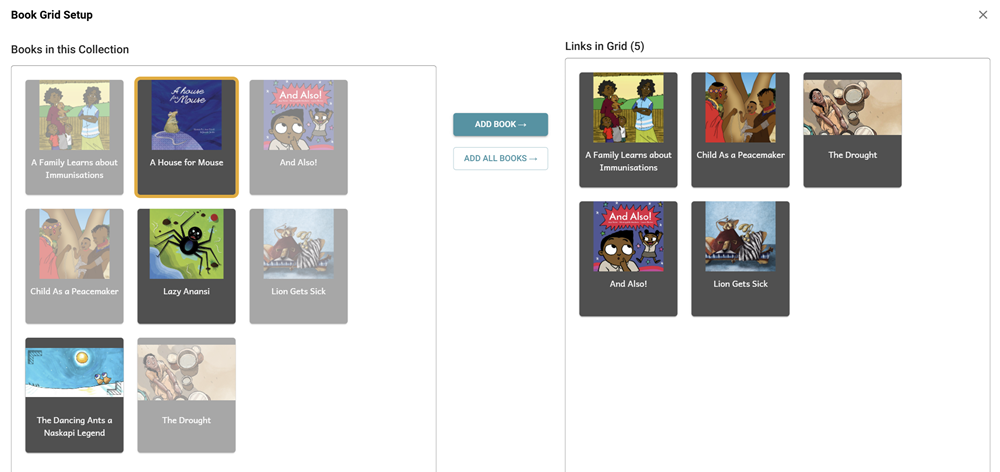
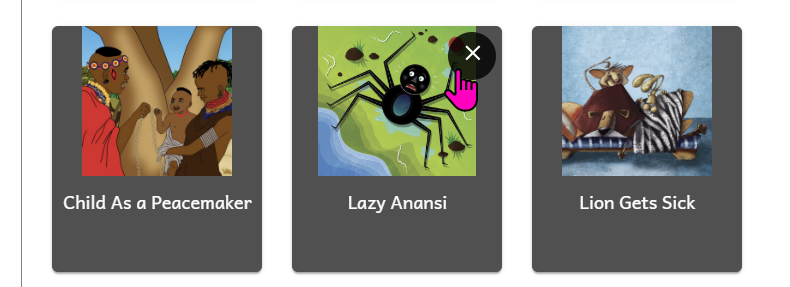

On the page above, each image contains a hyperlink to a section in [this large dictionary](https://bloomlibrary.org/book/ut7kZKm13T), and the three colored buttons in the book link to [another book ](https://bloomlibrary.org/book/xYT3bUEKEy)containing example sentences.

When the reader clicks on any of these Navigation Buttons, the browser jumps to the intended book or section.

To access Navigation Buttons, click beside the word “Navigation” on the Canvas Tool to expand it:

## Four Button Styles {#36d4bb19df12802ab0aaed29772e0134}

There are four button styles:

1. Image + Text
2. Image Only
3. Text Only
4. Book Grid

## Choose Link Target {#36d4bb19df12800bb5f4df201636aa1a}

After you have added a Navigation Button (types 1-3), you need to add your hyperlink. Select the overlay and click on the link icon:

You will see something like this:

- On the left side, choose the book you wish to link to.
- On the right side, choose which page you wish to link to.

Or, if you wish to link to an external website, you may paste in the URL directly at the top.

## Choose Books {#36d4bb19df1280b9954fcb28d597ddb2}

When you add a Book Grid overlay,  the grid will be empty. Click “Choose Books”:

Select books on the left side you wish to add and click ADD BOOK to add it:

To remove a book you no longer wish to be included in the grid, hover your mouse over the book thumbnail, and click on the X

